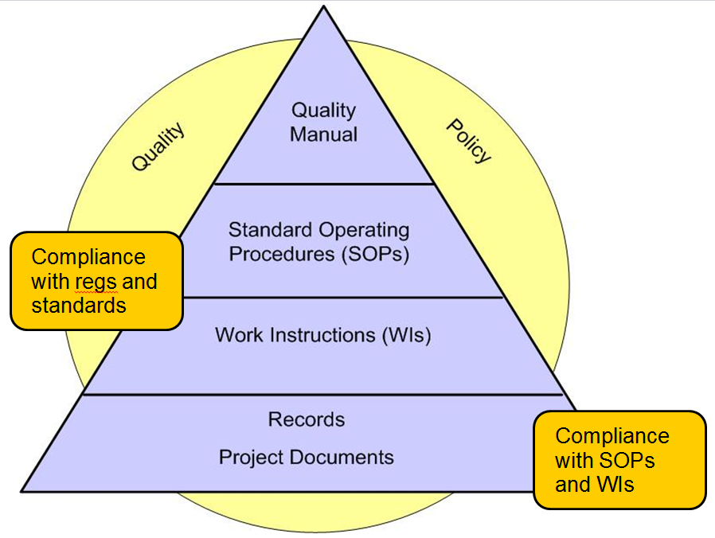
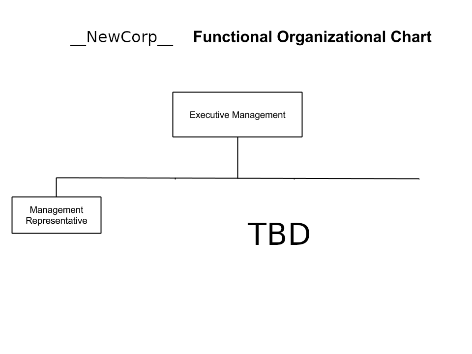

# __NewCorp__ Quality Manual
## QM-001
-----------------------------------------

## 1.0 PURPOSE

__NewCorp__ is a neuroscience-focused company developing __what?__ to 
__do what?__

This Quality Manual establishes the Quality Management System (QMS)
for __NewCorp__. Policies and procedures required for compliance
are shown using the word **“shall”**.

This QMS complies with applicable sections of ISO-13485, the FDA
Quality System Regulation (21 CFR Part 820), and applicable FDA
guidance documents and international standards.

*This QMS currently does not comply with the EU medical device
regulation defined in the Medical Device Directive (MDD) 93/42/CE
amended by Directive 2007/47/CE. Future revisions to this QMS are
planned to address MDD requirements – specifically compliance with IEC
62304 Medical Device Software – Software Life Cycle Processes.*

Medical device software developed by __NewCorp__ is developed in
accordance with this QMS and in a manner consistent with FDA
regulations, guidance documents and international standards.

Medical devices are defined in §201(h) of the Federal Food Drug &
Cosmetic Act.

## 2.0 SCOPE

This Quality Manual defines policies and procedures related to the
design and development of medical devices as defined by the US FDA in
§201(h) of the Federal Food Drug & Cosmetic (FD&C) Act.

All __NewCorp__ employees and subcontractors are required to adhere
to the policies and procedures outlined in this Quality Manual when
designing and developing medical devices.

This Quality Manual applies to regulated medical device product
development activities. Research activities are not regulated by FDA
and therefore are not governed by this Quality Manual.

__NewCorp__ does not perform traditional manufacturing. Therefore,
the following ISO-13485 manufacturing-related requirements (sections)
are not applicable to this QMS:

-   §7.5.1.2.1 - Cleanliness of product and contamination control

-   §7.6 - Control of Monitoring and Measuring Devices

## 3.0 REFERENCES, TERMS AND ACRONYMS

### 3.1 References
------------------

1.  21 CFR Part 820 FDA Quality System Regulation, 1996

2.  21 CFR Part 11 Electronic Records and Electronic Signatures, 1997

3.  ANSI/AAMI/ISO-13485:2003 Medical Devices-Quality Management Systems
    Requirements for Regulatory Purposes

4.  ANSI/AAMI/ISO-14971:2007 Medical Devices – Application of Risk
    Management for Medical Devices.

5.  ISO/IEC 62366-1:2015 Medical Devices – Part 1: Application of
    Usability Engineering to Medical Devices

6.  Guidance for the Content of Premarket Submissions for Software
    Contained in Medical Devices, May 11, 2005

7.  Guidance for Off-the-Shelf Software Use in Medical Devices,
    September 9, 1999

8.  General Principles of Software Validation, FDA, Final Guidance,
    January 2002

9.  Content of Premarket Submissions for Management of Cybersecurity in
    Medical Devices, October 2, 2014

10. Postmarket Management of Cybersecurity in Medical Devices – DRAFT
    2016

11. Applying Human Factors and Usability Engineering to Medical Devices,
    2016

### 3.2 __NewCorp__ Procedures 
---------------------------------

1.  Design Control Procedure, [SOP-001](SOP-001--Design_Control.md)

2.  Risk Management Procedure, [SOP-006](SOP-006--Risk_Management.md)

3.  Complaint Handling and Medical Device Reporting, [SOP-004](SOP-004--Complaint_Handling_and_MDR.md)

4.  Design Review Procedure, [SOP-007](SOP-007--Design_Review.md)

5.  Document and Record Control Procedure, [SOP-008](SOP-008--Document_and_Record_Control.md)

6.  Installation and Service Controls Procedure, [SOP-010](SOP-010--Installation_and_Service_Controls.md)

7.  Supplier and Purchasing Controls Procedure, [SOP-002](SOP-002--Supplier_and_Purchasing_Controls.md)

8.  Software Development Procedure, [SOP-012](SOP-012--Software_Development.md)

9.  Internal and External Audit Procedure, [SOP-005](SOP-005--Internal_and_External_Audit.md)

10. Corrective and Preventive Action Procedure, [SOP-011](SOP-011--CAPA.md)

### 3.3 Terms
---------

- **Complaint**: Any written, electronic or oral communication that alleges
deficiencies related to the identity, quality, durability, reliability,
safety or performance of a medical device that has been placed on the
market.

- **Design Controls**: The portion of the FDA Quality System Regulation that
applies to the design and development of medical devices. Design
Controls are contained in 21 CFR Part 820.30.

- **Design History File**: The design history file (DHF) contains or references
the documentation necessary to demonstrate that the design was developed
in accordance with the approved design plan and associated procedures.

- **Labeling**: Any written, printed or graphic matter affixed to a medical
device or any of its containers or wrappers, or accompanying a medical
device, related to identification, technical description, and use of the
medical device, but excluding shipping documents.

- **Validation**: Confirmation by examination and provision of objective
evidence that the particular requirements for a specific intended use
can be consistently fulfilled.  ```[QSR 820.3(z)]```.

- **Software Validation**: Confirmation by examination and provision of
objective evidence that all software specifications conform to user
needs and intended uses, and that the particular requirements
implemented through software can be consistently fulfilled. ```[GPSV]```

- **Verification**: Confirmation by examination and provision of objective
evidence that specified requirements have been fulfilled. ```[QSR
820.3(aa)]```.

- **Software Verification**: Provides objective evidence that the design
outputs of a particular phase of the software development lifecycle meet
all of the specified requirements for that phase. ```[GPSV]```

### 3.4 Acronyms
------------

- **CAPA** Corrective Action / Preventive Action

- **CFR** Code of Federal Regulations

- **DHF** Design History File

- **MDR** Medical Device Report

- **OTSS** Off-the-shelf software

- **QM** Quality Manual

- **QMS** Quality Management System

- **QSR** Quality System Regulation

- **RMF** Risk Management File

- **SOP** Standard Operating Procedure

- **SOUP** Software of Unknown Provenance (aka open source software)

- **WI** Work Instruction

  
## 4.0 QMS OVERVIEW

### 4.1 General Requirements
-----------------------------

The QMS applies to medical device software designed and developed by
__NewCorp__. All __NewCorp__ employees and subcontractors
who are involved in the design and development of medical device
software are responsible for understanding and complying with
applicable provisions of this Quality Manual (QM) and the
__NewCorp__ QMS. __NewCorp__ Executive Management is ultimately
responsible for assuring that personnel can and do comply with all
provisions of the QM and the QMS.

The QM identifies several Standard Operating Procedures (SOPs) and
Work Instructions (WIs). These SOPs and WIs identify activities,
project documents and records to be produced as part of developing
medical devices. Project documents may include product specifications,
project plans and reports, etc. Records may include meeting minutes,
test results, etc. and provide evidence that activities required by
SOPs have been performed.

__NewCorp__ Executive Management is responsible for periodically
assessing the effectiveness of the QMS against defined quality
objectives in order to ensure __NewCorp__ medical devices are
developed in a manner consistent with the QMS and that its medical
devices are safe and effective.

The following processes have been identified as critical to the
development of safe and effective medical devices:

-   Design Controls (see [section 7.1](QualityManual.md#71-design-controls))

-   Supplier and Purchasing Controls (see section 7.6)

-   Document and Records Controls (see section 7.5)

-   Installation and Service Controls (see section 7.7)

-   Control of Nonconforming Product (see section 8.1)

-   Corrective and Preventive Action (see section 8.2)

-   Complaint Handling and Medical Device Reporting (see section 8.3)

-   Internal and External Audits (see section 8.4)

### 4.2 QMS Documentation 
----------------------

Documentation is the cornerstone of an effective QMS. __NewCorp__
**shall** establish and maintain procedures for the control of
documents and records related to the design, development, testing and
support of all medical device software developed under this QMS.

The QMS documentation hierarchy is shown in Figure 1 and includes:

-   This Quality Manual (QM)

-   SOPs and WIs as required by this QM and applicable FDA regulations,
    guidance documents and international standards

-   Project documents needed by __NewCorp__ to ensure the effective
    planning, operation and control of its processes

-   Records required by SOPs and WIs

> 
> Figure 1 – Hierarchy of QMS Documentation

The purpose of each level of documentation is as follows:

-   The **Quality Manual** provides a description of the __NewCorp__
    quality policy and the general structure and methods for maintaining
    the quality system. It provides policies, broad scopes of
    responsibilities and authorities. This QM establishes compliance
    with relevant FDA regulations, guidance documents and
    international standards. It identifies requirements (indicated by
    the word **“shall”**) for creating SOPs, WIs, project documents
    and records.

-   **SOPs** are high-level procedures used to specify *what* needs to
    be done, by whom, when, and the records that are produced as
    evidence that the activity was executed as required.

-   **WIs** are detailed documents used to specify *how* some activity
    or operation is to be done, by whom, when it is done, and the
    records produced as evidence that the activity was executed
    as required.

-   **Records** provide evidence that activities prescribed in SOPs and
    WIs were performed.

-   **Project documents** are documents produced as part of product
    development and production activities. These may include plans,
    reports, product specifications, and other documents based on
    individual project requirements. The specific documents to be
    produced are defined in a project plan.

## 5.0 MANAGEMENT RESPONSIBILITY

### 5.1 Management Commitment
-------------------------

__NewCorp__ Executive Management is committed to implementing an
effective QMS that addresses all relevant aspects of medical device
design, development, deployment and support. This commitment is
demonstrated through the establishment of the QMS and the Quality
Policy (shown below) and is supported by providing the necessary
resources, equipment and appropriately trained staff.

### 5.2 Quality Policy
----------------------

__NewCorp__ quality policy is as follows:

```
__NewCorp__ identifies new and innovative software medical devices that can
improve the quality of care and patient outcomes.

__NewCorp__ designs and develops safe and effective software medical devices
in accordance with applicable regulations and standards.
```

### 5.3 Resources 
----------------------

#### 5.3.1 Organization

The functional organization chart included as Appendix A (TBD)
summarizes how __NewCorp__ is structured to ensure responsibilities
and authorities are defined and communicated within the organization
with regard to the design and development of medical devices.

__NewCorp__ clearly establishes and documents the responsibilities,
authority, and interrelation of employees who manage, perform, and
verify work which affects quality as shown in Appendix A (TBD).

All employees assigned to a medical device project must have requisite
medical device training as identified in the applicable Project Plan.

#### 5.3.2 Management Representative Responsibilities

__NewCorp__ **shall** appoint a Management Representative with the
following minimum responsibilities:

-   Authority to prevent deployment of nonconforming medical devices
    into clinical use until the deficiency or unsatisfactory condition
    is corrected. When a dispute occurs concerning the quality of a
    medical device, the issue is brought before Executive Management
    for resolution.

-   Promotes awareness of customer requirements throughout
    the organization.

-   Responsible for coordinating visits by the FDA with __NewCorp__
    and for coordinating all responses to the FDA.

-   Responsible for coordinating periodic internal audits of all
    activities covered by this Quality Manual. Internal Audits are
    described in section 8.4.1 below.

-   Maintains this Quality Manual and distributes controlled copies of
    the Quality Manual.

-   Proposes changes to the Quality Manual that are discussed and
    reviewed with staff. Executive Management reviews these changes.

-   Responsible for removing obsolete Quality Manual revisions and
    making the most recently approved revision available to the staff.

### 5.3.3 Management Reviews

__NewCorp__ **shall** conduct an annual Management Review. This
review assesses the continuing QMS suitability, adequacy and
effectiveness, identifying opportunities for improvement and needed
changes. At each Management Review meeting, the following topics may be
considered for discussion:

-   Status of all product development activities

-   User, product, and quality issues

-   Regulatory, quality and compliance issues

-   Issues with subcontractors

-   QMS issues

-   Staff training needs

-   Systems, equipment and infrastructure needs to support product
    development and the QMS

-   Results of audits

-   Customer feedback

-   Process performance and product conformity

-   Status of preventive and corrective actions

-   Follow-up actions from previous management reviews

-   Planned changes that could affect the quality management system

-   Recommendations for improvement

-   New or revised regulatory requirements

    The Management Representative or designee **shall** maintain meeting
    minutes of each Management Review. Meeting minutes of management
    reviews are filed separately from any Design History File (DHF) as
    they are not subject to review during external audit.

  
## 6.0 RESOURCE MANAGEMENT 

### 6.1 Provision of Resources
--------------------------

Executive Management is responsible for providing appropriate resources
to accomplish planned activities. Resources may include but not be
limited to:

-   People

-   Systems, equipment and infrastructure

-   Legal resources (PW: just a thought)

Resources include those required to support the design, development, distribution 
and effective use of medical devices developed by __NewCorp__.

Resources to be provided also include those required to implement, support,
maintain and improve the QMS.

#### 6.1.1 People

Executive Management **shall** ensure that all employees and
subcontractors involved in activities that affect the quality, safety
and effectiveness of medical devices developed by __NewCorp__ meet
minimum levels of competence.

Executive Management **shall** provide awareness training to all
employees to make certain that all employees are made aware of the:

-   Importance of their activities

-   How their activities affect the safety and effectiveness of medical
    devices

-   How their activities contribute to the achievement of the quality
    objectives

-   Educating employees on their legal responsibilities

All training **shall** be documented in training records.

#### 6.1.2 Systems, Equipment and Infrastructure

Executive Management **shall** be responsible for deciding which medical
device projects should be developed and deployed. For each of these
projects, Executive Management **shall** be responsible for providing
adequate systems, equipment, and infrastructure to support the design,
development, deployment and support of medical devices developed under
this QMS.

## 7.0 PRODUCT REALIZATION

Product realization activities include all activities required to
design, develop, verify, validate, distribute and support medical
devices developed within this QMS. These activities, at a minimum,
**shall** include:

-   Design Controls (see section 7.1)

-   Software Development (see section 7.2)

-   Risk Management (see section 7.3)

-   Design Reviews (see section 7.4)

-   Document and Record Controls (see section 7.5)

-   Supplier and Purchasing Controls (see section 7.6)

-   Installation and Service Controls (see section 7.7)

### 7.1 Design Controls 
--------------------

__NewCorp__ **shall** establish and maintain a Design Control
procedure that minimally addresses applicable requirements in the FDA
QSR (21 CFR Part 820.30), applicable FDA guidance documents and
international standards.

All product development activities related to a medical device
**shall** be performed and documented in accordance with the Design
Controls Procedure, [SOP-001](SOP-001--Design_Control.md) and with the Software Development
Procedure, [SOP-012](SOP-012--Software_Development.md).

### 7.2 Software Development 
--------------------

__NewCorp__ **shall** establish and maintain a Software Development
procedure that minimally addresses applicable requirements in the FDA
QSR (21 CFR Part 820.30) and applicable FDA guidance documents and
international standards.

All software development activities related to a medical device
**shall** be performed and documented in accordance with the Software
Development Procedure, [SOP-012](SOP-012--Software_Development.md).

All software development tools used to develop medical devices
**shall** be considered for validation as described in the Software
Tool Validation Procedure, SOP-013.

### 7.3 Risk Management
--------------------

__NewCorp__ **shall** establish and maintain a Risk Management
procedure that minimally addresses applicable requirements in the FDA
QSR (21 CFR Part 820.30), applicable FDA guidance documents and
ISO-14971.

All risk management activities related to a medical device **shall**
be performed and documented in accordance with the Risk Management
Procedure, [SOP-006](SOP-006--Risk_Management.md).

### 7.4 Design Reviews
--------------------

__NewCorp__ **shall** establish and maintain a Design Review
procedure that minimally addresses applicable requirements in the FDA
QSR (21 CFR Part 820.30), applicable FDA guidance documents and
international standards.

All design reviews related to a medical device **shall** be performed
and documented in accordance with the Design Review Procedure,
[SOP-007](SOP-007--Design_Review.md).

### 7.5 Document and Record Controls
--------------------

__NewCorp__ **shall** establish and maintain a Document and Record
Control procedure that minimally addresses the document and record
control requirements contained in the FDA QSR (21 CFR Part 820.40),
applicable FDA guidance documents and international standards.

Documents and records related to a medical device **shall** be created
and maintained in accordance with the Document and Record Controls
Procedure, [SOP-008](SOP-008--Document_and_Record_Control.md).

A Design History File (DHF) **shall** be created for each development
project. Project documents and records identified in the SOPs, WIs and
project plans **shall** be maintained in the project DHF.

The Design Controls [SOP-001](SOP-001--Design_Control.md) **shall** also 
establish requirements for performing Risk Management in a manner that complies
with ISO-14971. All project records associated with Risk Management **shall** be
filed in the project Risk Management File (RMF).

### 7.6 Supplier and Purchasing Controls
--------------------

__NewCorp__ **shall** establish and maintain a Supplier and
Purchasing Controls Procedure that minimally addresses the following:

-   Creation and maintenance of an Approved Supplier List (ASL)

-   Supplier Qualification for components, engineering services,
    consultants, contractors and other third parties

The development of a medical device may incorporate
off-the-shelf (OTS) components provided by suppliers as well as
custom components developed by third parties (such as a Contract
Engineering firm) developed to specifications prepared
by __NewCorp__.

Supplier and purchasing activities related to a medical device
**shall** be performed and documented in accordance with the Supplier
and Purchasing Controls Procedures, [SOP-002](SOP-002--Supplier_and_Purchasing_Controls.md).

### 7.7 Installation and Service Controls
--------------------

__NewCorp__ **shall** establish and maintain an Installation and
ServiceControls procedure that minimally addresses the following:

- **Installation**: Procedures that describe how the device is to be installed 
and how proper operation is to be confirmed following installation.

- **Service**:  Procedures that describe how the medical device is to be updated
and serviced, what records need to be prepared as part of service
activities, and how the medical device is deemed to be ready for use
in the clinical setting following updating.

__NewCorp__ **shall** maintain all installation and device service
records records in the DHF.

Installation and service activities related to a medical device
**shall** be performed and documented in accordance with the
Installation and Service Controls Procedure, [SOP-010](SOP-010--Installation_and_Service_Controls.md).

## 8.0 MEASUREMENTS, ANALYSIS AND IMPROVEMENT

__NewCorp__ **shall** establish and maintain procedures for measurement, 
analysis, monitoring, and improvement. Statistical methods and other techniques
may be used to demonstrate conformity and effectiveness.

These activities, at a minimum, **shall** include:

-   Control of Nonconforming Product (see section 8.1)
-   Corrective and Preventive Action (see section 8.2)
-   Complaint Handling and Medical Device Reporting (see section 8.3)
-   Internal and External Audits (see section 8.4)

### 8.1 Control of Nonconforming Product
------------------------------------

__NewCorp__ **shall** establish and maintain a Nonconforming
Product Procedure that minimally provides for identification, review,
and disposition of nonconforming product. This procedure **shall**
ensure that __NewCorp__ and its subcontractors have an effective
system to prevent unintended use or delivery of nonconforming product.

Control of nonconforming product activities related to a medical
device **shall** be performed and documented in accordance with the
Design Control Procedure, [SOP-001](SOP-001--Design_Control.md)

### 8.2 Corrective and Preventive Action (CAPA)
-------------------------------------------

__NewCorp__ **shall** establish and maintain a CAPA process that
minimally requires action be action taken to prevent recurrence of a
nonconformance that has already occurred. The CAPA process **shall**
also require that preventive action be taken when a potential
nonconformity is identified as the result of an analysis of records
and other relevant sources of information.

CAPA activities related to medical devices **shall** be performed and
documented in accordance with the Corrective and Preventive Action
Procedure, [SOP-011](SOP-011--CAPA.md).

### 8.3 Complaint Handling and Medical Device Reporting
---------------------------------------------------

__NewCorp__ **shall** establish and maintain a Complaint Handling and 
Medical Device Reporting Procedure that minimally **shall** comply with FDA
complaint handling and Medical Device Reporting (MDR) regulations.

Complaint handling and medical device reporting activities **shall**
be performed and documented in accordance with the Complaint Handling
and Medical Device Reporting Procedure, [SOP-004](SOP-004--Complaint_Handling_and_MDR.md).

### 8.4 Internal and External Audits
--------------------------------

Audits are a critical tool for improving the QMS and for improving the
safety and effectiveness of medical devices developed within the QMS.
__NewCorp__ is committed to performing and participating in
internal and external audits.

Activities related to planning, conducting and documenting internal
and external audits of medical devices **shall** be performed and
documented in accordance with the Internal and External Audit
Procedure, [SOP-005](SOP-005--Internal_and_External_Audit.md).

  
## Appendix A __NewCorp__ Organization Chart


Figure 2 – __NewCorp__ Organization Chart
  
## Appendix B Cross-Reference Table 

**ISO 13485:2003, __NewCorp__ QM and SOPs, FDA QSR**

**DOCUMENTATION AND RECORD CONTROL REQUIREMENTS**

<table>
<tbody>
<tr class="odd">
<td><strong>ISO-13485:2003 Requirement</strong></td>
<td><strong>__NewCorp__ QM and SOPs</strong></td>
<td><strong>FDA QSR Reference</strong></td>
</tr>
<tr class="even">
<td><strong>4.2 Documentation Requirements:</strong></td>
<td></td>
<td></td>
</tr>
<tr class="odd">
<td>General</td>
<td>QM-001</td>
<td>NA</td>
</tr>
<tr class="even">
<td>Quality Manual</td>
<td>QM-001</td>
<td>NA</td>
</tr>
<tr class="odd">
<td>Control of Documents</td>
<td><p>QM-001 Section 7.3</p>
<p>Document and Record Controls SOP</p></td>
<td>820.40</td>
</tr>
<tr class="even">
<td>Control of Records</td>
<td><p>QM-001 Section 7.3</p>
<p>Document and Record Controls SOP</p></td>
<td>820.180,181,184,186</td>
</tr>
</tbody>
</table>

**MANAGEMENT RESPONSIBILITY**

<table>
<tbody>
<tr class="odd">
<td><strong>ISO-13485:2003 Requirement</strong></td>
<td><strong>__NewCorp__ QM and SOPs</strong></td>
<td><strong>FDA QSR Reference</strong></td>
</tr>
<tr class="even">
<td><strong>5.1 Management Commitment </strong></td>
<td>QM-001 Sections 5 and 6</td>
<td>820.20</td>
</tr>
<tr class="odd">
<td><strong>5.2 Customer Focus</strong></td>
<td><p>QM-001 Section 8.3</p>
<p>Complaint Handling and Medical Device Reporting SOP</p></td>
<td>NA</td>
</tr>
<tr class="even">
<td><strong>5.3 Quality Policy</strong></td>
<td>QM-001 Section 5.2</td>
<td>820.20</td>
</tr>
<tr class="odd">
<td><strong>5.4 Planning:</strong></td>
<td></td>
<td></td>
</tr>
<tr class="even">
<td>Quality Objectives</td>
<td>QM-001 Section 5.3.3 and 5.3.5</td>
<td>820.20</td>
</tr>
<tr class="odd">
<td>QMS Planning</td>
<td>QM-001 Section 5.3</td>
<td>820.20</td>
</tr>
<tr class="even">
<td><p><strong>5.5 Responsibility, Authority &amp; </strong></p>
<p><strong>Communication:</strong></p></td>
<td></td>
<td></td>
</tr>
<tr class="odd">
<td>Responsibility &amp; Authority</td>
<td>QM-001 Section 2.1</td>
<td>820.20</td>
</tr>
<tr class="even">
<td>Management Representative</td>
<td><p>QM-001 Section 5.3.2</p>
<p>Management Representative</p></td>
<td>820.20</td>
</tr>
<tr class="odd">
<td>Internal Communication</td>
<td>QM-001 5.3.2</td>
<td>NA</td>
</tr>
<tr class="even">
<td><strong>5.6 Management Review:</strong></td>
<td></td>
<td></td>
</tr>
<tr class="odd">
<td>General</td>
<td><p>QM-001 Section 5.3.3</p>
<p>Management Review</p></td>
<td>QSR 820.20</td>
</tr>
<tr class="even">
<td>Review Input</td>
<td></td>
<td></td>
</tr>
<tr class="odd">
<td>Review Output</td>
<td></td>
<td></td>
</tr>
</tbody>
</table>

**RESOURCE MANAGEMENT**

<table>
<tbody>
<tr class="odd">
<td><strong>ISO-13485:2003 Requirement</strong></td>
<td><strong>__NewCorp__ QM and SOPs</strong></td>
<td><strong>FDA QSR Reference</strong></td>
</tr>
<tr class="even">
<td><strong>6.1 Provision of Resources</strong></td>
<td>QM-001 Section 6.1.1</td>
<td>820.20</td>
</tr>
<tr class="odd">
<td><strong>6.2 Human Resources:</strong></td>
<td></td>
<td></td>
</tr>
<tr class="even">
<td>General</td>
<td>QM-001 Section 6.1.1</td>
<td>820.20</td>
</tr>
<tr class="odd">
<td>Competence, Awareness &amp; Training</td>
<td>QM-001 Section 6.1.1</td>
<td>820.25</td>
</tr>
<tr class="even">
<td><strong>6.3 Infrastructure</strong></td>
<td>QM-001 Section 6.1.2</td>
<td>820.70, .75, .170</td>
</tr>
<tr class="odd">
<td><strong>6.4 Work Environment</strong></td>
<td>QM-001 Section 6.1.3</td>
<td>820.70, .75, .170</td>
</tr>
</tbody>
</table>

**PRODUCT REALIZATION**

<table>
<tbody>
<tr class="odd">
<td><strong>ISO-13485:2003 Requirement</strong></td>
<td><strong>__NewCorp__ QM and SOPs</strong></td>
<td><strong>FDA QSR Reference</strong></td>
</tr>
<tr class="even">
<td><strong>7.1 Planning of Product Realization</strong></td>
<td>QM-001 Section 7</td>
<td>820.20, .80, .170, .184</td>
</tr>
<tr class="odd">
<td><strong>7.2 Customer-Related Processes:</strong></td>
<td></td>
<td></td>
</tr>
<tr class="even">
<td>
<p>Determination of Requirements to the product</p>
<p>Review of Requirements related to the product</p>
<p>Customer Communication</p>
</td>
<td><p>QM-001 Section 7.1</p>
<p>Design Control [SOP-001](SOP-001--Design_Control.md)</p></td>
<td>820.30, 181, 120, 130, 160</td>
</tr>
<tr class="odd">
<td><p><strong>7.3 Design &amp; Development</strong></p>

<p>Design and development planning</p>
<p>Design and development inputs</p>
<p>Design and development outputs</p>
<p>Design and development review</p>
<p>Design and development verification</p>
<p>Design and development validation</p>
<p>Control of design and development changes</p>
</td>
<td><p>QM-001 Section 7.1</p>
<p>Design Control [SOP-001](SOP-001--Design_Control.md)</p>
<p>Software Development SOP-012</p></td>
<td><h4 id="section-4">820.30, .130, .181</h4></td>
</tr>
<tr class="even">
<td><strong>7.4 Purchasing:</strong></td>
<td></td>
<td></td>
</tr>
<tr class="odd">
<td>Purchasing Process</td>
<td><p>QM-001 Section 7.2</p>
<p>Supplier and Purchasing Controls [SOP-002](SOP-002--Supplier_and_Purchasing_Controls.md)</p></td>
<td>820.50</td>
</tr>
<tr class="even">
<td>Purchasing Information</td>
<td></td>
<td></td>
</tr>
<tr class="odd">
<td>Verification of Purchased Product</td>
<td></td>
<td></td>
</tr>
<tr class="even">
<td><strong>7.5 Product &amp; Service Provision:</strong></td>
<td></td>
<td></td>
</tr>
<tr class="odd">
<td>
<p>Control of Production and Service</p>
</td>
<td><p>QM-001 Section 7.4</p>
<p>Production and Service Controls [SOP-010](SOP-010--Installation_and_Service_Controls.md)</p></td>
<td><p>820.70, .75, .170</p>
<p>820.130,.140,.150,.160</p></td>
</tr>
<tr class="even">
<td>
<p>Validation of Processes for Production and service</p>
</td>
<td><p>QM-001 Section 7.4</p>
<p>Production and Service Controls [SOP-010](SOP-010--Installation_and_Service_Controls.md)</p></td>
<td>820.70, .75, .170</td>
</tr>
<tr class="odd">
<td>
<p>Identification &amp; Traceability</p>
</td>
<td><p>QM-001 Section 7.4</p>
<p>Production and Service Controls [SOP-010](SOP-010--Installation_and_Service_Controls.md)</p></td>
<td><p>820.60, .65, .120</p>
<p>820.80, .184</p>
<p>820.86</p></td>
</tr>
<tr class="even">
<td>
<p>Customer Property</p>
</td>
<td>NA</td>
<td>NA</td>
</tr>
<tr class="odd">
<td>
<p>Preservation of Product</p>
</td>
<td><p>QM-001 Section 7.4</p>
<p>Production and Service Controls [SOP-010](SOP-010--Installation_and_Service_Controls.md)</p></td>
<td>820.130,.140,.150,.160</td>
</tr>
<tr class="even">
<td><strong>7.6 Control of Monitoring &amp; Measuring Devices</strong></td>
<td><p>QM-001 Section 7.4</p>
<p>Production and Service Controls [SOP-010](SOP-010--Installation_and_Service_Controls.md)</p></td>
<td>820.72</td>
</tr>
</tbody>
</table>

**MEASUREMENT, ANALYSIS & IMPROVEMENT**

<table>
<tbody>
<tr class="odd">
<td><strong>ISO-13485:2003 Requirement</strong></td>
<td><strong>__NewCorp__ QM and SOPs</strong></td>
<td><strong>FDA QSR Reference</strong></td>
</tr>
<tr class="even">
<td><strong>8.1 General</strong></td>
<td>QM-001 Section 8.0</td>
<td>820.80, .184, 250</td>
</tr>
<tr class="odd">
<td><strong>8.2 Monitoring &amp; Measurement:</strong></td>
<td></td>
<td></td>
</tr>
<tr class="even">
<td>Customer Satisfaction</td>
<td><p>QM-001 Section 8.3</p>
<p>Complaint Handling and Medical Device Reporting [SOP-004](SOP-004--Complaint_Handling_and_MDR.md)</p></td>
<td>820.198</td>
</tr>
<tr class="odd">
<td>Internal Audit</td>
<td><p>QM-001 Section 8.4.1</p>
<p>Internal and External Audits [SOP-005](SOP-005--Internal_and_External_Audit.md)</p></td>
<td>820.22</td>
</tr>
<tr class="even">
<td>Monitoring &amp; measurement of processes</td>
<td>N/A</td>
<td><p>820.80, .184</p>
<p>820.22</p>
<p>820.250</p></td>
</tr>
<tr class="odd">
<td>Monitoring &amp; measurement of product</td>
<td>N/A</td>
<td>820.80, .184</td>
</tr>
<tr class="even">
<td><strong>8.3 Control of Non-Conforming Product</strong></td>
<td><p>QM-001 Section 8.1</p>
<p>Control of Nonconforming Product [SOP-003](SOP-003--Non-conforming_Product.md)</p></td>
<td>820.90</td>
</tr>
<tr class="odd">
<td><strong>8.4 Analysis of Data</strong></td>
<td>QM-001 Quality Manual</td>
<td><p>820.250</p>
<p>820.100, .198, 820.90</p></td>
</tr>
<tr class="even">
<td><strong>8.5 Improvement:</strong></td>
<td></td>
<td></td>
</tr>
<tr class="odd">
<td>Continual Improvement</td>
<td>QM-001 Section 8.0</td>
<td>NA</td>
</tr>
<tr class="even">
<td>Corrective Action</td>
<td><p>QM-001 Section 8.2</p>
<p>Corrective &amp; Preventive Action SOP-011</p></td>
<td>820.100, .198</td>
</tr>
<tr class="odd">
<td>Preventive Action</td>
<td><p>QM-001 Section 8.2</p>
<p>Corrective &amp; Preventive Action SOP-011</p></td>
<td>820.100, .198</td>
</tr>
</tbody>
</table>
