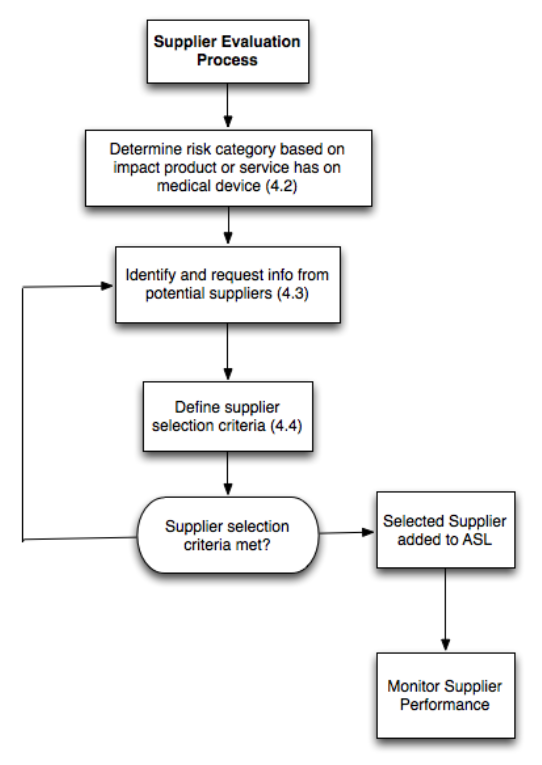

# __NewCorp__ Quality Manual
## Supplier and Purchasing Control Procedure
## SOP-002
-----------------------------------------------------------------------

# 1.0 PURPOSE

This Standard Operating Procedure (SOP) describes *minimum* requirements 
(requirements are expressed using the word **shall**) for evaluating, selecting,
and monitoring suppliers who provide products or services required for the
development or distribution of software-only medical devices by __NewCorp__.

# 2.0 SCOPE

This SOP applies to the design and development of new medical devices by 
__NewCorp__ or by third parties working under the direction of __NewCorp__.

This procedure addresses the following topics:

- Selecting and evaluating suppliers of components and services used to develop software-only medical devices

- Monitoring performance of selected suppliers

- Purchasing components and services

- Assessing and controlling risk associated with using purchased or existing items as part of a software-only medical device

This procedure applies to new product development as well as enhancements and 
maintenance to previously released software-only medical devices developed by
__NewCorp__.
  
# 3.0 REFERENCES, TERMS AND ACRONYMS

## 3.1 Regulatory References
-------------------------

1.  21 CFR Part 820 FDA Quality System Regulation, 1996

2.  ANSI/AAMI/ISO 13485:2003 Medical Devices-Quality Management Systems
    Requirements for Regulatory Purposes

3.  ANSI/AAMI/ISO 14971:2007 Medical Devices – Application of Risk
    Management for Medical Devices.

4.  FDA Guidance for the Content of Pre-market Submissions for Software
    Contained in Medical Devices, May 11, 2005

5.  FDA Guidance for Off-the-Shelf Software Use in Medical Devices,
    September 9, 1999

6.  FDA Guidance Medical Device Use-Safety: Incorporating Human Factors
    Engineering into Risk Management, July 18, 2000

7.  FDA Design Control Guidance for Medical Device Manufacturers, March
    1997

## 3.2 __NewCorp__ References 
------------------------------

1.  Quality Manual, [QM-001](QM-001--QualityManual.md)

2.  Design Control Procedure, [SOP-001](SOP-001--Design_Control.md)

3.  Risk Management Procedure, [SOP-006](SOP-006--Risk_Management.md)

4.  Non-conforming Product Process, [SOP-003](SOP-003--Non-conforming_Product.md)

## 3.3 Terms
------------------------------

- **Approved Supplier List**: The ASL is a controlled document listing approved
suppliers, subcontractors, and consultants for purchase of materials and
services.

- **Device Master Record**: The DMR is a compilation of records containing all
the individual procedures and specifications (including purchasing
requirements) for a finished device. The DMR contains all required
information required to manufacture the medical device. It includes or
references the Bill of Material (BOM) that contains detailed information
on all materials and components used to manufacture the medical device.

- **Non-conformance**: A product or service that does not comply with stated
requirements.

- **OTS component**: A standard or generic component that requires no further
processing to meet QSM Diagnostic requirements.

- **Outsourced Process**: A process that is either permanently or temporarily
contracted to a supplier that affects product conformity with __NewCorp__ 
requirements.

- **Procurement Spec**: A specification that controls the relationship between
approved suppliers and the items they are approved to supply to __NewCorp__. 
A procurement spec includes purchasing requirements to be included in the
purchase order and also specifies the incoming inspection requirements.

- **Risk**: The combination of the probability of occurrence of harm and the
severity of that harm.

- **Risk Category**: A **risk** rating of the supplier corresponding with the
**risk** of the items to be purchased.

- **Supplier**: File A file containing all documents, correspondence and
records associated with each evaluated and selected supplier.

- **Supplier Status**: Suppliers are assigned a status based on documented
compliance with this procedure.

## 3.3 Acronyms
------------

- **ASL**: Approved Suppliers List

- **CAPA**: Corrective Action / Preventive Action

- **BOM**: Bill of Materials

- **CMO**: Contract Manufacturing Organization

- **DHF**: Design History File

- **DMR**: Device Master Record

- **FAI**: First article inspection

- **NA**: Not applicable

- **NDA**: Non-disclosure agreement

- **OTS**: Off the shelf

- **RMF**: Risk Management File

  
# 4.0 PROCESS OVERVIEW 

Suppliers are evaluated, selected and monitored using the processes described in
sections 4.1 through 4.6. Consultants and contractors are evaluated, selected
and monitored using the process described in section 4.7. Section 5 identifies
records created as a result of following this procedure.

## 4.1 Supplier Evaluation Process
-------------------------------

Suppliers are evaluated and selected based on their ability to provide
products and services that meet __NewCorp__’s requirements. These
requirements are documented as **procurement specifications** and
provided to potential suppliers once they have signed the appropriate
non-disclosure agreement (NDA).

The evaluation and selection process occurs early in a development
project in order to ensure that only qualified, competent suppliers
are selected. The process is illustrated in the following figure.

> 

> Figure 1 – Supplier Evaluation Process

Once a supplier is selected, appropriate monitoring controls are
identified and applied. The type and extent of monitoring controls
applied to a supplier depends on the potential risk the purchased
product or service has on the product realization process or the final
product. This risk-based approach assigns a supplier a **risk category** 
consistent with the **risk** of the purchased product or service.

The Supplier Approval Process is initiated with a Supplier Survey,
included in Appendix A. After reviewing the completed Supplier Survey,
a Supplier Approval Record (SAR) form (included in Appendix B) is
created to document the decision to accept or reject a potential
supplier based on the supplier’s capabilities as documented in the
Supplier Survey. For suppliers being evaluated for High Risk category
items, an on-site Supplier Audit **shall** be performed. The **Risk Category** 
assigned to a supplier is documented on the SAR.

Selected suppliers are added to the Approved Suppliers List (ASL)
along with specific monitoring requirements. These requirements may
include activities such as incoming inspection, periodic audits, or
other similar monitoring activities to ensure products and services
continue to comply with stated requirements.

## 4.2 Risk Categories
-------------------------------

A risk assessment of products, components, and services being
requested from potential suppliers is performed. The objective of this
assessment is to determine the potential safety impact to patients and
users of the medical device should a non-conforming product, component
or service be provided and not be detected prior to use in the
clinical setting.

Based on this risk assessment, products, components, and services are
assigned to one of the following risk categories:

- **Risk Category High**: Products, components, or services are considered
high-risk if a product, component, or service could pose a safety hazard to the
patient or user of the finished medical device.

- **Risk Category - Low**: Products, components, or services are considered
low-risk if a product, component, or service could not pose a safety hazard to
the patient or user of the finished medical device.

## 4.3 Supplier Selection Criteria
-------------------------------

Initiating the Supplier Evaluation process begins with identifying
specific products, components or services required. __NewCorp__ **shall**:

- Determine the **risk** **category** (High or Low) for the component, product
or service to be acquired

- Determine what evidence needs to be collected to select a potential supplier
based in part on the **risk** **category**.

- Determine if the potential supplier is certified to internationally recognized
quality management standards such as ISO-9001 or ISO-13485

__NewCorp__ contacts potential suppliers of these components, products and
services and request that they complete and return a:

- Non-disclosure agreement (NDA)

- Supplier Survey shown in Appendix A

A **Supplier File shall** be created and maintained for all potential and
selected suppliers. This file is the repository for all documents, 
correspondence and records related to each potential and selected supplier.

## 4.4 Supplier Selection Process
---------------------------------------

When all requested information (including an on-site Audit Report, if
applicable) is reviewed, __NewCorp__ decides to select or reject a
supplier. The SAR form **shall** be used to document the rationale for
selecting or rejecting potential suppliers. Selected suppliers are
added to the **Approved Supplier List** with a status of **Approved.**

The Supplier Survey, the NDA, SAR form, Audit Plan and Report (if
applicable), and all correspondence, documents and records **shall**
be filed in the **Supplier File.**

## 4.5 Periodic Supplier Monitoring
-----------------------------------------

Every selected supplier on the ASL **shall** have periodic monitoring
as appropriate to ensure that products, components and services they
provide continue to comply with stated requirements. The specific
monitoring to be performed **shall** be documented and updated as
appropriate on the SAR form. Results of periodic monitoring **shall**
be filed in the **Supplier File.**

Based on the results of supplier monitoring activities, the **Supplier Status**
is changed accordingly.

## 4.6 Changes to Approved Suppliers
-------------------------------------------

The SAR form (shown in Appendix B) is used to record changes to information for
those suppliers on the ASL.

- **Change Risk Category**

If an approved supplier is being asked to provide a product that is in
a lower **risk category**, a rationale should be prepared and filed in
the **Supplier File.**

If an approved supplier is being asked to provide a product that is in
a higher **risk category**, then a re-evaluation of the Supplier
Survey is required to determine if this supplier meets requirements
for higher risk items.

A SAR form is used to document the change. A rationale approving or
rejecting this change is prepared, reviewed and approved by Quality
Assurance. All documents are filed in the **Supplier File.**

- **Change Supplier Details**

Changes to supplier details can be made by attaching the appropriate
information to the original Supplier Survey. If the change involves
moving a manufacturing process to another location, additional
information may be needed before approving this change, based on the
**risk category**.

A SAR form is used to document the proposed change. A rationale
approving or rejecting this change is prepared, reviewed and approved
by the QA Representative. All documents are filed in the **Supplier File**.

- **Change Supplier Status**

Each supplier on the ASL **shall** be assigned a supplier status as follows:

  - **Approved:** Supplier has successfully demonstrated the capability
    to consistently deliver products, components or services that
    comply with stated requirements.

  - **Probationary:** Supplier has exhibited negative trends in quality
    or delivery performance or if there are issues with the
    business relationship. Any supplier with Probationary Status
    **shall** be prohibited from providing products or services in the
    High and Medium Risk categories until such time as the trends in
    quality or delivery have improved to acceptable levels.

  - **Rejected:** Supplier does not demonstrate capability to meet
    defined requirements. Supplier **shall** not be authorized to
    provide any products or services.

Results of required periodic monitoring **shall** be used in part to
justify changes to supplier status. Any change in status requires
documentation, justification and Quality Assurance review and
approval.

## 4.7 Selection of Consultants and Contractors
----------------------------------------------

Consultants and contractors include companies and individuals that
provide services rather than products or components.

Each potential consultant and contractor **shall** be required to sign
an NDA as part of the selection process.

__NewCorp__’s personnel evaluate potential consultants and
contractors based on an assessment of a resume or curriculum vitae
(CV). Professional certifications from organizations such as American
Society for Quality (ASQ), Institute of Electrical and Electronic
Engineers (IEEE), Regulatory Affairs Professional Society (RAPS) are
also considered. Evidence of relevant training in medical device
topics (e.g., training certificates or records) is also considered.
References from medical device professionals can also be used as part
of the evaluation process.

Once the evaluation is completed, selected consultants and contractors
**shall** be required to sign a contract with __NewCorp__. The
contract **shall** define the required work products and services to
be delivered as well as any other relevant information to ensure the
work products meet __NewCorp__’ requirements.

After selected consultants and contractors sign a contract with
__NewCorp__, they are added to the ASL with a status of **Approved**.

The results of the evaluation and selection process are documented
using the SAR form. A **Supplier File** is created for each consultant
and subcontractor. All related documents (such as resumes, CVs,
references, certifications, contracts, NDAs, etc.) are filed in the
**Supplier File**.

# 5.0 RECORDS

The following records **shall** be collected and maintained in the
**Supplier File** for all potential and selected suppliers:

- Signed NDA

- Completed Supplier Survey

- SAR form

- Completed Audit Plan and Report (if applicable)

- Results of periodic monitoring of supplier performance

- Supplier Risk Category

The following records **shall** be collected and maintained in the
**Supplier File** for all consultants and subcontractors:

- Signed NDA

- Resume or CV

- Certifications and training records

# Appendix A Supplier Survey

This Supplier Survey is intended to identify qualified suppliers who are
capable of manufacturing medical devices on behalf of __NewCorp__
(referred to as the Customer).

<table>
<thead>
<tr class="header">
<th><strong>Customer Information</strong></th>
</tr>
</thead>
<tbody>
<tr class="odd">
<td><strong>Customer Name: </strong></td>
</tr>
<tr class="even">
<td><strong>Customer Address:</strong></td>
</tr>
<tr class="odd">
<td><strong>Customer Phone / Fax:</strong></td>
</tr>
<tr class="even">
<td><strong>Customer contact:</strong></td>
</tr>
<tr class="odd">
<td><strong>E-mail:</strong></td>
</tr>
<tr class="even">
<td><strong>Device to be manufactured by supplier:</strong></td>
</tr>
</tbody>
</table>

**Supplier Information**

<table>
<thead>
<tr class="header">
<th><ol style="list-style-type: decimal">
<li>
<strong>General Information</strong>
</li>
</ol></th>
</tr>
</thead>
<tbody>
<tr class="odd">
<td><strong>Company Name: </strong></td>
</tr>
<tr class="even">
<td></td>
</tr>
<tr class="odd">
<td><strong>Division or subsidiary:</strong></td>
</tr>
<tr class="even">
<td></td>
</tr>
<tr class="odd">
<td><strong>Company Address:</strong></td>
</tr>
<tr class="even">
<td><strong>Company Phone / Fax:</strong></td>
</tr>
<tr class="odd">
<td><strong>Company Web site:</strong></td>
</tr>
</tbody>
</table>

<table>
<thead>
<tr class="header">
<th><ol style="list-style-type: decimal">
<li>
<strong>Survey Contact Person</strong>
</li>
</ol></th>
</tr>
</thead>
<tbody>
<tr class="odd">
<td><strong>Name:</strong></td>
</tr>
<tr class="even">
<td><strong>Title:</strong></td>
</tr>
<tr class="odd">
<td><strong>Office Phone:</strong></td>
</tr>
<tr class="even">
<td><strong>Mobile Phone:</strong></td>
</tr>
<tr class="odd">
<td><strong>E-mail:</strong></td>
</tr>
</tbody>
</table>

<table>
<thead>
<tr class="header">
<th><ol style="list-style-type: decimal">
<li>
<strong>Supplier Business Information</strong>
</li>
</ol></th>
</tr>
</thead>
<tbody>
<tr class="odd">
<td><strong>Type of business:</strong></td>
</tr>
<tr class="even">
<td><strong>Years in business:</strong></td>
</tr>
<tr class="odd">
<td><strong>Percent total business manufacturing medical devices:</strong></td>
</tr>
<tr class="even">
<td><strong>Number Plant locations:</strong></td>
</tr>
<tr class="odd">
<td><strong>Total number employees:</strong></td>
</tr>
<tr class="even">
<td><strong>Total number employees in Quality function:</strong></td>
</tr>
<tr class="odd">
<td>
<strong>Medical device reference accounts</strong>

<blockquote>

<strong>Company name:</strong>

<strong>Contact person:</strong>

<strong>Phone / E-mail:</strong>

<strong>Company name:</strong>

<strong>Contact person:</strong>

<strong>Phone / E-mail:</strong>

<strong>Company name:</strong>

<strong>Contact person:</strong>

<strong>Phone / E-mail:</strong>

</blockquote></td>
</tr>
<tr class="even">
<td></td>
</tr>
<tr class="odd">
<td></td>
</tr>
</tbody>
</table>

<table>
<thead>
<tr class="header">
<th><ol style="list-style-type: decimal">
<li>
<strong>Bank Reference</strong>
</li>
</ol></th>
</tr>
</thead>
<tbody>
<tr class="odd">
<td><strong>Bank Name:</strong></td>
</tr>
<tr class="even">
<td><strong>Bank Address:</strong></td>
</tr>
<tr class="odd">
<td><strong>Bank Phone / Fax:</strong></td>
</tr>
<tr class="even">
<td><strong>Bank Account number:</strong></td>
</tr>
<tr class="odd">
<td><strong>Account Officer:</strong></td>
</tr>
</tbody>
</table>

1.  ***Supplier Quality Information***

    1.  Please attach a copy of Supplier’s Quality Manual.

    2.  Is there a Quality function within the organization? ( ) Yes ( )
        No

    3.  The Quality function reports to:
        \_\_\_\_\_\_\_\_\_\_\_\_\_\_\_\_\_\_\_\_\_\_\_\_\_\_\_\_

    4.  Is the Quality function independent of Manufacturing? ( ) Yes
        ( ) No

    5.  Please attach a functional organization chart (without names
        of individuals) of the company, division, or subsidiary.

    6.  Is the Supplier registered with the US Food and Drug
        Administration (FDA) as a contract manufacturer?

> ( ) Yes - please attach a copy of the FDA Establishment Registration.
>
> ( ) No - but plan to register with US FDA by
> \_\_\_\_\_\_\_\_\_\_\_\_\_\_\_

1.  Please list all internationally recognized certifications, licenses,
    or classifications (for example, ISO-9001:2008). Please attach a
    copy of all certifications.

<table>
<thead>
<tr class="header">
<th><strong>Certification:</strong></th>
<th></th>
</tr>
</thead>
<tbody>
<tr class="odd">
<td><strong>Date:</strong></td>
<td></td>
</tr>
<tr class="even">
<td><strong>Registrar:</strong></td>
<td></td>
</tr>
<tr class="odd">
<td><strong>Covered activities:</strong></td>
<td></td>
</tr>
<tr class="even">
<td><strong>Covered facilities:</strong></td>
<td></td>
</tr>
</tbody>
</table>

<table>
<thead>
<tr class="header">
<th><strong>Certification:</strong></th>
<th></th>
</tr>
</thead>
<tbody>
<tr class="odd">
<td><strong>Date:</strong></td>
<td></td>
</tr>
<tr class="even">
<td><strong>Registrar:</strong></td>
<td></td>
</tr>
<tr class="odd">
<td><strong>Covered activities:</strong></td>
<td></td>
</tr>
<tr class="even">
<td><strong>Covered facilities:</strong></td>
<td></td>
</tr>
</tbody>
</table>

<table>
<thead>
<tr class="header">
<th><strong>Certification:</strong></th>
<th></th>
</tr>
</thead>
<tbody>
<tr class="odd">
<td><strong>Date:</strong></td>
<td></td>
</tr>
<tr class="even">
<td><strong>Registrar:</strong></td>
<td></td>
</tr>
<tr class="odd">
<td><strong>Covered activities:</strong></td>
<td></td>
</tr>
<tr class="even">
<td><strong>Covered facilities:</strong></td>
<td></td>
</tr>
</tbody>
</table>

1.  ***Audit History***

Has your facility ever been audited by the US FDA, ISO Registrar or
other national regulatory agency? ( ) Yes ( ) No

1.  If yes, please identify auditing agency, dates audit was conducted,
    and audit focus:

<table>
<thead>
<tr class="header">
<th><strong>Auditing Agency:</strong></th>
<th></th>
</tr>
</thead>
<tbody>
<tr class="odd">
<td><strong>Audit Dates:</strong></td>
<td></td>
</tr>
<tr class="even">
<td><strong>Facility Audited:</strong></td>
<td></td>
</tr>
<tr class="odd">
<td><strong>Audit Focus:</strong></td>
<td></td>
</tr>
</tbody>
</table>

<table>
<thead>
<tr class="header">
<th><strong>Auditing Agency:</strong></th>
<th></th>
</tr>
</thead>
<tbody>
<tr class="odd">
<td><strong>Audit Dates:</strong></td>
<td></td>
</tr>
<tr class="even">
<td><strong>Facility Audited:</strong></td>
<td></td>
</tr>
<tr class="odd">
<td><strong>Audit Focus:</strong></td>
<td></td>
</tr>
</tbody>
</table>

<table>
<thead>
<tr class="header">
<th><strong>Auditing Agency:</strong></th>
<th></th>
</tr>
</thead>
<tbody>
<tr class="odd">
<td><strong>Audit Dates:</strong></td>
<td></td>
</tr>
<tr class="even">
<td><strong>Facility Audited:</strong></td>
<td></td>
</tr>
<tr class="odd">
<td><strong>Audit Focus:</strong></td>
<td></td>
</tr>
</tbody>
</table>

1.  ***Key Supplier Contacts***

    1.  Quality and regulatory issues:

<table>
<thead>
<tr class="header">
<th><strong>Name:</strong></th>
<th></th>
</tr>
</thead>
<tbody>
<tr class="odd">
<td><strong>Title:</strong></td>
<td></td>
</tr>
<tr class="even">
<td><strong>E-mail:</strong></td>
<td></td>
</tr>
<tr class="odd">
<td><strong>Phone:</strong></td>
<td></td>
</tr>
</tbody>
</table>

1.  Schedule and Delivery issues:

<table>
<thead>
<tr class="header">
<th><strong>Name:</strong></th>
<th></th>
</tr>
</thead>
<tbody>
<tr class="odd">
<td><strong>Title:</strong></td>
<td></td>
</tr>
<tr class="even">
<td><strong>E-mail:</strong></td>
<td></td>
</tr>
<tr class="odd">
<td><strong>Phone:</strong></td>
<td></td>
</tr>
</tbody>
</table>

1.  Manufacturing Process and Production issues:

<table>
<thead>
<tr class="header">
<th><strong>Name:</strong></th>
<th></th>
</tr>
</thead>
<tbody>
<tr class="odd">
<td><strong>Title:</strong></td>
<td></td>
</tr>
<tr class="even">
<td><strong>E-mail:</strong></td>
<td></td>
</tr>
<tr class="odd">
<td><strong>Phone:</strong></td>
<td></td>
</tr>
</tbody>
</table>

1.  ***Manufacturing Practices***

    1.  What department is responsible for disposition of non-conforming
        materials?

<table>
<tbody>
</tbody>
</table>

1.  Are manufacturing processes validated according to a defined
    protocol? ( ) Yes ( ) No

> If yes, please attach an example of a manufacturing process validation
> protocol.

1.  How are manufacturing lots defined?

<table>
<tbody>
</tbody>
</table>

1.  As part of the manufacturing process, can the supplier generate test
    data for the Device History Record (DHR)? ( ) Yes ( ) No

2.  Explain Supplier’s procedures for establishing component
    traceability to lot numbers.

<table>
<tbody>
</tbody>
</table>

1.  What software applications are used in manufacturing? Please include
    any Enterprise Resource Planning (ERP) software.

<table>
<thead>
<tr class="header">
<th><strong>Software application:</strong></th>
<th></th>
</tr>
</thead>
<tbody>
<tr class="odd">
<td><strong>Revision:</strong></td>
<td></td>
</tr>
<tr class="even">
<td><strong>Validation Date:</strong></td>
<td></td>
</tr>
<tr class="odd">
<td><strong>Validation Report:</strong></td>
<td></td>
</tr>
</tbody>
</table>

<table>
<thead>
<tr class="header">
<th><strong>Software application:</strong></th>
<th></th>
</tr>
</thead>
<tbody>
<tr class="odd">
<td><strong>Revision:</strong></td>
<td></td>
</tr>
<tr class="even">
<td><strong>Validation Date:</strong></td>
<td></td>
</tr>
<tr class="odd">
<td><strong>Validation Report:</strong></td>
<td></td>
</tr>
</tbody>
</table>

<table>
<thead>
<tr class="header">
<th><strong>Software application:</strong></th>
<th></th>
</tr>
</thead>
<tbody>
<tr class="odd">
<td><strong>Revision:</strong></td>
<td></td>
</tr>
<tr class="even">
<td><strong>Validation Date:</strong></td>
<td></td>
</tr>
<tr class="odd">
<td><strong>Validation Report:</strong></td>
<td></td>
</tr>
</tbody>
</table>

1.  How are customers notified of changes to materials and manufacturing
    processes?

<table>
<thead>
<tr class="header">
<th><strong>Material changes:</strong></th>
<th></th>
</tr>
</thead>
<tbody>
<tr class="odd">
<td><strong>Process changes:</strong></td>
<td></td>
</tr>
</tbody>
</table>

1.  What procedures are used to obtain customer approval BEFORE making
    changes to materials or manufacturing procedures?

<table>
<thead>
<tr class="header">
<th><strong>Material changes:</strong></th>
<th></th>
</tr>
</thead>
<tbody>
<tr class="odd">
<td><strong>Process changes:</strong></td>
<td></td>
</tr>
</tbody>
</table>

1.  How are create Device History Records (DHRs) created, maintained and
    provided to the customer?

<table>
<tbody>
</tbody>
</table>

1.  What mechanism is used for lot travellers?

<table>
<tbody>
</tbody>
</table>

1.  How is the decision made to ship product to the customer?

<table>
<tbody>
</tbody>
</table>

1.  Does the Quality function have the authority to stop shipments?

<table>
<tbody>
</tbody>
</table>

1.  How are non-conforming materials labeled and segregated? Please
    attach an example of a Non-conforming Materials procedure.

2.  How are corrective and preventive actions (CAPA) initiated? Please
    attach an example of a CAPA procedure.

3.  Does the CAPA Procedure apply to sub-contractor issues?

4.  Does the CAPA Procedure apply to customer issues?

5.  What statistical sampling plans (such as ANSI Z1.4) are routinely
    used?

6.  Are documented calibration and preventive maintenance procedures
    routinely used? Please attach examples of both.

7.  Is there a documented Disaster Recovery Plan and/or Business
    Contingency Plan? If so, please provide copies.

<!-- -->

1.  ***Signature***

\_\_\_\_\_\_\_\_\_\_\_\_\_\_\_\_\_\_\_\_\_\_\_\_\_\_/\_\_\_\_\_\_\_\_\_\_\_\_\_\_\_\_\_\_\_\_\_\_\_\_\_\_

**Signature** and **printed name** of person completing this survey:

**Title:** \_\_\_\_\_\_\_\_\_\_\_\_\_\_\_\_\_\_\_\_

**Date:** \_\_\_\_\_\_\_\_\_\_\_\_\_\_\_\_\_\_\_\_

Please provide the completed survey and all requested attachments to the
Customer Contact listed in the Customer Information above.

  
Appendix B Supplier Approval Record
=================================================================================================================================

**SUPPLIER APPROVAL RECORD (SAR)**

**Supplier:**
\_\_\_\_\_\_\_\_\_\_\_\_\_\_\_\_\_\_\_\_\_\_\_\_\_\_\_\_\_\_\_\_\_\_\_\_\_\_\_\_\_\_
**Date:** \_\_\_\_\_\_\_\_\_\_\_\_\_

**Product or service provided to __NewCorp__:**
\_\_\_\_\_\_\_\_\_\_\_\_\_\_\_\_\_\_\_\_\_\_\_\_\_\_\_\_\_\_\_\_\_\_\_\_\_\_\_\_\_\_\_\_\_\_\_\_\_\_\_\_\_\_\_\_\_\_\_\_\_\_\_\_\_\_\_\_\_\_

**Risk Category (High or Low):** \_\_\_\_\_\_\_\_\_\_\_ **Consultant or
subcontractor?** \_\_\_\_\_\_\_

<table>
<thead>
<tr class="header">
<th><strong>Criteria</strong></th>
<th>
<strong>Met requirements?</strong>

<strong>(Yes, No, N/A)</strong>
</th>
<th><strong>Comments</strong></th>
</tr>
</thead>
<tbody>
<tr class="odd">
<td>__NewCorp__ Supplier Survey questionnaire completed?</td>
<td></td>
<td></td>
</tr>
<tr class="even">
<td>
Proof of Quality System registration (attach)

Type : _________________, _________________

(ISO 9001, ISO 13485 etc.)

Expiry date of certificates: _________, _________
</td>
<td></td>
<td></td>
</tr>
<tr class="odd">
<td>On-site Audit Report</td>
<td></td>
<td></td>
</tr>
<tr class="even">
<td>Supplier Quality Manual Reviewed?</td>
<td></td>
<td></td>
</tr>
<tr class="odd">
<td>Control Plan Evaluated?</td>
<td></td>
<td></td>
</tr>
<tr class="even">
<td>Product evaluation – including FAI?</td>
<td></td>
<td></td>
</tr>
<tr class="odd">
<td>Non-disclosure agreement signed?</td>
<td></td>
<td></td>
</tr>
<tr class="even">
<td>Resume / CV (consultants and subcontractors)?</td>
<td></td>
<td></td>
</tr>
<tr class="odd">
<td>Contract/service agreement in place?</td>
<td></td>
<td></td>
</tr>
<tr class="even">
<td>Training Records (consultants and subcontractors)?</td>
<td></td>
<td></td>
</tr>
<tr class="odd">
<td>
Other (specify)

Example: references from supplier’s clients
</td>
<td></td>
<td></td>
</tr>
</tbody>
</table>

**NOTES: **

-   Attach applicable copies of questionnaire, certificates, control
    plan, quality manual, CV, site audit report, and FAI report and
    agreement document

-   Retain all above documentation in the Supplier File

**SUPPLIER APPROVAL RECORD**

**DECISION:**

**Approve:** \_\_\_\_\_\_\_\_ **Reject:** \_\_\_\_\_\_\_\_\_\_\_\_
(attach rationale)

**APPROVAL SIGNATURES:**

**Purchasing**

Name: \_\_\_\_\_\_\_\_\_\_\_\_\_\_\_\_\_\_\_\_\_
Signature:\_\_\_\_\_\_\_\_\_\_\_\_\_\_\_\_\_ Date:
\_\_\_\_\_\_\_\_\_\_\_

**Quality Assurance**

Name:
\_\_\_\_\_\_\_\_\_\_\_\_\_\_\_\_\_\_\_\_\_Signature:\_\_\_\_\_\_\_\_\_\_\_\_\_\_\_\_\_\_
Date: \_\_\_\_\_\_\_\_\_\_\_

**Subject matter expert **

Name: \_\_\_\_\_\_\_\_\_\_\_\_\_\_\_\_\_\_\_\_Signature:
\_\_\_\_\_\_\_\_\_\_\_\_\_\_\_\_\_\_Date: \_\_\_\_\_\_\_\_\_\_\_\_

(Representation from Engineering, R&D, or other functional group)
