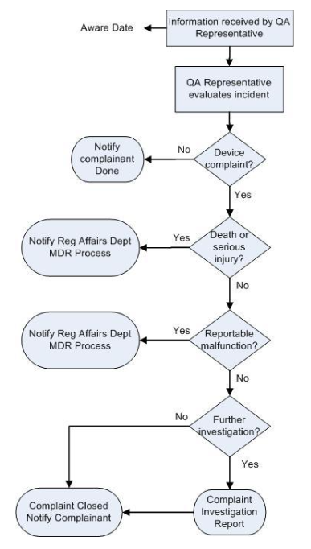

# __NewCorp__ Quality Manual
## Complaint Handling and Medical Device Report Procedure
## SOP-003
-----------------------------------------------------------------------

# 1.0 PURPOSE

This Standard Operating Procedure (SOP) provides *minimum*
requirements (requirements are expressed using the word ***shall**)*
for the process of receiving, documenting, evaluating, investigating,
trending, and closing complaints related to software-only medical
devices developed by __NewCorp__.

This procedure also describes the process for reviewing, documenting,
evaluating, and processing complaints related to software-only medical
devices developed by __NewCorp__ that meet established FDA criteria
for reportable events.

# 2.0 SCOPE

This SOP applies to the use of new software-only medical devices
developed by __NewCorp__. This SOP also applies to modifications
made to existing software-only medical devices previously developed by
__NewCorp__.

This SOP does not apply to research activities.

# 3.0 REFERENCES, TERMS AND ACRONYMS

## 3.1 Regulatory References
-------------------------

1.  21 CFR Part 820 FDA Quality System Regulation, 1996

2.  21 CFR Part 803 Medical Device Reporting, 1995

3.  ANSI/AAMI/ISO 13485:2003 Medical Devices-Quality Management Systems
    Requirements for Regulatory Purposes

4.  ANSI/AAMI/ISO 14971:2007 Medical Devices – Application of Risk
    Management for Medical Devices.

5.  FDA Guidance: “How to Report a Problem (Medical Devices)” located
    at: http://www.fda.gov/MedicalDevices/Safety/ReportaProblem/default.htm

6.  FDA Guidance “Medical Device Reporting for Manufacturers” provides
    all the information necessary for MDR reporting.

## 3.2 __NewCorp__ References 
------------------------------

1.  Quality Manual, QM-001

2.  Design Control Procedure, SOP-001

3.  Document and Record Control Procedure, SOP-008

4.  Corrective and Preventive Action Procedure, SOP-011

## 3.3 Other References
--------------------

Robitaille, D., *Root Cause Analysis – Basic Tools and Techniques*,
Paton Press, 2004

## 3.4 Terms
---------

- **Aware Date**: The date __NewCorp__ becomes aware of a complaint.

- **Caused or contributed to**: A device may have “caused or contributed to” a 
death or serious injury, if the death or serious injury was or may
be attributed to the device, or the device may have been a factor in the
death or serious injury because of device failure or malfunction,
improper or inadequate design, manufacture, labeling, instruction or
user error.

- **Complaint**: A complaint is defined as any written, electronic, or oral
communication that alleges deficiencies related to the identity,
quality, durability, reliability, safety, effectiveness, or performance
of a device after it is released for distribution. ```[21CFR 820.3(b)]```

- **Complainant**: Any person reporting a potential complaint.

- **Malfunction**: A malfunction is the failure of a device to meet its
performance specifications or to perform as intended. The intended
performance refers to the intended use for which the device is labeled
or marketed.

- **Medical Device Report**: FDA regulation 21CFR 803 that requires
manufacturers to report to the FDA incidents where death or serious
injury or their potential may have or could have occurred. Medical
Device Reports are referred to as MDRs.

- **Permanent**: Irreversible impairment or damage to a body structure or
function, excluding trivial impairment or damage.

- **Reportable Event**: A complaint that has been reviewed by Regulatory
Affairs and that reasonably suggests that a device:

  - May have caused or contributed to a death or serious injury, or

  - Has malfunctioned and that the device would be likely to cause or
    contribute to a death or serious injury if the malfunction were
    to recur.

  - A device that shows no malfunction or deterioration, but
    nevertheless has a characteristic which is likely to cause or
    contribute to a death or a serious deterioration in the state
    of health or serious injury (example: omissions or
    inaccuracies in the instructions leaflet), should be reported
    as a near incident.

  A reportable event is often referred to as an MDR.

- **Serious Injury**: An injury or illness that:

  - Is life-threatening

  - Results in **permanent** impairment of a body function or
    **permanent** damage to a body structure, or

  - Necessitates medical or surgical intervention to preclude permanent
    impairment of a body function or permanent damage to a
    body structure.

## 3.5 Acronyms
------------

- **CAPA**: Corrective Action / Preventive Action

- **CFR**: Code of Federal Regulations

- **DHF**: Design History File

- **DMR**: Device Master Record

- **IFU**: Indications for Use

- **MDR**: Medical Device Report

- **NA**: Not applicable

- **QM**: Quality Manual

- **QMS**: Quality Management System

- **QSR**: Quality System Regulation

- **SOP**: Standard Operating Procedure

- **SRS**: Software Requirements Specification

- **WI**: Work Instruction

# 4.0 COMPLAINT PROCESS

## 4.1 Overview
------------

A complaint is defined as any written, electronic, or oral
communication that alleges deficiencies related to the identity,
quality, durability, reliability, safety, effectiveness, or
performance of a medical device after it is released for distribution.

Complaints can originate with patients, users (clinicians), any
__NewCorp__ employee, and contractors working under __NewCorp__’
direction, or any other source. Complaints can be expressed verbally
or in writing.

This procedure applies to complaints received from any source
regarding software-only medical devices developed by __NewCorp__.
The types of complaints are covered by this procedure include:

- **PERFORMANCE:** the medical device in some way does not perform to
  user's expectation or to any level of functionality or usability as
  conveyed to users in writing via printed labeling or verbally by
  __NewCorp__ employees.

- **SAFETY:** the medical device is in some way thought to be unsafe.

- **RELIABILITY:** the observed failure rate or need for service
  adjustments of the medical device is greater than the
  user’s expectation.

- **APPEARANCE:** visual defects are inconsistent with the user's
  expectations for a medical device.

- **GENERAL:** these include delayed or unacceptable responses to
  reported problems, unfulfilled promises, etc.

- **MDR REPORTABLE EVENTS:** these include all complaints involving
  device-related deaths, serious injuries as well as malfunctions that
  could have caused death or serious injury.

The complaint process is shown in the figure below.

> 

> Figure 1 – The complaint process

The __NewCorp__ QA Representative **shall** be the designated unit
for receiving and processing all complaints related to medical devices
developed by __NewCorp__.

The QA Representative **shall** initiate and maintain a **Complaint File** for 
each type of medical device. The **Complaint File** **shall** contain a paper 
record of all complaints, investigations, related reports and data, as well as 
all Medical Device Reports (MDRs) and related documentation and communication 
with FDA.

__NewCorp__ Regulatory Affairs Representative **shall** review all
complaints for potential reportable events (MDRs). If a complaint is
received that meets the definition of a reportable event, the
Regulatory Affairs Representative **shall** work with the QA
Representative to coordinate the activities required to comply with
the Medical Device Reporting regulation (21 CFR Part 803).

## 4.2 Receiving and Documenting Complaints 
-----------------------------------------

The QA Representative is the designated unit for receiving all
**complaints** related to medical devices manufactured by
__NewCorp__. The date the **complaint** is received by the QA
Representative is considered as the **Aware Date**. The **Aware Date**
is a critical date should the complaint meet the definition of a
reportable event (MDR).

All **complaints** are recorded in a **Complaint Handling System**. A
paper copy of every **complaint** is printed and filed in the
**Complaint File** established and maintained by the QA Representative
for each type of medical device.

One key aspect of receiving a **complaint** is capturing the
information (verbal or written) provided by the complainant using the
*complainant’s exact words*. The words of the complainant need to be
recorded exactly as stated – an interpretation of the complainant’s
words is **not** acceptable.

When the QA Representative receives information that meets the
definition of a **complaint**, the following is recorded in the
**Complaint Handling System**:

- Name, address, phone number, and e-mail address of the complainant

- __NewCorp__ facility and department where the complainant used
  the medical device

- Date complaint was received by the QA Representative - this is the
  **Aware Date**

- *Exact words* used by the complainant when reporting the incident

- Context or medical procedure within which the medical device was
  being used

- Patient impact (i.e., death, serious injury, or none) resulting from
  use of the medical device

- Medical device identifying information (such as model number, serial
  number, software version, etc.)

Each **complaint** is assigned a unique complaint number for tracking
purposes and is entered into the Complaint Handling System.

Refer to the example Complaint Form included in Appendix A.

## 4.3 Evaluating Complaints
-------------------------

The QA Representative **shall** perform an initial evaluation of every
reported incident. This initial evaluation is focused on determining
if the reported incident meets the definition of a **complaint.**

### 4.3.1 Incidents that do not meet the definition of a complaint

Some examples of incidents that do not meet the definition of a
**complaint** include:

1.  A request to add additional features or capabilities to the medical
    device

2.  A request to changes to existing features or capabilities already
    included in the medical device

3.  A request for a missing or replacement part or component that was
    not initially provided

Incidents that do not meet the definition of a complaint are entered
into the complaint system and identified as “Not a complaint” with an
appropriate justification. A written or verbal response is provided to
the complainant explaining the incident and any appropriate corrective
action that is to be provided. Once this is done, no further action is
required.

### 4.3.2 Incidents that do meet the definition of a complaint

Some examples of incidents that do meet the definition of a
**complaint** include incidents that:

1.  Resulted in death or serious injury to patients

**The** QA Representative **shall contact __NewCorp__ Regulatory
Affairs Representative** **immediately upon receiving information that
indicates the medical device may have contributed to death or serious
injury.**

In this case, the QA Representative **shall** enter the complaint into
the Complaint Handling System. __NewCorp__ Regulatory Affairs
Representative **shall** review the complaint with the QA
Representative in order to determine if the incident meets the
definition of a reportable event (MDR) as described in Section 5.0.

2.  Represented a potential device malfunction

**The** QA Representative **shall contact __NewCorp__ Regulatory
Affairs Representative** **immediately upon receiving a complaint that
indicates the medical device may have malfunctioned and such
malfunction, if it recurred, could contribute to death or serious
injury.**

In this case, the QA Representative **shall** enter the complaint into
the Complaint Handling System. __NewCorp__ Regulatory Affairs
Representative **shall** review the complaint with the QA
Representative in order to determine if the incident meets the
definition of a reportable event (MDR) as described in Section 5.0.

3.  Represented potential misuse of the medical device (as determined by
    the statement of intended use) and such misuse may have caused or
    contributed to death or serious injury

**The** QA Representative **shall** contact __NewCorp__ Regulatory
Affairs Representative immediately upon receiving information that
indicates the medical device may have caused or contributed to death
or serious injury as a result of device misuse. **

In this case, the QA Representative **shall** enter the complaint into
the Complaint Handling System. __NewCorp__ Regulatory Affairs
Representative **shall** review the complaint with the QA
Representative in order to determine if the incident meets the
definition of a reportable event (MDR) as described in Section 5.0.

4.  Alleged deficiencies related to the identity, quality, durability,
    reliability, safety, effectiveness, or performance of the medical
    device

In this case, the QA Representative **shall** enter the complaint into
the Complaint Handling System.

If the initial evaluation of an incident determines that the incident
does in fact meet the definition of a **complaint,** the complaint is
entered into the Complaint Handling System and a complaint
investigation is then performed (as described below). The complainant
is informed (verbally or in writing) that a complaint investigation is
being performed and that they will be notified of the outcome of the
investigation when it is completed.

## 4.4 Investigating Complaints
----------------------------

The focus of investigating **complaints** is to determine the root
cause(s) of the incident that is the focus of the **complaint.**

The QA Representative notifies the Project Manager that an incident
has been reported that meets the definition of a **complaint** and
therefore needs to be investigated.

### 4.4.1 Investigation Team

An Investigation Team is formed to investigate all complaints. The
team consists of at least one member of the Development Team and the
QA Representative. Additional team members may be added as needed.

The Development Team representative leads the investigation by
performing a review of all relevant facts and all relevant design
documents created during the development phase (such as the product
requirements, test plans and reports, etc.).

Root cause analysis methods and techniques are employed to help
determine root cause. ```[Refer to Robitaille, D., *Root Cause Analysis
– Basic Tools and Techniques*, Paton Press, 2004]```

The QA Representative’s role on the Investigation Team is to ensure
that the investigation is performed in a timely manner and that the
underlying root cause(s) is identified.

### 4.4.2 Return of Medical Devices for Investigation

If return of the medical device that is the subject of the
**complaint** is necessary, then the Investigation Team makes
appropriate arrangements to have the medical device returned.

### 4.4.3 Complaint Investigation Report

The Investigation Team **shall** prepare a report that includes the
following information, as appropriate:

1.  Applicable medical device model and serial numbers, software
    versions, fault codes and other diagnostic information

2.  A description of the problem from the complaint record

3.  A description of investigation and results that includes a summary
    of actions taken to complete the investigation, what conclusions
    were made, description of any experiments performed with a summary
    of results, includes pictures when applicable

4.  One or more identified root causes – supported by data

5.  A brief complaint investigation summary to be included in the
    original complaint.

6.  Indication of whether deficiencies have been identified in the
    medical device

7.  References to related documents, supporting material, meeting
    minutes that are attached

8.  References to any records related to the investigation

The report **shall** be signed by the author and reviewed by a senior
member of the Development Team. The QA Representative **shall** review
and approve the Complaint Investigation Report. The QA Representative
**shall** attach the Complaint Investigation Report to the original
complaint. The updated complaint is filed in the Complaint File (see
section 6).

The Investigation Team **shall** recommend appropriate and reasonable
corrective and/or preventive actions (CAPAs) needed to address
deficiencies uncovered as a result of the investigation. Any CAPAs
resulting from the investigation **shall** be indicated on the
complaint record and initiated as appropriate. Refer to the
__NewCorp__ Medical Device Corrective and Preventive Action
Procedure, SOP-011.

## 4.5 Trending of Complaints
--------------------------

The QA Representative is responsible for performing trend analysis on
complaint records to identify any trends that could result in harm to
patients. The trend analysis is discussed with Executive Management as
part of the Management Review as defined in the __NewCorp__ Medical
Device Quality Manual, QM-001.

## 4.6 Closing Complaints
----------------------

The QA Representative **shall** be responsible for closing complaints.
The original complainant is notified in writing when a complaint is to
be closed and provided with a summary (extracted from the complaint
record) documenting the investigation and any corrective actions taken
to address the complaint. A record of this notification is included in
the complaint record.

Complaints are considered closed when the following records have been
filed in the Complaint File:

- Updated Complaint Record

- Complaint Investigation Report

- Evidence written notification of the complaint resolution has been
  provided to the complainant

- If a CAPA was associated with a complaint, the CAPA **shall** be
  completed and the effectiveness check performed, as described in the
  Corrective and Preventive Action Procedure, SOP-011.

# 5.0 REPORTABLE EVENTS

## 5.1 Overview
------------

A reportable event (MDR) is a complaint that represents an event that
must be reported to FDA. A reportable event suggests that a device may
have caused or contributed to a death or serious injury. These
complaints are considered **adverse events**. Complaints also include
reports that a device has malfunctioned.

A **malfunction** is reportable when it is likely to cause or
contribute to a death or serious injury if it were to recur. A
**malfunction** is reportable if any of the following is true:

-   the chance of it causing or contributing to a death or serious
    injury is not remote or minute,

-   it affects the device in a catastrophic manner that may lead to a
    death or serious injury,

-   it causes the device to fail to perform its essential function and
    compromises the effectiveness which could cause or contribute to a
    death or serious injury,

-   device is a long-term implant or is life-supporting or life
    sustaining,

-   action is taken or would be required to be taken to reduce a risk to
    health as a result of the malfunction,

-   the same malfunction has actually caused or contributed to a death
    or serious injury in the past.

## 5.2 Reporting Requirements
--------------------------

21 CFR 803 defines FDA’s medical device reporting requirements.
Section 803.3(2) describes responsibility to report events based upon
the **aware date**:

The following reports are submitted to FDA using Form FDA 3500A:

<table>
<thead>
<tr class="header">
<th><strong>WHAT TO REPORT</strong></th>
<th><strong>WHEN</strong></th>
</tr>
</thead>
<tbody>
<tr class="odd">
<td>30 day reports of deaths, serious injuries and malfunctions</td>
<td>Within 30 calendar days from becoming aware of an event</td>
</tr>
<tr class="even">
<td>5-day reports of events that require remedial action to prevent an unreasonable risk of substantial harm to the public health and other types of events designated by FDA</td>
<td>Within 5 work days from becoming aware of an event</td>
</tr>
</tbody>
</table>

## 5.3 MDR Process
---------------

### 5.3.1 Employee Requirement to Report Incidents 

In the event that any __NewCorp__ employee becomes aware of an
incident that reasonably suggests that a medical device manufactured
by __NewCorp__ may have malfunctioned and/or contributed to a death
or serious injury, they **shall** immediately notify the QA
Representative. The QA Representative **shall** document the details
of the incident and obtain all information required to document a
device complaint.

### 5.3.2 Determination of a Reportable Event 

If a complaint indicates that a medical device manufactured by
__NewCorp__ has malfunctioned, the QA Representative notifies
__NewCorp__ Regulatory Affairs Representative

The QA Representative determines if the malfunction is likely to cause
death or serious injury.

If a death or serious injury has occurred, or it is clear that a death
or serious injury is likely to occur, then the QA Representative
notifies __NewCorp__ Regulatory Affairs Representative

__NewCorp__ Regulatory Affairs Representative initiates and
coordinates the reporting activities.

The QA Representative reviews all device complaints to determine if
the incident is reportable. An initial review is normally performed
within five (5) business days of entry of the device complaint into
the database. A second review is performed after reviewing and
approving the completed Complaint Investigation (if applicable)
related to the complaint. These reportable event reviews include a
rationale for the decisions made, which remains a part of the
complaint record.

In those cases where the medical consequences of the incident or
investigation are still not clear or obvious, then the QA
Representative has the option to initiate a health hazard evaluation
to assess the risks of the issue to the patient, and if necessary also
request the opinion of a medical professional qualified to assess the
medical impact to the patient. Records of these activities are
retained with the complaint record.

# 6.0 RECORDS

The following records are created and filed in the Complaint File for
each type of device as a result of executing this procedure. Record
retention requirements are specified in the Document and Records
Control Procedure, SOP-008.

-   **Incidents**

All incidents are documented and maintained in the Complaint File for
each type of medical device

-   **Complaints**

All complaints are documented and maintained in the Complaint File for
each type of medical device

-   **Complaint Investigation Reports**

    All complaint investigations are documented and maintained in the
    Complaint File for each type of medical device

-   **Medical Device Reports (MDRs) \[§803.18(b)(1)\]**

Manufacturers are to maintain records related to an event (whether
reportable or not) for two years from the date of the event or a
period equivalent to the expected life of the device, whichever is
longer. MDR files may incorporate references to other information
sources such as medical records, patient files, and engineering
reports.

MDR files must contain:

-   information related to the event, including all documentation of
    deliberations and decision-making processes used to decide whether
    the event was or was not reportable; and

-   the original or a copy of the initial record complaint/event. This
    record should include the available information needed to complete
    the Form 3500A. The record may be a documented telephone call, a
    letter or facsimile, a service report, documents related to a
    lawsuit, a voluntary Form 3500 received from a health care
    professional or consumer, or a mandatory Form 3500A received from a
    user facility and/or a distributor,

-   copies of any records documenting the firm’s attempts to follow-up
    and obtain missing or additional information about the event. When
    the manufacturer cannot obtain information, they must write an
    explanation of these events for inclusion in the file. In addition,
    there must be an explanation of why any missing information,
    required by the MDR regulation, was not obtained and submitted.

-   copies of any test reports, laboratory reports, service records and
    reports, and records of investigations.

-   copies of all documentation involving the final assessment of the
    event, any deliberation and/or decision making processes used to
    determine whether an MDR report was or was not needed. When
    applicable, the final assessment should indicate what action
    (if any) the firm took to assure that the cause of the event is
    corrected or otherwise mitigated.

-   copies of all Form 3500As submitted to FDA, when applicable. This
    includes a copy of any Form 3500As received from user facilities
    and distributors.

-   documents verifying that the event has been evaluated in accordance
    with the applicable requirements of 21 CFR 820.198.

-   references to any other relevant documents or information used
    during assessment.

# APPENDIX A COMPLAINT FORM

TBD

# APPENDIX B SUMMARY OF REPORTING REQUIREMENTS

Reporting timeframes for 5, 10, and 30-day reports start the day after
the **aware date**. Report is to be sent within the time specified
below.

<table>
<tbody>
<tr class="odd">
<td></td>
<td><p><strong>MDR Action </strong></p>
<p><strong>Timeframe to file MedWatch Report (Form 3500A) with FDA</strong></p></td>
</tr>
<tr class="even">
<td></td>
<td></td>
</tr>
<tr class="odd">
<td>A malfunction was to occur that requires immediate remedial action to prevent an unreasonable risk of substantial harm to the public health.</td>
<td><p>Yes</p>
<p>Initial Report</p>
<p>5 working days</p></td>
</tr>
<tr class="even">
<td>The FDA has identified an event, and submitted a written request to file a report, for all subsequent events of the same nature that involve similar devices for a specified time period.</td>
<td><p>Yes</p>
<p>5 working days</p></td>
</tr>
<tr class="odd">
<td>Information reasonably suggests a death or serious injury has occurred and was caused or contributed to by a device manufactured by our company.</td>
<td><p>Yes</p>
<p>30 days</p></td>
</tr>
<tr class="even">
<td>A malfunction has occurred with a device manufactured by our company and would be likely to cause or contribute to a death or serious injury if the malfunction were to recur.</td>
<td><p>Yes</p>
<p>30 days</p></td>
</tr>
<tr class="odd">
<td>An FDA baseline report has not been filed for the product.</td>
<td><p>Submit form 3417,</p>
<p>with MDR</p></td>
</tr>
<tr class="even">
<td>Additional information becomes available after the initial report has been submitted.</td>
<td>Supplemental Report</td>
</tr>
<tr class="odd">
<td>A systematic Recall has been initiated due to risk of Death or Serious Injury (reported to a Regulatory Agency)</td>
<td><p>No</p>
<p>Submit Report</p>
<p>Within 10 working days</p>
<p>of initiating action</p></td>
</tr>
</tbody>
</table>
