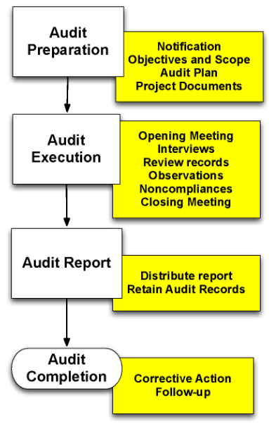

# __NewCorp__ Quality Manual
## Internal and External Autid Procedures
## SOP-005
-----------------------------------------------------------------------

# 1.0 PURPOSE

This procedure provides *minimum* requirements (requirements are
expressed using the word ***shall**)* for performing internal and
external audits of the __NewCorp__  Quality Management System.
Results of all audits **shall** be reviewed with Executive Management
as part of the Management Review, as defined in the Quality Manual,
QM-001.

This procedure also provides requirements for the conduct of external
audits conducted by regulatory agencies such as FDA.

# 2.0 SCOPE

Periodic internal audits **shall** be performed according to the
procedures contained in this SOP. These audits **shall** cover all
aspects of the __NewCorp__  Quality Management System, including:

-   Software Development

-   Design Controls

-   Risk Management

-   Verification and Validation

-   Purchasing and Supplier Controls

-   Document and Record Controls

-   Installation and Service Controls

-   Control of Non-conforming Product

-   Corrective and Preventive Action (CAPA)

-   Complaint Handling and Medical Device Reporting

# 3.0 REFERENCES, TERMS AND ACRONYMS

## 3.1 Regulatory References
-------------------------

1.  21 CFR Part 820 FDA Quality System Regulation, 1996

2.  ANSI/AAMI/ISO 13485:2003 Medical Devices-Quality Management Systems
    Requirements for Regulatory Purposes

3.  ANSI/AAMI/ISO 14971:2007 Medical Devices – Application of Risk
    Management for Medical Devices.

4.  FDA Design Control Guidance for Medical Device Manufacturers, March
    11, 1997

5.  ISO-19011:2011 Guidelines for auditing management systems

## 3.2 __NewCorp__  References 
------------------------------

1.  Quality Manual, QM-001

2.  Design Control Procedure, SOP-001

3.  Supplier and Purchasing Controls, SOP-002

4.  Control of Non-conforming Product, SOP-003

5.  Complaint Handling and Medical Device Reporting, SOP-004

6.  Risk Management, SOP-006

7.  Design Reviews, SOP-007

8.  Document and Record Control Procedure, SOP-008

9.  Installation and Service Controls, SOP-010

10. Corrective and Preventive Action (CAPA) Procedure, SOP-011

11. Software Development Procedure, SOP-012

## 3.3 Terms
---------

Audit A systematic and independent examination to determine whether
quality activities and related results comply with planned
arrangements and whether these arrangements are implemented
effectively and are suitable to achieve objectives.

Audit observation A statement of fact made during an audit that is
substantiated by objective evidence.

Auditee The organization or project that is the subject of an audit.

Auditor A person with relevant qualifications and competence to
perform audits and who is part of or is authorized by __NewCorp__ .

Design History File The design history file (DHF) contains or
references the documentation necessary to demonstrate that the design
was developed in accordance with the approved design plan and
associated procedures.

Device Master Record The device master record (DMR) is a compilation
of records containing the procedures and specifications for a finished
device.

Lead Auditor A person who has participated in several internal audits
and who is designated to plan and execute an audit by themself or with
additional auditors.

Nonconformity The nonfulfillment of specified requirements with the
planned arrangements. Synonymous with noncompliance, deficiency.

Objective evidence Verifiable information or records pertaining to the
quality of an item or service or to the existence and implementation
of a quality system element, which is based on visual observation,
measurement or test.

## 3.4 Acronyms
------------

- **CAPA**: Corrective Action / Preventive Action

- **CFR**: Code of Federal Regulations

- **DHF**: Design History File

- **NA **:Not applicable

- **QM**: Quality Manual

- **QMS**: Quality Management System

- **QSR**: Quality System Regulation

- **RMF**: Risk Management File

- **SOP**: Standard Operating Procedure

- **WI**: Work Instruction

  
# 4.0 INTERNAL AUDIT PROCESS 

## 4.1 General Audit Principles
----------------------------

### 4.1.1 Independence

The audit process should ensure objectivity and impartiality. Auditors
should perform their duties in an independent and objective manner
avoiding any potential conflicts of interest. Auditors cannot audit
their own work or areas in which they are directly involved.

### 4.1.2 Competence of Auditors

Auditors shall have demonstrated competence in performing and leading
audits. Auditors shall have the necessary technical and regulatory
competence to cover the scope of the audit. Specific topics where
demonstrated competence is required include:

-   Applicable regulatory, statutory, and safety requirements

-   Appropriate medical device technologies and development processes

-   Auditing of medical device manufacturers’ quality system

CorticMetrics’ Management Representative is responsible for
qualifying, training and assigning internal auditors. ISO 19011:2011
provides guidelines on competence and attribute requirements for
internal quality auditors.

Minimum criteria for internal quality auditors include:

-   **Education:** Bachelor’s degree in science or related field

-   **Experience:** Two years in a medical device or within an ISO
    certified environment (Note: The experience requirement may be
    waived if candidates demonstrate personal attributes and skills
    stated in ISO 19011.)

-   **Training:** 16 hours of training, external or in-house, plus 3
    days auditing experience. (Note: The training can be by an external
    course or seminar provided by a qualified institution such as a
    registrar, accredited training organization, or in-house training
    provided by a qualified consultant/trainer. For training in-house,
    the trainer must have had formal Lead Auditor training.)

Internal auditor candidates who lack any auditing experience must
perform a minimum of three (3) days of auditing with a qualified Lead
Auditor as provisional auditor. The Lead Auditor reviews the
performance of the provisional auditor and documents this review in
the employee’s training record. Upon satisfactory completion of the
3-day auditing, the Lead Auditor confirms the qualification of the
auditor and updates the auditor’s training records.

### 4.1.3 Audit Frequency

The entire Quality Management System (QMS) will be audited at least
once a year. The QMS includes all topic areas identified in section 2
above. Each topic area can be the focus of one or more audits so long
as the entire QMS is audited at least once annually. The Management
Representative is responsible for creating an annual audit schedule as
described in section 4.2.1 below.

### 4.1.4 Audit Planning

During the planning stages, the Lead Auditor defines the audit
objectives and scope. The objectives define what is to be accomplished
and the scope establishes boundaries and identifies what is to be
examined. An Audit Plan (see Appendix A) shall be prepared for each
internal audit. The audit plan shall be reviewed and signed by the
Lead Auditor, the Management Representative, and the auditee.

### 4.1.5 Audit Process 

The audit process described in the sections below shall be followed
for all internal audits.

### 4.1.6 Audit Report

The Audit Report is the mechanism for communicating the results of an
audit. The Lead Auditor shall prepare an Audit Report for each audit
conducted. The Audit Report shall reference the approved Audit Plan,
the regulations and standards used, the audit methodology,
nonconformities found, conclusions (supported by evidence) and any
recommendations.

All Audit Reports are reviewed at periodic Management Reviews.

### 4.1.7 Corrective Action in Response to Audit Report

The auditee is expected to take corrective actions to correct any
nonconformities found in an audit. Corrective actions are typically
identified using the Corrective and Preventive Action (CAPA)
Procedure, SOP-011. The Management Representative is responsible for
following up with the auditee to ensure that corrective actions are
identified, implemented and are effective.

### 4.1.8 Resources 

In order to ensure audits are effective, there needs to be adequate
resources (competent staff, financial support, time, technical
information, external expertise, etc.) allocated by Executive
Management for this purpose.

## 4.2 Responsibilities
--------------------

### 4.2.1 Management Representative

The Management Representative or designee shall be responsible for
coordinating periodic internal audits of those projects covered by
this quality manual. Where applicable, these audits shall focus on:

-   Project Design History File (DHF) contents

-   Project Team compliance with applicable SOPs and WIs

-   Training employees and third parties in applying applicable SOPs and
    WIs

The Management Representative coordinates all internal audit
activities.

The Management Representative selects a qualified Lead Auditor and
works with the Lead Auditor and auditee to plan and coordinate the
audit. The Management Representative is responsible for maintaining
project documents and records (e.g., DHF, employee training records,
etc.) that may be reviewed during an audit. During an audit, the
Management Representative is responsible for retrieving documents and
records as requested by the Lead Auditor.

For planning purposes, the Management Representative prepares an
annual schedule of audits that are to be conducted in the coming year.
This schedule is reviewed with Executive Management at the Management
Review. Progress against this schedule is presented at Management
Review as well. The internal audit schedule is subject to change to
reflect current projects, including adding additional audits when
warranted.

### 4.2.2 Project Manager and Project Team

The focus of an internal audit is typically a project that is
currently underway or was recently completed. The Project Manager
works with the Management Representative to schedule audits and ensure
that all required personnel and staff are made available to the
auditor.

Project team members may be interviewed as part of an internal audit.
Project team members shall be allowed to participate in internal
audits.

### 4.2.3 Third Parties

Third parties are subject to internal audit and should be included in
the annual audit schedule.

Audit Reports of third parties are included in the Audit Plan and
approved by the auditee and Executive Management.

### 4.2.4 Executive Management

Internal audits are conducted for the benefit of Executive Management.

Executive Management is responsible for ensuring adequate resources
are allocated for internal audits. This includes:

-   Competent staff trained in auditing practices

-   Financial support (especially if travel is required)

-   Time to participate in audits

-   Technical information

-   External expertise

## 4.3 Audit Process
-----------------

The audit process is shown below.

> 

> Figure 1 – Supplier Evaluation Process

<embed src="media/image1.emf" width="303" height="478" />

### 4.3.1 Audit Planning

The audit planning process begins by reviewing the annual audit
schedule and notifying a Project Manager, Contract Engineering firm,
or Contract Manufacturing Organization (CMO) that an audit of their
activities is being planned. Notification is provided in writing and
the audit timeframe is confirmed.

The Management Representative selects a Lead Auditor for the audit
from a pool of qualified auditors. The Management Representative and
the Lead Auditor determine if additional Audit Team members are
required and if so, identifies those resources.

The Lead Auditor drafts an Audit Plan using the outline in Appendix A.
This plan is reviewed with the auditee and once approved, signed by
the Lead Auditor, the auditee and the Management Representative.

The Audit Plan should:

-   Identify the objectives and scope of the audit

-   Identify the auditees’ management team who will receive the Audit
    Report

-   Identify the key documents that will be reviewed in advance of the
    audit

-   Specify the audit schedule, including expected time and duration for
    each audit activity

-   Invite members of the auditees’ management to attend the Opening and
    Closing Meetings as well as a daily Close-out

Once the Audit Plan is approved, the Lead Auditor requests all of the
audit documents in the plan. The Audit Team and reviews these
documents and notes any potential concerns that need to be reviewed
further during the audit.

The Lead Auditor can request additional documents not identified in
the Audit Plan, as appropriate.

Based on this review, the Lead Auditor can request adjustments to the
proposed audit schedule included in the Audit Plan.

### 4.3.2 Audit Execution

The audit starts with an Opening Meeting. The purpose of this meeting
is to:

-   Introduce the Audit Team to the auditee

-   Restate and clarify if necessary, the audit objectives and scope and
    the schedule

-   Have key management stakeholders present to confirm their support
    for the audit and their understanding of what is included in the
    Audit Plan

-   Review the methods to be used during the audit. Elements of the
    quality system are evaluated by collecting objective evidence using
    the following methods:

    -   Interviewing and questioning people associated with the
        respective areas

    -   Reviewing records and documents

    -   Visually observing activities and conditions

-   Confirm that the necessary resources (people) and facilities (such
    as a conference room where the Audit Team can work) needed to
    support the audit are available

-   Discuss how audit results will be presented:

-   **Findings**

Findings represent conditions having a significant adverse effect on
the quality of the activity under review. Findings are negative in
nature and represent systemic failures to comply with regulatory
requirements and/or internal SOPs and WIs.

-   **Observations**

Observations represent conditions having the potential for adverse
effect on the quality of the activity under review. Observations
represent isolated instances of failures to comply with regulatory
requirements and/or internal SOPs and WIs.

-   **Recommendations**

Recommendations are suggestions for areas that need improvement. These
recommendations are not specific but rather serve to identify areas
where improvement is needed.

-   **Positive Feedback**

Positive feedback includes information on what is being done properly
and as a result, deserves recognition and continued support from
Management

-   Discuss the daily close-out meeting held at the end of each day and
    discuss what will be presented at the Closing Meeting

Following the Opening Meeting, the Audit Team begins by interviewing
selected individuals and/or observing selected activities according to
the audit schedule.

Objective evidence, such as records and documents, is collected during
these activities to support conclusions stated in the Audit Report.

At the end of each day, a brief daily close out meeting is held. The
purpose of this meeting is to keep management abreast of what
transpired during the day. Also, if there were any misunderstandings
between the Audit Team and the auditee, these can be discussed and
resolved.

### 4.3.3 Audit Completion

The Lead Auditor determines when the audit is completed based on
achieving the objectives stated in the Audit Plan. The Audit Team
prepares a brief preview of the Audit Report. This preview is
presented and discussed at the Closing Meeting. The purpose of the
Closing Meeting is to:

-   Give Management a brief summary of what is likely to be included in
    the Audit Report

-   Ensure that the auditee’s staff understands all of the issues that
    were uncovered during the audit and why these issues need to be
    corrected

-   Obtain the auditee’s commitment to initiate corrective actions for
    all documented deficiencies included in the Audit Report

-   Allow the auditee’s staff to correct any oversights, ommissions or
    misunderstandings that may have occurred during the audit

-   Recognize positive results and provide encouragement for people
    associated with achieving those results

### 4.3.4 Audit Reporting

Following the Closing Meeting, the Lead Auditor prepares the Audit
Report. An example Audit Report is included in Appendix B. The Audit
Team reviews this report before sending it to the designated recipient
as identified in the Audit Plan.

The Audit Report is reviewed and approved by:

-   Lead Auditor

-   Management Representative

-   Auditee

The Management Representative is responsible for retaining all
internal audit documents, including but not limited to Audit Plans and
Audit Reports along with all corresponding evidence.

### 4.3.5 Corrective and Preventive Action

The Management Representative is responsible to follow up with the
auditee to ensure that all deficiencies identified in the Audit Report
are addressed.

Corrective action means correcting the immediate problem by fixing the
instances of nonconformity. For example, if three (3) records were
found with problems during an audit, then fixing the corrective action
would include the correction of the three (3) records and a review of
similar records to ensure no similar problems occurred or will occur.

Actions taken to prevent recurrence include those initiated to ensure
that the problem does not persist or recur after the immediate problem
correction. For example, if the problem was the same three (3) records
discovered with problems, then appropriate preventive actions may
include retraining the person who completed the records to enable
improved understanding for proper record completion. It may also
include changing the procedure to ensure that the record is verified
as correct before being filed.

Submitting corrective and preventive actions are performed in
accordance with Corrective and Preventive Action (CAPA) Procedure,
SOP-011.

The Management Representative is responsible to ensure that
appropriate CAPAs have been submitted, that they are implemented in a
reasonable timeframe, and that they are effective.

# 5.0 External Audits / FDA Inspections

External audits are conducted by regulatory agencies that regulate the
design, development and deployment of medical devices. __NewCorp__ 
may be audited by or on behalf of a regulatory body such as the Food
and Drug Administration (FDA).

This procedure describes how __NewCorp__  will accommodate such an
audit.

This procedure does not apply to visits by:

-   ISO Registrars

-   Joint Commission (JHACO)

External audits can be announced or unannounced.

## 5.1 Announced Audits
--------------------

FDA inspectors usually provide notice of an impending inspection in
the form of a letter. The Management Representative is the designated
regulatory contact for __NewCorp__  with regard to medical devices
development by __NewCorp__ .

Any other __NewCorp__  employee receiving notification of an
impending FDA inspection should immediately forward that notification
to the Management Representative. The Management Representative is
responsible for replying to the notification and advising other
members of __NewCorp__  Executive Management Team of the impending
inspection; they are responsible for advising their staff. The
Management Representative is responsible for coordinating the
preparations for the inspection.

## 5.2 Unannounced Audits
----------------------

Although unusual, FDA inspectors are allowed to present themselves at
a __NewCorp__  location unannounced.

If this should happen, the __NewCorp__  employee receiving the FDA
inspector should request they wait in the facility’s lobby until the
Management Representative is contacted and can arrive at that
location. If the Management Representative is not available, the FDA
inspector is informed and asked to return the next day that the
Management Representative is available.

## 5.3 Preparation for FDA Inspections
-----------------------------------

The Management Representative prepares for an FDA inspection by:

-   Reserving a conference room where the FDA inspector can work

-   Providing guidance to __NewCorp__  staff about the inspection
    schedule and focus

-   Making any other logistical arrangements

### 5.3.1 Documenting the Audit

The following must be documented for an FDA inspection:

-   The identity and contact information of the FDA inspector

-   The correspondence authorizing the audit and describing its scope
    (FDA form FDA-482 – Notice of Inspection)

-   A list of all documents provided to the auditor

-   A list of all __NewCorp__  employees interviewed by the auditor

-   Notes capturing the essence of all conversations with the auditor

The Management Representative may use a voice recorder as a means of
documenting conversations.

### 5.3.2 Identifying FDA Inspectors

FDA inspectors should be asked for identification. They should present
an official identification card identifying them as an employee of the
Food and Drug Administration.

FDA inspectors should be asked to provide a document that describes
the purpose and scope of their audit (e.g., FDA form FDA-482 – Notice
of Inspection).

### 5.3.3 Accommodating FDA Inspectors

FDA Inspectors should be provided with a private work location – such
as a boardroom – for the duration of their visit. This location should
have a door, and be as close to the facility entrance as possible.

### 5.3.4 Interacting with Auditors

The Management Representative should be the only __NewCorp__ 
employee that meets directly with an FDA Inspector.

If the FDA Inspector asks questions that the Management Representative
is unable to answer, the Management Representative should meet
privately with an appropriate __NewCorp__  employee, obtain their
considered answer, and then convey that answer to the FDA Inspector.

If it is determined by the Management Representative that the FDA
Inspector must speak directly to an __NewCorp__  employee, the
Management Representative should first meet privately with that
employee to explain the issue, and to advise them to answer the
question truthfully and to the best of their ability, but to avoid
volunteering information that has not been explicitly requested.

In general, __NewCorp__ ’ employees should be trained to:

-   Only speak with an auditor when asked a direct question

-   Be responsive, cooperative and truthful, but not volunteer
    information

-   Avoid making excuses or attempting to transfer blame if an issue is
    encountered

-   Decline answering questions which lie outside the authority of the
    auditor

-   Not provide speculative responses

-   Request clarification if questions are unclear

-   Object to questions that seem unreasonable

### 5.3.5 Controlling and Supervising the Movement of FDA Inspectors on Company Premises

The Management Representative should advise FDA Inspectors that they
may not leave their location without being accompanied by a designated
__NewCorp__  escort. Furthermore, the Management Representative
should stay with the FDA Inspector in the assigned work location.

### 5.3.6 Network Access 

FDA Inspectors may not use or access __NewCorp__  computer network
or other information technology infrastructure without the written
permission of the Management Representative.

### 5.3.7 Office Equipment

FDA Inspectors may not use __NewCorp__  office equipment – copiers,
fax machines or telephones – without the written permission of the
Management Representative. Copies of requested documents will be made
by the Management Representative who will arrange for the vetting of
the document by an appropriate employee, if necessary.

### 5.3.8 Confidentiality

The Management Representative should advise FDA Inspectors that
__NewCorp__  considers certain of its documents to contain sensitive
proprietary information and reserves the right to redact parts of
these documents once reviewed by the auditor.

All copies of documents and records provided to the FDA Inspector
should be identified as **Company Confidential.**

### 5.3.9 Photographs

FDA Inspectors should be advised that they are not permitted to take
photographs.

### 5.3.10 Offering Refreshments and Food 

FDA Inspectors may be offered refreshments (water, coffee, tea, etc.)
as a courtesy but should not be offered meals whether on or off-site.

### 5.3.11 Vetting Documents Provided to FDA Inspectors

All documents requested by an FDA Inspector should be vetted prior to
being provided to the FDA Inspector. The intent of this vetting is to
provide the Management Representative with an appreciation of any
potential vulnerability that the document may contain so that an
appropriate response can be considered.

Original documents may be provided to FDA Inspectors for viewing only.
FDA Inspectors cannot keep original documents.

## 5.4 Receiving the Audit Report
------------------------------

FDA Inspectors normally provide an audit report prior to their
departure. This report should be reviewed with the Management
Representative prior to the departure of the auditors.

If the report contains vague or inaccurate statements or assertions,
clarification should be requested and/or an objection should be
raised.

### 5.4.1 Debriefing

As soon as possible after the receipt of the inspection report, the
Management Representative should communicate the results of the
inspection to __NewCorp__  Executive Management.

  
# Appendix A Example Internal Audit Plan

The following is a template for an Audit Plan. Examples are indicated in
*italics.* Note that this example plan is focused on software – a
similar outline can be used for auditing a third party.

**AUDIT PLAN – &lt;*Auditee Name&gt;***

1.  **Objectives**

-   To perform a compliance audit for the *&lt;NAME OF AUDITEE&gt;*.

-   The objective of this audit is to determine if *project-specific
    plans and relevant SOPs have been followed during the course of
    this project. *

1.  **Scope of Audit**

-   This audit will focus on *&lt;activity for a specific device&gt; *

-   *The audit will focus on Design Controls as applied to device
    software and as defined in 820.30 and relevant guidance documents
    and standards (see below).*

-   *This audit will include compliance of software plans and procedures
    to applicable regulations, guidance, and standards listed below. *

1.  **Applicable FDA Regulations, Guidance Documents, and Standards**

The following documents will be used as references for this audit:

<table>
<tbody>
<tr class="odd">
<td><strong>Document</strong></td>
<td><strong>Type</strong></td>
<td><strong>Date</strong></td>
</tr>
<tr class="even">
<td><em>FDA QSR 820.30 (Design Controls)</em></td>
<td><em>Regulation</em></td>
<td><em>1997</em></td>
</tr>
<tr class="odd">
<td><em>FDA General Principles of Software Validation </em></td>
<td><em>Guidance</em></td>
<td><em>2002</em></td>
</tr>
<tr class="even">
<td><em>ISO 14971 Medical Device Risk Management</em></td>
<td><em>Standard</em></td>
<td><em>2007</em></td>
</tr>
<tr class="odd">
<td><em>ISO 13485 Medical Device - Quality Management Systems</em></td>
<td><em>Standard</em></td>
<td><em>2003</em></td>
</tr>
</tbody>
</table>

Additional Guidance documents and standards may be added as
appropriate...

1.  **Documents Requested for Review**

The following documents will be provided in electronic format (Word or
PDF) at least one week in advance of the scheduled audit date to be
reviewed in preparation for this audit:
>
*&lt;TYPICAL LIST&gt; *
>
***Plans and SOPs: ***

-   *Software Development SOP*

-   *Risk Management SOP*

-   *Software V&V SOP*

-   *Software Configuration Management SOP*

-   *SQA Plan*

-   *Change Control Board SOP*

-   *Defect Tracking SOP*

-   *Design Review SOP*

-   *Design Transfer SOP*

***Project Documents:***

-   *Software Project Management Plan*

-   *Software Requirement Specification*

-   *Software Design Specification*

-   *Software Test Plan and Report*

-   *Project Risk Management Plan and Report*

-   *Requirements Traceability Report *

-   *List of Software Development Tools Used*

1.  **Audit Personnel**

    Lead Auditor:
    \_\_\_\_\_\_\_\_\_\_\_\_\_\_\_\_\_\_\_\_\_\_\_\_\_\_\_\_\_\_\_\_\_\_\_\_\_\_

    Audit Team:
    \_\_\_\_\_\_\_\_\_\_\_\_\_\_\_\_\_\_\_\_\_\_\_\_\_\_\_\_\_\_\_\_\_\_\_\_\_\_\_

2.  **Audit Schedule**

The audit is scheduled for *&lt;DATE&gt;.* Below is a tentative
schedule for the audit. This schedule is subject to change on a daily
basis. This audit is expected to take about *&lt; N &gt;* days.

<table>
<tbody>
<tr class="odd">
<td><strong>Date</strong></td>
<td><strong>Planned Audit Focus <em>&lt;Typical Agenda &gt;</em></strong></td>
</tr>
<tr class="even">
<td>Day 1</td>
<td>
<em>9am Opening Meeting</em>

<em>Project Plan and Project Management</em>

<em>Other Plans and Relevant SOPs</em>

<em>Design Input</em>

<em>Software Development Process</em>

<em>Design Output</em>

<em>Design Verification</em>

<em>Design Review</em>

<em>Configuration Management</em>

<em>4pm Daily Close-out</em>
</td>
</tr>
<tr class="odd">
<td>Day 2</td>
<td>
<em>9am Defect Tracking</em>

<em>Design Validation</em>

<em>Software Validation</em>

<em>Design Changes</em>

<em>Risk Assessment </em>

<em>Traceability</em>

<em>4pm Daily Close-out</em>
</td>
</tr>
<tr class="even">
<td>Day 3</td>
<td>
<em>9am Design Transfer</em>

<em>Software Tool Validation</em>

<em>2pm Closing Meeting</em>
</td>
</tr>
</tbody>
</table>

1.  **Audit Deliverables**

Upon completion of the planned audit, an Audit Report will be
prepared. The Audit Report will identify:

-   Who was interviewed

-   What evidence was examined

-   Where deficiencies were observed

The Audit Report will include the following information:

-   **Findings**

Findings represent conditions having a significant adverse effect on
the quality of the activity under review. Findings are negative in
nature and represent systemic failures to comply with regulatory
requirements and/or internal SOPs and WIs.

-   **Observations**

Observations represent conditions having the potential for adverse
effect on the quality of the activity under review. Observations
represent isolated instances of failures to comply with regulatory
requirements and/or internal SOPs and WIs.

-   **Recommendations**

Recommendations are suggestions for areas that need improvement. These
recommendations are not specific but rather serve to identify areas
where improvement is needed.

-   **Positive Feedback**

Positive feedback includes information on what is being done properly
and as a result, deserves recognition and continued support from
Management

> The Audit Report will be provided to: *&lt;AUDITEES’ MANAGEMENT
> TEAM&gt;*

**8. Audit Plan Approvals:**

**\_\_\_\_\_\_\_\_\_\_\_\_\_\_\_\_\_\_\_\_\_\_\_\_\_\_ Date:
\_\_\_\_\_\_\_\_\_**

*&lt;Name&gt; *

> *&lt;Lead Auditor&gt;*

**Date: \_\_\_\_\_\_\_\_\_**

*&lt;Name&gt; *

> *&lt;Management Representative&gt;*

**Date: \_\_\_\_\_\_\_\_\_**

*&lt;Name&gt; *

> *&lt;Auditee Representative&gt;*

 
## Appendix B Example Internal Audit Report
========================================

The following is an example of an internal audit report:

**Audit Report**

An audit of *&lt;PROJECT, CONTRACT DEVELOPER, CONTRACT MANUFACTURER&gt;*
was performed *&lt;DATE&gt;.* This report documents the findings from
this audit. Included in this audit report are:

-   Executive Summary

-   Audit Overview

-   Detailed Report

-   Documents Reviewed

-   Approved Audit Plan

**Executive Summary - Example**

An audit of *&lt;PROJECT, CONTRACT DEVELOPER, CONTRACT MANUFACTURER&gt;*
was performed *&lt;DATE&gt;* as described in the attached Audit Plan.
The focus of this audit was to determine if the various plans and SOPs
applicable to this product were followed during the course of the design
and development. Additionally, the audit looked at compliance with FDA
regulations and guidance documents identified in the Audit Plan.

A total of &lt;N&gt; findings and &lt;M&gt; observations are included in
the detailed report below.

<table>
<tbody>
<tr class="odd">
<td><strong>Audit Report prepared by:</strong></td>
<td><em>Lead Auditor signature</em></td>
<td><strong>Date:</strong></td>
<td></td>
</tr>
<tr class="even">
<td></td>
<td></td>
<td></td>
<td></td>
</tr>
<tr class="odd">
<td><strong>Audit Report reviewed by:</strong></td>
<td><em>Management Rep</em></td>
<td><strong>Date:</strong></td>
<td></td>
</tr>
<tr class="even">
<td></td>
<td></td>
<td></td>
<td></td>
</tr>
<tr class="odd">
<td><strong>Audit Report received by:</strong></td>
<td><em>Auditee signature</em></td>
<td><strong>Date:</strong></td>
<td></td>
</tr>
<tr class="even">
<td></td>
<td></td>
<td></td>
<td></td>
</tr>
</tbody>
</table>

**Audit Overview - Example**

1.  **Purpose and Scope of Audit**

-   The purpose of this audit is to determine if project-specific plans
    and relevant SOPs have been followed during the course of
    this project.

-   The audit will focus on Design Controls as applied to device
    software and as defined in 820.30 and relevant guidance documents
    and standards (see below).

-   This audit will include compliance with applicable FDA regulations,
    guidance, and international standards listed below.

1.  **Applicable Regulations, Guidance Documents, and Standards**

The following documents were used as references for this audit:

<table>
<tbody>
<tr class="odd">
<td><strong>Document</strong></td>
<td><strong>Type</strong></td>
<td><strong>Date</strong></td>
</tr>
<tr class="even">
<td><em>FDA Quality System Regulation (QSR) 820.30 - Design Controls</em></td>
<td><em>Regulation</em></td>
<td><em>1997</em></td>
</tr>
<tr class="odd">
<td><em>FDA General Principles of Software Validation </em></td>
<td><em>Guidance</em></td>
<td><em>2002</em></td>
</tr>
<tr class="even">
<td><em>ISO 14971-2000 Medical Device Risk Management</em></td>
<td><em>Standard</em></td>
<td><em>2000</em></td>
</tr>
</tbody>
</table>

1.  **Audit Personnel **

    Audit Team included:
    \_\_\_\_\_\_\_\_\_\_\_\_\_\_\_\_\_\_\_\_\_\_\_\_\_\_\_\_\_\_\_\_\_\_\_\_\_\_\_\_\_\_

2.  **Audit Interviews**

The audit was conducted according to the attached Audit Plan. An
Opening Meeting was held on *&lt;DATE&gt;.* Attending the opening
meeting were: *&lt;LIST&gt;*

Interviews with the following staff members were held to discuss
documents and clarify information.

*&lt;LIST OF PEOPLE INTERVIEWED DURING COURSE OF AUDIT&gt;*

A Closing Meeting was held on *&lt;DATE&gt;* where a brief summary of
the major findings was presented. Present at the Closing Meeting were
*&lt;LIST&gt;*

**Detailed Report**

**Findings - Examples**

<table>
<thead>
<tr class="header">
<th><strong>Topic </strong></th>
<th><strong>Reference</strong></th>
<th><strong>Finding</strong></th>
<th><strong>Evidence</strong></th>
</tr>
</thead>
<tbody>
<tr class="odd">
<td>General</td>
<td>
<strong>QSR 820.30 Design controls. (a) General</strong>

(1) Each manufacturer of any class III or class II device, and the class I devices listed in paragraph (a)(2) of this section, shall establish and maintain procedures to control the design of the device in order to ensure that specified design requirements are met.
</td>
<td><ol style="list-style-type: decimal">
<li>
There are no documented procedures to control the design of the device as required by the QSR.
</li>
</ol></td>
<td><ol style="list-style-type: decimal">
<li>
There are no documented procedures that address software development.
</li>
</ol></td>
</tr>
<tr class="even">
<td>Design Input</td>
<td>
<strong>QSR 820.30 (c) Design input</strong>

Each manufacturer shall establish and maintain procedures to ensure that the design requirements relating to a device are appropriate and address the intended use of the device, including the needs of the user and patient. The procedures shall include a mechanism for addressing incomplete, ambiguous, or conflicting requirements.
</td>
<td><ol style="list-style-type: decimal">
<li>
There are no documented procedures to ensure that the design requirements relating to a device are appropriate and address the intended use of the device, including the needs of the user and patient, as required by the QSR.
</li>
<li>
There are no documented procedures for identifying incomplete, missing, or ambiguous requirements.
</li>
</ol></td>
<td><ul>
<li>
There are no procedures that address Design Input.
</li>
</ul>
<ol style="list-style-type: decimal">
<li>
The project plans used to develop software do not address the issue of incomplete, missing, or ambiguous requirements.
</li>
</ol></td>
</tr>
</tbody>
</table>

**Observations - Examples**

<table>
<tbody>
<tr class="odd">
<td><strong>Topic </strong></td>
<td><strong>Reference</strong></td>
<td><strong>Observation</strong></td>
<td><strong>Evidence</strong></td>
</tr>
<tr class="even">
<td>Design Changes</td>
<td>
<strong>QSR 820.30 (j) Design changes</strong>

Each manufacturer shall establish and maintain procedures for the identification, documentation, validation or where appropriate verification, review, and approval of design changes before their implementation.
</td>
<td><ol style="list-style-type: decimal">
<li>
Software changes have not been reviewed and approved according to the Change Control Procedure for Software Functional Specs.
</li>
</ol></td>
<td><ol style="list-style-type: decimal">
<li>
Document Change Control Procedure for Software Functional Specs states that at a minimum, one Change Request meeting per SFS volume per EVAL is required. This is currently not done, rather each CR is reviewed to assess impact on SFS volumes.
</li>
</ol></td>
</tr>
</tbody>
</table>

**Recommendations - Examples**

<table>
<tbody>
<tr class="odd">
<td><strong>Topic </strong></td>
<td><strong>Recommendation</strong></td>
</tr>
<tr class="even">
<td>Risk Management</td>
<td><ul>
<li>
The Risk Management Procedure and Risk Management SOP do not address all of the requirements for Risk Management in ISO 14971:2000. Outside training in effective risk management techniques is recommended. Following this training, these documents should be revised to be consistent with the standard.
</li>
</ul></td>
</tr>
<tr class="odd">
<td>Audit Findings</td>
<td><ul>
<li>
The results of internal audits, including this audit, should be entered into the CAPA system to ensure that audit findings are addressed in a timely and effective manner.
</li>
</ul></td>
</tr>
<tr class="even">
<td>Design Transfer</td>
<td><ul>
<li>
There is no evidence that the files on the archive can recreate the executable files. Recommend creating a process validation protocol to demonstrate that this can be done…
</li>
</ul></td>
</tr>
</tbody>
</table>

**Positive Results - Examples**

<table>
<tbody>
<tr class="odd">
<td><strong>Topic </strong></td>
<td><strong>Comments</strong></td>
</tr>
<tr class="even">
<td>DHF</td>
<td>The Design History File is very well organized and contains signed and dated copies of many documents and records. A significant amount of effort and discipline has resulted in a DHF that contains much of the information reviewed during the audit. In addition, the time required to locate requested documents and records was very reasonable.</td>
</tr>
<tr class="odd">
<td>Software Validation</td>
<td>Software validation testing appears to be well documented and well organized. The overall approach for software validation testing, including the test case design and traceability to requirements, and the fact that tests are reviewed by the test leads and selective tests re-run is good.</td>
</tr>
<tr class="even">
<td>Off the Shelf Software</td>
<td>OTS software has been evaluated for use in the device and there are well-document reports documenting the review and qualification process in the DHF.</td>
</tr>
<tr class="odd">
<td>Defect Tracking</td>
<td>The Defect Tracking process is documented and is defined in an approved plan. Metrics are used to track open, closed, and pending defects.</td>
</tr>
</tbody>
</table>

**List of Documents and
Records Reviewed - Examples**

The following documents were reviewed during the course of this audit:

1.  Project DHF

2.  Software Project Management Plan, rev. 2.0

3.  Risk Management Plan, rev. 2.0

4.  Risk Management Plan Training Records

5.  System Requirements Specification, rev. 3.1

6.  Hardware Specification, rev. 2.0

7.  Software Configuration Management Plan, rev 1.3

8.  Software Quality Assurance Plan, rev 3.3
