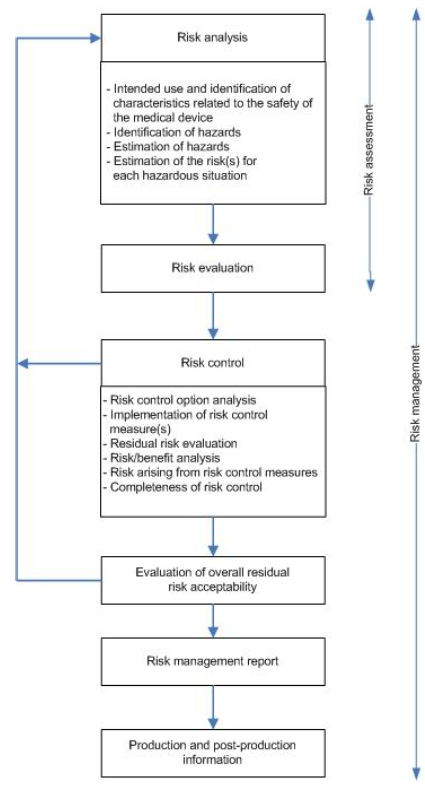
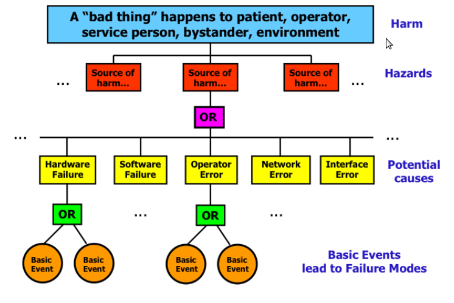
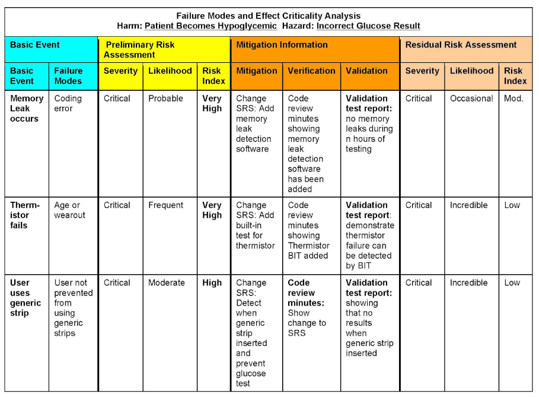

# __NewCorp__ Quality Manual
## Risk Management Procedure
## SOP-006
-----------------------------------------------------------------------

# 1.0 PURPOSE

This procedure provides *minimum* requirements (requirements are
expressed using the word ***shall**)* for performing risk management
for software-only medical devices developed by __NewCorp__. Risk
management is an on-going process consisting of risk analysis, risk
evaluation and risk control throughout the lifecycle of a product.

# 2.0 SCOPE

This procedure applies to software-only medical devices developed by
__NewCorp__ to be used in a clinical setting or by third parties
working under the direction of __NewCorp__.

This procedure also applies to new product development as well as
enhancements and maintenance to previously released software-only
medical devices developed by __NewCorp__.

This procedure does not apply to research activities.

# 3.0 REFERENCES, TERMS AND ACRONYMS

## 3.1 Regulatory References

1.  21 CFR Part 820 FDA Quality System Regulation,1996

2.  21 CFR Part 880 Medical Device Data Systems, 2011

3.  ANSI/AAMI/ISO 13485:2003 Medical Devices-Quality Management Systems
    Requirements for Regulatory Purposes

4.  ANSI/AAMI/ISO 14971:2007 Medical Devices – Application of Risk
    Management for Medical Devices.

5.  FDA Guidance for the Content of Pre-market Submissions for Software
    Contained in Medical Devices, May 11, 2005

6.  Guidance for Off-the-Shelf Software Use in Medical Devices,
    September 9, 1999

7.  FDA Guidance Medical Device Use-Safety: Incorporating Human Factors
    Engineering into Risk Management, July 18, 2000

8.  FDA Design Control Guidance for Medical Device Manufacturers, March
    11, 1997

## 3.2 __NewCorp__ References 

1.  Quality Manual, QM-001

2.  Design Control Procedure, SOP-001

3.  Document and Record Control Procedure, SOP-008

4.  Software Development Procedure, SOP-012

## 3.3 Terms

- **Design History File**: The design history file (DHF) contains or references
the documentation necessary to demonstrate that the design was developed
in accordance with the approved design plan and associated procedures.

- **Harm**: Physical injury or damage to the health of people, or damage to
property or the environment.

- **Hazard**: Potential source of harm

- **Occurrence**: Occurrence is the probability or likelihood of an event
occurring.

- **Residual risk**: Risk remaining after risk control measures have been
taken.

- **Risk**: The combination of the probability of occurrence of harm and the
severity of that harm.

- **Risk Analysis**: Systematic use of available information to identify
hazards and to estimate the risk.

- **Risk Assessment**: Overall process comprising risk analysis and risk
evaluation.

- **Risk Control**: Process in which decisions are made and measures
implemented by which risks are reduced to, or maintained within
specified levels

- **Risk Evaluation**: Process of comparing the estimated risk against given
risk criteria to determine the acceptability of the risk

- **Risk Management**: Systematic application of management policies,
procedures, and practices to the tasks of analyzing, evaluating,
controlling and monitoring risk.

- **RMF**: A file containing all required records created as part of performing
required risk management activities.

- **Severity**: Severity is defined as the measure of the possible consequences
of a hazard.

- **Validation**: Validation means confirmation by examination and provision of
objective evidence that the particular requirements for a specific
intended use can be consistently fulfilled.

- **Verification**: Verification means confirmation by examination and
provision of objective evidence that specified requirements have been
fulfilled. ```[820.3(aa)]```

## 3.3 Acronyms

- **CAPA**: Corrective Action / Preventive Action

- **CFR**: Code of Federal Regulations

- **DHF**: Design History File

- **DMR**: Device Master Record

- **FMEA**: Failure Mode Effects Analysis

- **FMECA**: Failure Mode Effect and Criticality Analysis

- **FTA**: Fault Tree Analysis

- **IFU**: Indications for Use

- **MDR**: Medical Device Report

- **NA**: Not applicable

- **OTS**: Off the shelf

- **QA/RA**: Quality Assurance/Regulatory Affairs

- **QM**: Quality Manual

- **QMS**: Quality Management System

- **QSR**: Quality System Regulation

- **RMF**: Risk Management File

- **RMP**: Risk Management Plan

- **RMR**: Risk Management Report

- **RMT**: Risk Management Team

- **SOP**: Standard Operating Procedure

- **WI**: Work Instruction

  
# 4.0 RISK MANAGEMENT PROCEDURE

## 4.1 Overview

Each medical device project **shall** be required to create a
project-specific Risk Management Plan (RMP) that tailors requirements
of this Risk Management SOP to meet the specific needs of the project.
Any requirements required by this Risk Management SOP that are not
included in the RMP **shall** be justified.

Risk Management activities are performed by a Risk Management Team
(RMT). Members of the RMT are trained in this SOP and the project’s
RMP.

The RMT prepares a project-specific RMP for each project based on
requirements included in this SOP. Depending upon the nature of a
given device, aspects of the Risk Management process outlined in this
SOP may or may not be performed. Justification for not performing any
part of this process is documented in the RMP.

Risk management is an on-going process that continues throughout the
product lifecycle: from design phase distribution and to
post-production activities. When new features or design changes are
proposed to an approved device, the device risk is re-assessed as a
part of the change process.

## 4.2 Risk Management Planning 

The RMT prepares a RMP for each medical device that is developed. The
RMP **shall** minimally address the following topics:

-   Scope – device and development phases for which this plan applies

-   Intended Use of Device covered by this plan

-   Responsibility and authority

-   Training of personnel involved in Risk Management activities

-   Risk Management Process

-   Risk Management Tools and Techniques

-   Risk Acceptability Criteria

-   Risk Management File

-   Requirements for review of risk management activities

-   Traceability of Risk Control verification and validation
    (if applicable)

-   Severity definitions and categorization methods

-   Occurrence definitions and estimation methods

-   Risk Index Tables

-   Requirements for post-production data collection and review

The RMP is reviewed and approved and filed in the Risk Management File
(RMF). The RMF is the repository for all records related to risk
management.

The Risk Management process is based on the process described in ISO
14971 as illustrated in the following figure.

> 

> Figure 1 – ISO 14971 Risk Management process

## 4.3 Risk Management Process

The Risk Management process is based on the process described in ISO
14971. The RMP **shall** address the following activities:

-   Risk Analysis

-   Risk Evaluation

-   Risk Control

-   Risk Management Report

-   Post-production Data Collection and Analysis

### 4.3.1 Risk Analysis

Risk analysis is a systematic use of available information to identify
hazards and to estimate the risk associated with those hazards. Tools
that may be used to perform this analysis may include but are not
limited to:

-   Fault Tree Analysis (FTA)

-   Failure Mode Effect and Criticality Analysis (FMECA)

-   Risk Index

Examples of these tools and techniques are included in Section 7 –
Risk Management Tools.

#### 4.3.1.1 Intended Use And Characteristics Related To Safety

For the particular medical device or accessory being considered, the
intended use and any reasonably foreseeable misuse **shall** be
described in the RMP.

In addition, qualitative and quantitative characteristics of the
device that could affect adversely safety **shall** be defined and,
where appropriate, their limits defined. These records **shall** be
maintained in the RMF. Questions like those included in ISO14971 Annex
B and C should be considered.

#### 4.3.1.2 Identification Of Known Or Foreseeable Hazards

A list of known or foreseeable hazards associated with the medical
device in both normal and fault conditions **shall** be compiled.
Previously recognized hazards **shall** be identified. This list
**shall** be maintained in the RMF.

Foreseeable sequences of events that may result in a hazardous
situation **shall** be considered and recorded. Examples of possible
hazards are listed in ISO14971 Annex E.

For each identified hazard, an analysis of how the hazard could occur
(what is/are the basic causal events) is performed.

A tool that may be used to perform this analysis (but not limited to)
is Fault Tree Analysis (FTA), as described in Section 8 – Risk
Management Tools.

#### 4.3.1.3 Estimation of Risk(s) for each Hazard

For each identified basic causal event for each identified hazard, the
risk(s) **shall** be estimated using available information, date or
judgment. For hazards for which the probability of the occurrence of
harm cannot be estimated, a listing of the possible consequences of
the hazard **shall** be prepared. The estimate of the risk(s)
**shall** be recorded in the RMF.

The tool to be used to perform risk estimation and evaluation is
Failure Mode Effect and Criticality Analysis (FMECA), as described in
Section 8 – Risk Management Tools.

The system used for categorization of occurrence estimates and
severity levels **shall** be defined and recorded in the RMF. These
definitions are used to assess risk by determining a risk index using
a lookup table. The risk index and the corresponding actions are
documented for each risk.

Default definitions for qualitative risk estimation of probability and
severity, and a risk index lookup table with corresponding actions are
listed in Section 7 – Risk Assessment And Acceptability. Individual
RMPs may use the default definitions or customize the definitions to
better reflect the individual situation. Modifications should be
explained in the RMP.

### 4.3.2 Risk Evaluation

If the results of the risk evaluation indicate the risk is not
acceptable, then further risk reduction is required. 

If the results of the risk evaluation indicate the risk is acceptable
then the RMT determines if further risk reduction is possible. If it
is, then the design is changed accordingly. If not, the RMT documents
why not.

The results of this risk evaluation **shall** be recorded in the RMF.

### 4.3.3 Risk Control

Risk control consists of an integrated approach in which one or more
of the following are used in the priority order listed:

-   design inherently safe devices

-   use protective measures in the medical device itself or in the
    manufacturing process

-   provide information for safety

The risk control measures selected **shall** be recorded in the RMF.

The effectiveness of the risk control measures **shall** be verified
and the results of the verification **shall** be recorded in the RMF.

Implementation of risk control measures **shall** be verified and the
results of this verification **shall** be recorded in the RMF.

#### 4.3.3.1 Residual Risk Evaluation

Any residual risk that remains after the risk control measure(s) are
applied **shall** be evaluated using the criteria defined in the RMP.
The results of this evaluation **shall** be recorded in the RMF.

After all risk control measures have been implemented and verified,
the RMT **shall** decide if the overall residual risk posed by the
medical device is acceptable using the criteria defined in the RMP.

The results of the overall residual risk evaluation **shall** be
recorded in the RMF.

#### 4.3.3.2 Risk / Benefit Analysis

If the residual risk is judged unacceptable using the criteria
established in the RMP and further risk control is impractical, a
risk/benefit analysis **shall** be performed by reviewing data and
literature on the medical benefits of the intended use/intended
purpose to determine if they outweigh the residual risk. If this
evidence does not support the conclusion that the medical benefits
outweigh the residual risk, then the risk remains unacceptable. The
results of this evaluation **shall** be recorded in the RMF.

## 4.4 Risk Management Report

The results of the risk management process are documented in a Risk
Management Report (RMR). The RMR **shall** provide traceability for
each hazard to the risk analysis, the risk evaluation, the
implementation and verification of the risk control measures, and the
assessment that the residual risk(s) is/are acceptable. The RMR is
part of the RMF.

## 4.5 Post-Production Data Collection And Analysis Activities

The RMT **shall** establish and maintain systematic methods to review
information gained about the medical device in the post-production
phase. These methods are incorporated into one or more procedures. The
information **shall** be evaluated for possible relevance to safety,
especially the following:

-   if previously unrecognized hazards are present

-   if the estimated risk(s) arising from a hazard is no longer
    acceptable

-   if the original assessment is otherwise invalidated

If any of the above conditions is satisfied, the results of the
evaluation **shall** be fed back as an input to the risk management
process.

In the light of this safety relevant information, a review of the
appropriate steps of risk management process for the medical device
**shall** be considered. If there is a potential that the residual
risk(s) or its acceptability has changed, the impact on previously
implemented risk control measures **shall** be evaluated.

The results of this evaluation are recorded in the RMF.

# 5 Risk Management Records

The Risk Management File is the repository for all records related to
risk management for a device. The Risk Management File **shall**
include the specific records identified in the Risk Management Plan.
In addition to the required records identified in the plan, the file
**shall** include the following information:

-   a description and identification of the medical device or accessory
    that was analyzed;

-   identification of the person(s) and organization(s) which carried
    out the risk analysis;

-   date(s) of the analyses

-   verification of implementation (if appropriate)

-   verification of effectiveness (if appropriate)

-   assessment of residual risk

-   post-production information collected

-   Risk Management Report

The RMF is considered part of the Device History File (DHF) for the
device.

## 5.1 Records Retention

Records related to Risk Management for a specific device **shall** be
retained for a period of time consistent with __NewCorp__ record
retention requirements as defined in the Document and Records Control
Procedure, SOP-008.

# 6 Risk Assessment and Acceptability

Tables 1 and 2 contain example definitions for occurrence and severity
levels. Using these definitions, the risk index is determined in Table
3. Actions based on the qualitative risk assessment are shown in Table
4.

Similar tables **shall** be included in the RMP with product-specific
terms and definitions.

> **Table 1 – Occurrence: Likelihood of an Event Occurring **

<table>
<tbody>
<tr class="odd">
<td>Occurrence</td>
<td>Definition</td>
</tr>
<tr class="even">
<td>Likely</td>
<td>Likely to occur many times per year</td>
</tr>
<tr class="odd">
<td>Probable</td>
<td>Likely to occur only a few times per year</td>
</tr>
<tr class="even">
<td>Occasional</td>
<td>Likely to occur less than once every year</td>
</tr>
<tr class="odd">
<td>Remote</td>
<td>Likely to occur less than once every ten years</td>
</tr>
<tr class="even">
<td>Improbable</td>
<td>Never expected to occur during the lifetime of the device</td>
</tr>
</tbody>
</table>

> **Table 2 – Severity: Impact of an Event Occurring**

<table>
<tbody>
<tr class="odd">
<td>Severity</td>
<td>Definition</td>
</tr>
<tr class="even">
<td>Catastrophic</td>
<td>Potential to result in serious injury or death</td>
</tr>
<tr class="odd">
<td>Major</td>
<td>Potential to result in a serious injury requiring hospitalization or extended medical intervention</td>
</tr>
<tr class="even">
<td>Moderate</td>
<td>Potential to result in a moderate injury that requires medical intervention</td>
</tr>
<tr class="odd">
<td>Minor</td>
<td>Potential to result in a minor injury or discomfort that does not require medical intervention</td>
</tr>
<tr class="even">
<td>Negligible</td>
<td>Potential for minor nuisance but not hazardous</td>
</tr>
</tbody>
</table>

> **Table 3 – Risk Index: Combination of Likelihood and Severity**

<table>
<thead>
<tr class="header">
<th>Risk Index</th>
</tr>
</thead>
<tbody>
<tr class="odd">
<td>Occurrence</td>
</tr>
<tr class="even">
<td></td>
</tr>
<tr class="odd">
<td>Likely</td>
</tr>
<tr class="even">
<td>Probable</td>
</tr>
<tr class="odd">
<td>Occasional</td>
</tr>
<tr class="even">
<td>Remote</td>
</tr>
<tr class="odd">
<td>Improbable</td>
</tr>
</tbody>
</table>

> **Table 4 – Resulting Action Based on Risk Index**

<table>
<tbody>
<tr class="odd">
<td>Risk Index</td>
<td>Resulting Action</td>
</tr>
<tr class="even">
<td>Very High</td>
<td>Intolerable risk - requires further mitigation</td>
</tr>
<tr class="odd">
<td>High</td>
<td>Acceptable only with Design Team approval, QA/RA approval and Executive Management approval</td>
</tr>
<tr class="even">
<td>Moderate</td>
<td>Acceptable with Design Team approval and QA/RA approval</td>
</tr>
<tr class="odd">
<td>Low</td>
<td>Acceptable with no additional review</td>
</tr>
</tbody>
</table>

The resulting actions were designed to satisfy the following:

1) Events that could potentially result in any form of medical
intervention require review and approval by the design team and QA/RA
for acceptance.

2) Events that could potentially result in hospitalization or extended
medical intervention require review and approval by both the design
team, QA/RA and executive management for acceptance.

3) Events that could occur many times per year (likely) require review
and approval by the design team, QA/RA and executive management for
acceptance.

# 7 Risk Management Tools

The following tools or methods are effective for risk management.
Other tools that are used should be described in the RMP.

## 7.1 Fault Tree Analysis

Fault Tree Analysis (FTA) is a graphical method used to identify basic
or root cause events that must occur for a hazardous event to be
created.

An FTA may be used to change the device design, to identify potential
mitigations, and/or user documentation regarding potential hazards.

Fault trees are graphic representations of an event. They use
deductive reasoning in that they start with a general top level or
output event (the hazard) and develop down through branches to basic
events or input events that must occur for the output event (the
hazard) to be generated.

Each event is analyzed by asking “How could this happen?” In answering
the question, the primary causes and how they interact (e.g. AND or OR
relationships between events to create a higher level event) to
produce an undesired event are identified. This logical process
continues until an event is

Identified that is related to a single design element or procedure
that can be changed or mitigated directly, based on the knowledge of
the designers – this is a basic event.

Generally, there should be one FTA for each hazard identified. The
following figure illustrates a typical fault tree.

> 

> Figure 1 – A typical fault tree


## 7.2 Failure Mode Effect And Criticality Analysis

After fault trees are constructed for each identified hazard, the
information in the fault tree is used to construct Failure Mode Effect
and Criticality Analysis (FMECA) tables. Constructing and maintaining
the table is a systematic way to record risk assessment, mitigation
and residual risk information for each basic event.

An individual table contains the list of basic events that were
identified as possibly leading to the hazard associated with the
table.

The tables should contain columns with the following information:

-   **Reference \#** - number to identify rows in the table

-   **FTA Icon \#** - from FTA diagrams (not shown here)

-   **Human Factors** – basic events that originate through the user 
    interacting with the system are highlighted in this column

-   **Basic Event** – the root cause event decomposed to the level at
    which design risk controls can be implemented

-   **Failure Modes** – nature of failure caused by the basic event and
    leading to the potential hazard. This could refer to an
    intermediate event between the basic event and the hazard event.

-   **Mitigation Information**

    -   **Design Risk Controls**

        -   **Prevention** – system design elements, software
            development procedures, manufacturing procedures, user
            instructions, etc. implemented to prevent the basic event

        -   **Detection** – system design elements, software development
            procedures, manufacturing procedures, user
            instructions, etc. implemented to detect the basic event
            and prevent a hazardous situation

    -   **Verification** – evidence of the implementation of the risk
        control

    -   **Validation** – evidence of the effectiveness of the risk
        control, if applicable

-   **Residual Risk** – the assessment of residual risk as determined by
    the design team as of the date of the FMECA table revision.

In most cases, a product will have a number of hazard tables.
Depending on the project, revisions can be controlled for each
individual table (hazard) or for all hazards related to a product. The
method of controlling revisions to the tables should be described in
the RMP and each revision should be filed in the RMF.

The following is an example of an FMECA Table.

> 

> Figure 2 – Example FMECA Table
