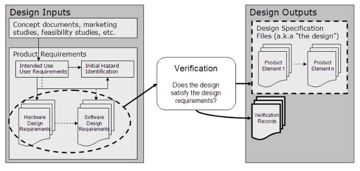
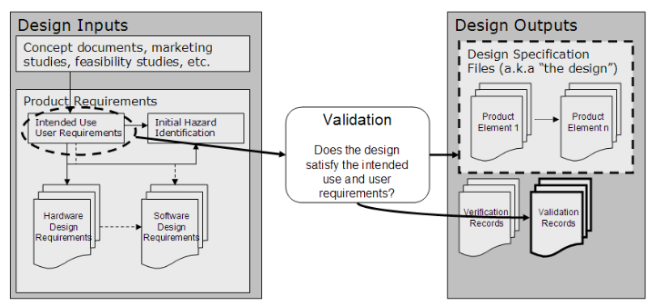

# __NewCorp__ Quality Manual
## Verification and Validation Procedures
## SOP-009

# 1.0 PURPOSE

 This procedure provides *minimum* requirements for design verification and validation of medical devices. The purpose of the design verification and validation processes is to facilitate the development of safe and effective medical devices that conform to relevant requirements, applicable FDA regulations, guidance documents, and standards, as well as meet intended use and defined user needs.

## 1.1 Tailoring

Tailoring is the process of adapting stated requirements outlined in this SOP to meet the needs of a specific medical device project.

A Project Verification and Validation Plan (PVVP) is a required document that shall be prepared for each medical device project. The PVVP can be a separate plan or it can be included in the overall Project Plan.

One of the purposes of the PVVP is to tailor the requirements of this SOP so that the required activities, tasks and work products are consistent with the user needs, project constraints, and safety risks of a specific medical device project.

All of the requirements set forth in this SOP shall be considered for inclusion in a PVVP. Any of these requirements deemed not relevant needs appropriate justification (included in the PVVP) from a safety risk perspective.

# 2.0 SCOPE

This procedure applies to medical devices (both hardware and software) developed by __NewCorp__ or by third parties working under the auspices of __NewCorp__.

This procedure applies to new product development as well as enhancements and maintenance to previously released medical devices.

This procedure does not apply to research activities.

# 3.0 REFERENCES, TERMS AND ACRONYMS

## 3.1 Regulatory References

1.  21 CFR Part 820 FDA Quality System Regulation, 1996

2.  21 CFR Part 880 Medical Device Data Systems, 2011

3.  ANSI/AAMI/ISO 13485:2003 Medical Devices-Quality Management Systems
    Requirements for Regulatory Purposes

4.  ANSI/AAMI/ISO 14971:2007 Medical Devices – Application of Risk
    Management for Medical Devices.

5.  AAMI SW87: 2012 Recommended Practice for the Application of Quality
    Management System concepts to Medical Device Data Systems (MDDS)

6.  FDA Guidance for the Content of Pre-market Submissions for Software
    Contained in Medical Devices, May 11, 2005

7.  FDA Guidance Medical Device Use-Safety: Incorporating Human Factors
    Engineering into Risk Management, July 18, 2000

8.  FDA Design Control Guidance for Medical Device Manufacturers, 1997

9.  FDA Guidance General Principles of Software Validation, January
    11, 2002.

## 3.2 __NewCorp__ References

1.  __NewCorp__ Quality Manual, [QM-001](./QualityManual.md)

2.  __NewCorp__ Medical Device Design Control Procedure, [SOP-001](./SOP-001--Design_Control.md)

3.  __NewCorp__ Document and Record Control Procedure, [SOP-008](./SOP-008--Document_and_Record_Control.md)

4.  __NewCorp__ Design Review Procedure, [SOP-007](./SOP-007--Design_Review.md)

5.  __NewCorp__ Software Development Procedure, [SOP-012](./SOP-012--Software_Development.md)

6.  __NewCorp__ Risk Management Procedure, [SOP-006](./SOP-006--Risk_Management.md)

## 3.3 Terms

| Terms | Definition |
| --- | --- |
| Design History File | The design history file (DHF) contains or references the documentation necessary to demonstrate that the design was developed in accordance with the approved design plan and associated procedures. |
| Design Input | The design input represents the requirements for the medical device and reflect intended use and the needs of the user and patient. |
| Design Output | The design output represents the result of translating the system and software requirements of the medical device into a design that addresses these requirements. |
| Design Review | The design review provides a systematic assessment of design results, including the device design and the associated designs for production and support processes; provides feedback to designers on existing or potential problems; assesses project technical progress; and provides confirmation that the project is ready to move on to the next stage of development. |
| Design Transfer | Design transfer ensures that the finished medical device design is properly transferred from the design environment to a released environment for subsequent distribution and installation for production use at clinical sites. |
| Device Master Record | The device master record (DMR) is a compilation of records containing the procedures and specifications for a finished device. |
| Static Analysis | Static analysis is a technique that identifies potential coding errors in software. A static analysis tool is used to parse the source code and identifies common coding errors such as buffer overflows, array out of bounds and memory leaks. |
| Validation | Validation means confirmation by examination and provision of objective evidence that the particular requirements for a specific intended use can be consistently fulfilled.     **Design validation** means establishing by objective evidence that device specifications conform to user needs and intended use(s).  [820.3(z)] |
| Verification | Verification means confirmation by examination and provision of objective evidence that specified requirements have been fulfilled. [820.3(aa)] |

## 3.4 Acronyms

| Acronyms | Definition |
| --- | --- |
| CAPA | Corrective Action / Preventive Action |
| CFR | Code of Federal Regulations |
| DHF | Design History File |
| DMR | Device Master Record |
| MDR | Medical Device Report |
| NA | Not applicable |
| OTS | Off the shelf |
| PVVP | Project Verification and Validation Plan |
| QM | Quality Manual |
| QMS | Quality Management System |
| QSR | Quality System Regulation **(21 CFR Part 820)** |
| RMF | Risk Management File |
| SOP | Standard Operating Procedure |
| SOUP | Software of Unknown Provenance (open source code) |
| WI | Work Instruction |

# 4.0 VERIFICATION AND VALIDATION

This procedure establishes *minimum* requirements for performing design verification and validation activities as required by the FDA Quality System Regulation (QSR) and as described in the FDA General Principles of Software Validation Guidance document.

Verification and validation activities are described in the sections below. Specific requirements for performing software verification and software validation are also included.

Responsibility for verification and validation tasks, activities, and deliverables is dependent upon the Product Development option (1 or 2) selected. The product development options are described in the Design Control Procedure, [SOP-001](./SOP-001--Design_Control.md).

The __NewCorp__ QA Representative is responsible for assuring that verification and validation activities comply with this procedure and the PVVP.

# 5.0 VERIFICATION PROCESS

## 5.1 Overview

The purpose of the Verification Process is to establish conformance of design outputs, contained in the design output specifications, to design input requirements, contained in System Specification and other design input documents. Verification is a detailed examination of aspects of a design at various stages in the development process.

The goal of Design Verification activities is to produce objective evidence that the design outputs conform to the design inputs and that the design is consistent, complete, and correct, as shown below.

> 

> Figure 1 – Design Verification

There are many methods that can be used to establish conformance between design outputs and design inputs. Individual project teams should select and apply appropriate design verification methods based on generally accepted practices for the technologies and engineering disciplines employed in their product designs.

Verification activities are performed during the course of product development on prototype hardware or OTS components.

## 5.2 Verification Planning

The PVVP shall document required Verification Planning. The PVVP shall identify all components requiring verification.

Individual design inputs are extracted from approved Design Input documents and compiled in a Requirements Trace Matrix (RTM). The design input requirements are matched with the corresponding design outputs. The RTM is used to ensure that all design outputs are verified against the corresponding design inputs by an acceptable means.

The specific design verification activities performed for each component are dependent upon the nature of the design outputs to be verified and the characteristics of each component. Design engineers involved in the design process perform verification activities on engineering prototypes.

For OTS components, design verification activities are performed based on the stated design input requirements the OTS component is intended to fulfill.

### 5.2.1 Hardware Verification

Hardware includes components that are:

-   Internally developed

-   Developed by third parties under the auspices of __NewCorp__

-   OTS

Acceptable techniques for design verification for these components may include:

-   Design reviews (refer to Design Review Procedure, [SOP-007](./SOP-007--Design_Review.md)) of a
    design output document or drawing against the design input
    requirements

-   Testing or studies that demonstrate the design outputs (i.e.,
    schematics, drawings, etc.) comply with design input requirements

Design engineers perform hardware verification on prototype hardware for internally development components. If the device includes OTS components, design verification testing shall be performed on those components.

Design verification also includes verification of the system’s electrical components. For OTS components, this includes verifying that the OTS component’s electrical specifications meets the specifications identified in the design inputs.

Any testing used as a design verification activity shall be performed according to a documented and approved verification test procedure. Any failures that occur during this testing shall be recorded and tracked to closure using a problem tracking and resolution process outlined in the PVVP.

Records for all hardware design verification activities shall be created and maintained in the Design History File (DHF).

### 5.2.2 Software Verification

Software includes components that are:

-   Developed by __NewCorp__ employees

-   Developed by Contract Developers at the direction of __NewCorp__

-   OTS or Open Source components (SOUP)

Acceptable techniques for verification of these components may include:

-   Design reviews (Refer to Design Review Procedure, [SOP-007](./SOP-007--Design_Review.md))

-   Code reviews (Refer to Design Review Procedure, [SOP-007](./SOP-007--Design_Review.md))

-   Unit and integration testing - including testing of such topics as:

    -   Error detection and recovery

    -   Performance/transaction rate

    -   Protocol standards compatibility

    -   Power failure recovery

    -   Units conversion

    -   Input/output

    -   Other topics as appropriate to the device

-   Static analysis of all source code

Software developers perform software verification activities on software components.

Any testing used as a verification activity shall be performed according to a documented and approved verification test procedure. For each test, expected results and acceptance criteria shall be defined as part of the Verification Procedure in advance of executing the tests. Any failures that occur during this testing shall be recorded and tracked to closure using a problem tracking and resolution process outlined in the PVVP.

Records for all software design verification activities shall be created and maintained in the Design History File (DHF).

## 5.3 Verification Protocols

Hardware and software verification activities are performed according to documented verification protocols. The required protocols are identified in the PVVP and shall be reviewed and approved prior to their use.

### 5.3.1 Executing Verification Protocols

Design engineers execute approved verification protocols on prototype hardware, software, or OTS components as appropriate. Any failures or other anomalies are recorded using the problem tracking and resolution system identified in the PVVP.

### 5.3.2 Documenting Verification Results

All verification results shall be documented in a Verification Report as prescribed in the PVVP. All Verification Reports are reviewed and approved and filed in the DHF.

## 5.4 Verification Activities

The following activities, at a minimum, shall be performed:

-   **Develop Verification Procedures for each design component**

 Verification Procedures shall be developed for each design component as specified in the PVVP. The Verification Procedure shall include the verification methods or techniques as well as acceptance criteria.

 For commercially available OTS components, the Verification Procedure shall verify that the component’s specification meets the specifications identified in the System Specification or Product Architecture.

 Verification Procedures shall be subject to a Design Review and shall be approved before they are executed.

-   **Execute Verification Procedures**

 Approved Verification Procedures shall be executed and results documented as required by the PVVP. All failures shall be recorded as specified by the issue tracking and problem resolution process defined in the PVVP.

-   **Conduct Required Design Reviews**

 Design Reviews shall be conducted in accordance with the Design Review Procedure, [SOP-007](./SOP-007--Design_Review.md) as required in the Project Plan. In addition, the Project Plan shall include specific acceptance criteria for determining if a given design artifact accurately implement the requirements specified for that artifact. The objective of these design reviews is to determine if the design artifacts agree with their corresponding requirements. Unless stated otherwise, the acceptance criteria shall be consensus of the Design Review participants.

-   **Update Risk Assessment**

 The risk assessment is updated based on current design information. Refer to Risk Management Procedure, [SOP-006](./SOP-006--Risk_Management.md).

-   **Update RTM**

 The RTM shall is updated to reflect changes and new information.

-   **Update Device Master Record (DMR) and Bill of Materials (BOM)**

 The Contract Manufacturer shall assist in creating the initial Device Master Record (DMR) and Bill of Materials (BOM). These documents will eventually contain all relevant information needed to manufacture the device.

-   **Update previously prepared documents, as appropriate**

 Documents prepared previously (such as the Project Plan, System Specification, Hardware and Software Requirements Specs, etc.) are updated as needed.

### 5.4.1 Verification Deliverables

The Verification Phase shall produce, at a minimum, the following deliverables:

-   Verification Test Procedures (for hardware and software,
    as appropriate)

-   Verification Test Reports (for hardware and software,
    as appropriate)

-   Updated Risk Assessment (refer to Risk Management
    Procedure, [SOP-006](./SOP-006--Risk_Management.md))

-   Updated RTM

-   Design Review Meeting Minutes (refer to Design Review
    Procedure, [SOP-007](./SOP-007--Design_Review.md))

### 5.4.2 Responsibility for Verification Activities and Deliverables

The responsibility for the tasks and activities of this phase are dependent upon the product development option, described below.

-   **Option 1 – __NewCorp__ performs all design and development**

 The __NewCorp__ Project Manager and Project Team shall be responsible for all tasks, activities, and deliverables defined below for the Verification Phase.

-   **Option 2 – __NewCorp__ acts as System Specifier**

 The __NewCorp__ Project Manager shall be responsible for:

 -   Reviewing and approving the PVVP

 -   Reviewing the verification records and filing in DHF

 -   Continuing the Risk Management process and updating the RMF
 
 -   Participating in the Design Reviews, as appropriate

 The **Contract Developer** shall be responsible for:

 -   Preparing the Project Verification and Validation Plan (PVVP)

 -   Executing the PVVP and creating required verification records

 -   Providing the verification records to __NewCorp__ Project Manager

 -   Updating the RTM and Project Plan

 -   Updating other documents as appropriate

# 6.0 VALIDATION PROCESS

## 6.1 Overview

The purpose of the Validation Process is to establish through objective evidence that product design specifications conform to defined user needs and intended uses. Validation is performed under defined operating conditions on initial production units, or their equivalents, under actual or simulated use conditions. A clinical trial may be performed as part of design validation.

The goal of the validation process is to create objective evidence (usually in the form of test results) that confirms that the device conforms to defined user needs and intended use, as shown below.

> 

> Figure 2 – Design Validation

Validation activities are performed upon completion of the product development process. In addition, people other than those involved in product development activities perform validation activities. All validation activities are performed on “initial production units” - hardware that has been manufactured in accordance with approved manufacturing procedures.

Validation is a cumulative summation of all efforts to ensure that the design conforms to user needs and intended use, when used by actual users and when exposed to the expected conditions in the actual use environment. Validation includes validation of all risk mitigations identified as part of the Risk Management process (Refer to Risk Management Procedure, [SOP-006](./SOP-006--Risk_Management.md)).

Validation can be planned to occur in stages depending upon the nature of the device and the risks to patients inherent in the device.

-   **Level 1** – Determines if the device software meets requirements
    defined in the SRS document when the device is tested in a
    development environment. Trained validation staff performs the
    validation testing based using pre-approved validation procedures.

-   **Level 2** – Determines if the device meets intended use and
    defined user needs as defined in the Product Specification when the
    device is used in a simulated clinical setting. Trained clinicians
    perform the validation testing based on pre-approved
    validation protocols.

-   **Level 3** – Determines if the device meets intended use and
    defined users needs when used in an actual (or simulated)
    clinical setting. Actual end users perform the validation testing
    using pre-approved validation protocols. This Validation Stage is
    referred to as a Clinical Trial and is required for certain types of
    medical devices where a 510(k) submission is required.

The objective of the Clinical Trial is to compare the performance of the medical device to the predicate device (a similar device already cleared by FDA). Performance data collected from the clinical trial is often submitted to FDA as part of the 510(k). If the Clinical Trial will be performed with patient data, the requirements for informed consent and review by an Institutional Review Board must be met.

Any failures that occur during validation shall be documented and resolved using the issue tracking and problem resolution processes defined in the Project Plan.

## 6.2 Validation Planning

The PVVP shall document the required Validation Planning. The PVVP shall identify the design inputs, intended use and user needs requiring validation. The PVVP shall also identify the conditions under which the validation activities are to be performed and the resources required to perform the design validation activities.

Design inputs are extracted from approved design input and risk management documents and compiled in the RTM. The design input requirements and risk mitigations are matched with the corresponding validation protocols. The RTM is used to ensure that all design inputs are validated by documented validation protocols.

The PVVP shall include:

-   Identification of the design to being validated - one or more
    product design documents (such as the Product Specification and
    Software Requirements Specification, for example).

-   Identification of defined user needs and intended use by reference
    to appropriate product level documents.

-   Methods of validation and acceptance criteria based on intended use
    and user requirements, as determined by the responsible person in
    consultation with the project team.

-   At least one validation activity that includes testing of the system
    by actual users under actual or simulated use conditions.

-   At least one review of the project Risk Management File, as per the
    Risk Management Plan. (Refer to Risk Management Procedure, [SOP-006](./SOP-006--Risk_Management.md))

## 6.3 Validation Protocols

Validation activities are performed according to documented protocols. These protocols are identified in the PVVP and shall be reviewed and approved prior to their use.

The project team ensures that all design inputs, the intended use, and user needs that require validation are addressed by the sum of all Design Validation Protocols. This information is documented in the RTM.

Each validation activity (i.e., Level 1, 2, or 3) shall be documented in a Validation Protocol that defines all of the details associated with that activity. These details shall include, at a minimum:

-   Identification of the specific requirements that are the focus of
    system validation (e.g., Product Specification or SRS)

-   Environment in which validation is to be performed (e.g., actual or
    simulated use conditions)

-   Resources required – including people, equipment and other supplies
    as appropriate.

-   Actual test cases, including specific test steps and
    expected results. An example of a test case is shown in Appendix A.

Validation protocols shall be reviewed and approved prior to executing those protocols for the record.

### 6.3.1 Executing Validation Protocols

Validation engineers (people not involved in the design activities) execute approved validation protocols on actual hardware that is manufactured according to approved manufacturing procedures. Any failures or other anomalies are reported to the problem tracking and resolution system identified in the PVVP or Project Plan.

### 6.3.2 Documenting Validation Results

All design validation results shall be documented in a Design Validation Report as prescribed in the Design Validation Protocol. Design Validation reports are filed in the DHF. Design Validation report for Level 1 Validation shall include. At a minimum, the following information:

-   Identification of the Validation Protocol the report is associated
    with

-   Executed copy of each test case (refer to Appendix A)

-   Copy of each defect or anomaly report showing its resolution

-   Status of all defects reported

-   Identification of defects reported for each software baseline tested

-   Regression testing done per software baseline

-   A summary and analysis of results including acceptability of
    validation results relative to the acceptance criteria defined in
    the PVVP

-   Final RTM showing all design input requirements and risk management
    mitigations and the activities used to validate each requirement
    and mitigation.

Validation Reports for Levels 2 and 3 shall include:

-   Identification of the Validation Protocol the report is associated
    with

-   Executed copy of each test protocol – signed and dated by the person
    who executed the protocol

-   Copy of each defect or anomaly report showing its resolution

-   A summary and analysis of results including acceptability of
    validation results relative to the acceptance criteria defined in
    the PVVP

All Validation Reports shall be reviewed as part of a final design review prior to Design Transfer.

## 6.4 Validation Activities

The following activities, at a minimum, shall be performed:

-   **Plan Validation Activities**

 All validation activities shall be identified in the PVVP. Level 1 is mandatory for all medical device projects and cannot be excluded for any reason.

-   **Develop Validation Procedures and Protocols**

 Validation Procedures and Protocols identified in the PVVP are developed, reviewed and approved. Each validation test shall include pre-determined pass/fail criteria that can be objectively determined.

-   **Conduct Required Design Reviews**

 Design Reviews shall be conducted as required in the Project Plan.

-   **Execute Validation Procedures (Level 1)**

 Validation tests are performed on initial production units by trained validation staff. Failures are reported and tracked to resolution using the issue reporting and resolution processes defined in the Project Plan.

-   **Execute Optional Validation Protocols (Levels 2 and 3)**

 Clinical resources execute validation protocols for the optional levels 2 and 3. Failures are reported and tracked to resolution using the issue reporting and resolution processes defined in the PVVP.

-   **Regression Testing**

 Regression testing is performed to ensure that changes to the device made to correct observed failures have not introduced new failures. The criteria for performing regression testing shall be included in the PVVP. Regression testing performed is documented in the Validation Reports.

-   **Prepare Validation Reports**

 Validation Reports shall be prepared for each level of validation that is performed. Required contents of the reports shall be defined in the PVVP.

-   **Update Risk Assessment**

 The risk assessment is updated based on current design information. Refer to Risk Management Procedure, [SOP-006](./SOP-006--Risk_Management.md).

-   **Update RTM**

 The RTM shall is updated to reflect design changes and validation test information. Each requirement in the SRS shall be traceable to at least one validation test. Requirements in the Product Specification shall also be traceable to validation tests or design reviews as appropriate.

-   **Update previously prepared documents, as appropriate**

 Documents prepared previously are updated as needed.

### 6.4.1 Validation Process Deliverables

The Validation Phase shall produce, at a minimum, the following deliverables:

-   Validation Procedures

-   Validation Protocols (optional – for Stage 2 and 3)

-   Validation Test Reports for each stage

-   Failure Reports and their resolution

-   Manufacturing Process Validation Protocols and Reports

-   Updated Risk Assessment (refer to Risk Management Procedure, [SOP-006](./SOP-006--Risk_Management.md))

-   Updated RTM

-   Design Review Meeting Minutes (refer to Design Review Procedure, [SOP-007](./SOP-007--Design_Review.md))

### 6.4.2 Responsibility for Validation Activities and Deliverables

The responsibility for the tasks and activities of this phase is dependent upon the product development option (1 or 2), described in the Design Control Procedure, [SOP-001](./SOP-001--Design_Control.md).

-   **Option 1 – __NewCorp__ performs all design and development**

 The __NewCorp__ Project Manager and Project Team shall be responsible for all tasks, activities, and deliverables defined below for the Validation Phase. Resources not directly involved in product development activities shall perform all validation activities.

-   **Option 2- __NewCorp__ acts as System Specifier**

 The __NewCorp__ Project Manager shall be responsible for:

 -   Participating in Design Review for PVVP

 -   Reviewing and approving PVVP

 -   Executing required Validation Levels 2 and 3 protocols as outlined
    in the PVVP

 -   Reviewing and approving final RTM and Level 1 Validation Report

 -   Continuing the Risk Management process and updating the RTM

 The **Contract Developer** shall be responsible for:

 -   Update the PVVP, as appropriate

 -   Conduct Design Review for PVVP

 -   Develop validation procedures and protocols

 -   Execute Validation Procedure (Level 1)

 -   Perform Regression Testing, as appropriate

 -   Document all defects found and how they were corrected

 -   Prepare Level 1 Validation Report

 -   Update RTM

# 7.0 RECORDS

The following records shall be created and maintained in the DHF as a result of executing this procedure. These records shall be maintained for a retention period as defined in the Document and Records Control Procedure, [SOP-008](./SOP-008--Document_and_Record_Control.md).

-   Project Verification and Validation Plan (PVVP)

-   Verification protocols

-   Verification reports

-   Validation protocols

-   Validation reports

-   RTM

-   Reported defects and anomalies as a result of verification and
    validation activities

***
# Appendix A – Example Validation Test Case

| | |
| --- | --- |
| **Test ID** | Identifier - ideally, should be requirement ID test is intended to validate. |
| **Test Objective** | A short statement that summarizes the objective of each test. |
| **System Configuration** | A description of the system configuration required for this test. Specifically, how is the client configured and how is the server configured. |
| **Special Equipment** | Identify any special equipment required for this test. |
| **Initial Conditions** | Identify initial conditions or state that the system should be in before executing the test. |

| **Test ID: 4.1.1-3** | | |
| --- | --- | --- |
| **Actions** | **Expected Results** | **Actual Results** |
| 1. Turn on the device. | The splash screen displays for a few seconds followed by the Main Menu (refer to Fig. x in SRS). | [] Pass [] Fail |
| 2. Click on "Calibrate" button. | Calibrate Window appears with options. | [] Pass [] Fail |
| 3. Select Option 1 | System calibrates and displays calibration data. Data should match table 1 in SRS. | [] Pass [] Fail |
| 4. Etc.. | | [] Pass [] Fail |
| 5. | | [] Pass [] Fail |
| 6. | | [] Pass [] Fail |
| Done. | | |
| | | |
| Test Performed by: | | Date:    |
| Software version tested: | | System ID: |
| Notes and Observations | | Problem Report: |
