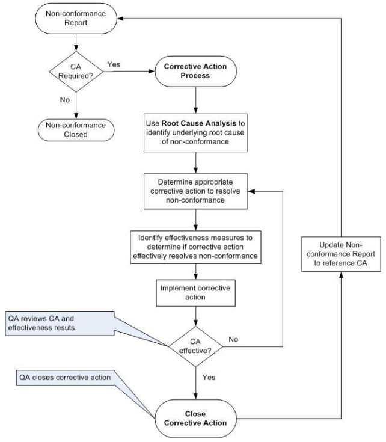
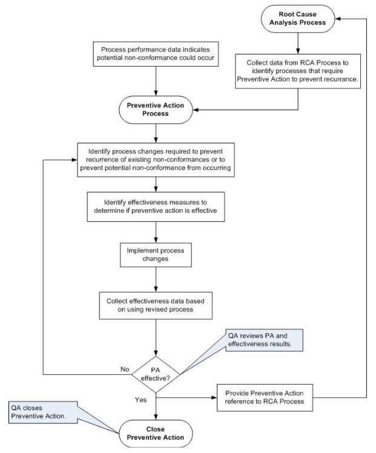
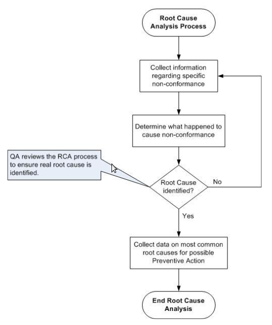

# __NewCorp__ Quality Manual
## Corrective and Preventive Actions (CAPA)
## SOP-011

# 1.0 PURPOSE

This Standard Operating Procedure (SOP) provides *minimum*
requirements (requirements are expressed using the word ***shall**)*
for the identification and application of corrective and preventive
actions to software-only medical devices developed by __NewCorp__.

# 2.0 SCOPE

This SOP applies to software-only medical devices developed by
__NewCorp__ or by third parties working under the direction of
__NewCorp__. This SOP also applies to modifications made to
existing software-only medical devices previously developed by
__NewCorp__.

This SOP does not apply to "off the shelf" products or components
where __NewCorp__ has no influence over the design process. This
SOP does not apply to research activities.

# 3.0 REFERENCES, TERMS AND ACRONYMS

## 3.1 Regulatory References

1.  21 CFR Part 820 FDA Quality System Regulation,1996

2.  ANSI/AAMI/ISO 13485:2003 Medical Devices-Quality Management Systems
    Requirements for Regulatory Purposes

3.  FDA Design Control Guidance for Medical Device Manufacturers, March
    11, 1997

## 3.2 __NewCorp__ References 

1.  Quality Manual, QM-001

2.  Document and Record Control Procedure, SOP-008

3.  Complaint Handling and Medical Device Reporting Procedure, SOP-004

## 3.3 Terms

- **Correction**: Action to eliminate a detected non-conformity.

- **Concession**: Permission to use or release a product that does not conform
to specified requirements.

- **Corrective action**: Action to eliminate the cause(s) of a detected
non-conformity or other undesirable situation.

- **Data Sources**: The processes within a Quality Management System that
provide quality information that could be used to identify
nonconformities, or potential non-conformities

- **Preventive action**: Action to eliminate the cause of a potential
non-conformity or other undesirable situation.

- **Non-conformity**: Non-fulfillment of a requirement.

- **Verification**: Confirmation through provision of objective evidence that
specified requirements have been fulfilled.

- **Validation**: Confirmation through provision of objective evidence that the
requirements for a specific intended use or application have been
fulfilled.

- **Change Request**: A Change Request (CR) is used to initiate corrections,
corrective or preventive actions. Note that product removals and recalls
are neither corrective nor preventive actions.

## 3.3 Acronyms

- **CAPA**: Corrective Action / Preventive Action

- **CFR**: Code of Federal Regulations

- **CR**: Change Request

- **DHF**: Design History File

- **DMR**: Device Master Record

- **MDR**: Medical Device Report

- **NA**: Not applicable

- **OTS**: Off the shelf

- **QA**: Quality Assurance

- **QM**: Quality Manual

- **QMS**: Quality Management System

- **QSR**: Quality System Regulation

- **RCA**: Root Cause Analysis

- **RMF**: Risk Management File

- **SOP**: Standard Operating Procedure

- **WI**: Work Instruction

# 4.0 CAPA PROCESS 

## 4.1 Overview

A **correction** is action taken to eliminate a **non-conformity**
that has occurred. **Corrective action** is action taken to prevent
recurrence of a non-conformity, which has already occurred.
Corrections and corrective actions may be performed at the same time.

**Preventive action** is taken when a potential non-conformity is
identified as the result of an analysis of records and other relevant
sources of information. Preventive actions typically apply to
processes (SOPs and WIs) used to develop, document, manufacture,
maintain or otherwise support a medical device.

A **non-conformance** may relate to product, process or the QMS
itself. Whenever a non-conformance is identified, __NewCorp__
**shall** determine the significance, the associated risk and the
potential for recurrence. Depending on the nature of a
non-conformance, one or more of the following activities may result:

-   A correction may be issued to correct the non-conformity in the
    medical device

-   A corrective action may be implemented to eliminate the cause of an
    observed non-conformity (after it occurs) within the QMS

-   A preventive action may be implemented to prevent a potential
    non-conformity from occurring within the QMS

The CAPA Process requires performing a thorough investigation to
identify the root cause of the non-conformity. The QA Representative
**shall** be responsible for ensuring that the CAPA Process is
followed.

### 4.1.1 Investigation

The purpose of the investigation is to determine the root cause of
existing or potential non-conformities, whenever possible, and to
provide recommendations changes. The magnitude and scope of the
investigation should be commensurate with the determined risk of the
non-conformity.

The investigation **shall**:

-   Determine both the risk and the extent of the nonconformity or
    potential nonconformity

-   Acknowledge that there may be several causes of an event; hence, the
    investigation should not cease prematurely

-   Require that symptoms be distinguished from root causes and advocate
    the treatment of root causes rather than just the symptoms

-   Require that an end point be defined for the investigation

-   Take into account the output of relevant risk management activities

-   Agree on the form of evidence. For example, evidence should support
    the:

    -   seriousness of the event

    -   likelihood of occurrence of the event

    -   significance of the consequences flowing from the event

The QA Representative **shall** lead the investigation process
bringing in additional resources as needed to determine root cause and
recommended changes.

### 4.1.2 Data Sources

Relevant data sources and their data elements, both internal and
external to the organization, **shall** be identified and documented.
Data elements provide information regarding non-conformities,
potential non-conformities and the effectiveness of the established
processes within the data sources.

Information relevant to product and process performance can come from
the:

-   Product development team

-   Production and Service team

-   IT help desk

-   End users

Examples of data that should be evaluated include, but are not
restricted to:

-   User complaints

-   Internal product non-conformity reports

-   Service records and reports

-   Production equipment maintenance records

-   Supplier deficiencies, and

-   Quality system audit records

-   Product Risk Assessment

-   Bugs, faults, failures, defects, glitches, and anomalies.

The QA Representative **shall** be responsible for identifying and
documenting relevant data sources.

### 4.1.3 Evaluation 

Data collected from the data sources identified above **shall** be
entered into a Problem Reporting repository (refer to Complaint
Handling and Medical Device Reporting SOP) for review and evaluation.
The QA Representative **shall** review data in this repository
periodically. Statistical techniques **shall** be used by QA to
analyze this data and may include:

-   Pareto Analysis

-   Trend Analysis

-   Linear and non-linear regression analysis

Based on the analysis of relevant data, an outcome of this evaluation
may be to initiate a correction, a corrective action or a preventive
action or some combination thereof.

## 4.2 Corrections and Corrective Actions

When nonconformity occurs, the QA Representative **shall** work with
the Project Manager (or designee) in order to:

-   Perform an investigation to determine the cause(s) of
    nonconformities

-   Evaluate the need for a correction to the product

-   Evaluate the need for a corrective action to ensure that the
    nonconformity does not recur

-   Determine and implement a correction and/or corrective action, if
    needed

-   Record the results of any investigation

-   Document any corrections and corrective actions taken

-   Review corrections and corrective actions taken and determine
    effectiveness

Examples of corrections may include:

-   Providing users with a corrected version of software for a device

-   Providing users with corrected user manuals or related labeling

Examples of corrective actions may include:

-   Changing Partners procedures to prevent an incorrect version of
    software from being distributed to users

-   Changing Partners procedures based on deficiencies in user training

The following illustrates the flow for corrective actions:

> 

> Figure 1 – Example Corrective Action Proceess

## 4.3 Preventive Actions

Preventive actions are implemented where there is an increased risk
for potential nonconformity. The need for a preventive action is
identified based upon information regarding capability and performance
of processes and work operations, product nonconformity rates, service
and user feedback, customer complaints, and effectiveness of the
quality system. For example, increasing incidents of product
nonconformities traceable to the same common cause; excessive
equipment problems; or increasing number of audit findings against the
same element of the quality system or department.

Based on review of relevant data sources and statistical analysis, the
QA Representative may recommend that preventative action be taken to
prevent a potential nonconformity. Other steps may include:

-   Determine potential nonconformities and their causes

-   Evaluate the need for preventive action to prevent occurrence of
    nonconformities

-   Determine and implement preventive action, if needed

-   Record the results of any investigations and of any preventive
    action taken

-   Review preventive action taken and determine its effectiveness.

The compilation and review of pertinent information that includes, but
is not limited to:

-   Reject and scrap rates

-   Product nonconformity reports (NCR)

-   Service records and reports

-   Production equipment maintenance records

-   Customer complaints

-   Supplier deficiencies, and

-   Quality system audit records

The following illustrates the flow for preventive actions:

> 

> Figure 2 – Example Preventative Action Process

## 4.4 Root Cause Analysis Process

A critical part of the corrective and preventive action process is
determining root cause. Root cause analysis (RCA) is essential to
ensure that corrective and preventive actions are effective. The QA
Representative **shall** ensure the RCA process is applied when
appropriate.

-   RCA is performed whenever a corrective or preventive action is
    initiated and requires collecting and reviewing relevant information
    related to the nonconformity.

-   RCA is the process of investigating, understanding, categorizing
    root causes.

-   RCA is performed by small cross-functional team and is led by QA

-   RCA is an analysis based on factual information obtained from:

    -   Documents and records

    -   Interviews

    -   Brainstorming sessions

-   RCA uses tools such as:

    -   Why Tree

    -   Pareto Analysis

The following illustrates the RCA process:

> 

> Figure 3 – Example Root Cause Analysis Process

# APPENDIX A CAPA Form

**TBD**
