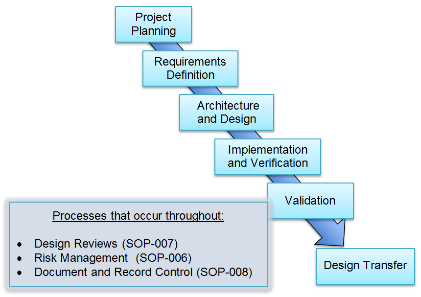

# __NewCorp__ Quality Manual
## Software Development Procedure
## SOP-012

# 1.0 PURPOSE

This Standard Operating Procedure (SOP) provides *minimum*
requirements (requirements are expressed using the word **shall**)
for the design and development of software-only medical device
software by __NewCorp__.

# 2.0 SCOPE

All software developed as part of a medical device project **shall**
be developed in accordance with this procedure regardless of whether
the software is developed by __NewCorp__ employees or by a third
party working under the direction of __NewCorp__.

This procedure does not apply to "off the shelf" products or
components where __NewCorp__ has no influence over the design
process. This procedure does not apply to research activities.

This procedure applies to new product development as well as
enhancements and maintenance to previously released medical devices.

# 3.0 REFERENCES, TERMS AND ACRONYMS

## 3.1 Regulatory References

1.  21 CFR Part 820 FDA Quality System Regulation, 1996

2.  21 CFR Part 11 Electronic Records and Electronic Signatures, 1997

3.  ANSI/AAMI/ISO-13485:2003 Medical Devices-Quality Management Systems
    Requirements for Regulatory Purposes

4.  ANSI/AAMI/ISO-14971:2007 Medical Devices – Application of Risk
    Management for Medical Devices.

5.  ISO/IEC 62366-1:2015 Medical Devices – Part 1: Application of
    Usability Engineering to Medical Devices

6.  Guidance for the Content of Premarket Submissions for Software
    Contained in Medical Devices, May 11, 2005

7.  Guidance for Off-the-Shelf Software Use in Medical Devices,
    September 9, 1999

8.  General Principles of Software Validation, FDA, Final Guidance,
    January 2002

9.  Content of Premarket Submissions for Management of Cybersecurity in
    Medical Devices, October 2, 2014

10. Postmarket Management of Cybersecurity in Medical Devices – DRAFT
    February 2016

11. Applying Human Factors and Usability Engineering to Medical Devices,
    February 2016

## 3.2 __NewCorp__ References 

1.  Quality Manual, [QM-001](QualityManual.md)

2.  Design Control Procedure, [SOP-001](SOP-001--Design_Control.md)

3.  Document and Record Control Procedure, [SOP-008](SOP-008--Document_and_Record_Control.md)

4.  Design Review Procedure, [SOP-007](SOP-007--Design_Review.md)

5.  Risk Management Procedure, [SOP-006](SOP-006--Risk_Management.md)

## 3.3 Terms

- **Baseline**:
  1. A specification or product that has been formally reviewed
and agreed upon, that thereafter serves as the basis for further
development, and that can be changed only through formal change control
procedures.

  2. A document or a set of such documents formally designated and
fixed at a specific time during the life cycle of a configuration
item. Any agreement or result designated and fixed at a given time,
from which changes require justification and approval. Each baseline
has a unique tag, label or identifier.

- **Defect**: Any condition that deviates from the expected based on
requirements specifications, design documents, standards, etc. or from
someone’s perceptions or experiences. Defects may be found during, but
not limited to, the review, test, analysis, compilation, or use of
software products or applicable documentation. The terms defect,
anomaly, failure and bug are often used interchangeably.

- **Design History File**: The design history file (DHF) contains or references
the documentation necessary to demonstrate that the design was developed
in accordance with the approved design plan and associated procedures.

- **Design Input**: The design input represents the requirements for the
medical device and reflect intended use and the needs of the user and
patient.

- **Design Output**: The design output represents the result of translating the
system and software requirements of the medical device into a design
that addresses these requirements.

- **Design Review**: The design review provides a systematic assessment of
design results, including the device design and the associated designs
for production and support processes; provides feedback to designers on
existing or potential problems; assesses project technical progress; and
provides confirmation that the project is ready to move on to the next
stage of development.

- **Design Transfer**: Design transfer ensures that the finished medical device
design is properly transferred from the design environment to a released
environment for subsequent distribution and installation for use at
clinical sites.

- **Open Source**: Open Source Software is computer software for which
the human-readable source code is made available under a
copyright license (or arrangement such as the public domain) that meets
the Open Source Definition. Also referred to as SOUP.

- **Validation**: Validation means confirmation by examination and provision of
objective evidence that the particular requirements for a specific
intended use can be consistently fulfilled.

- **Verification**: Verification means confirmation by examination and
provision of objective evidence that specified requirements have been
fulfilled. ```[820.3(aa)]```

## 3.4 Acronyms

- **BOM**: Bill of Materials

- **CRC**: Cyclic redundancy check

- **DHF**: Design History File

- **DMR**: Device Master Record

- **NA**: Not applicable

- **OTS**: Off the shelf

- **PRS**: Product Requirements Specification

- **QMS**: Quality Management System

- **QSR**: Quality System Regulation

- **RMF**: Risk Management File

- **RTM**: Requirements Trace Matrix

- **SAD**: Software Architecture Document

- **SDD**: Software Design Document

- **SOP**: Standard Operating Procedure

- **SOUP**: Software of Unknown Provenance, aka, open source software

- **SRS**: Software Requirements Specification

- **WI**: Work Instruction

# 4.0 SOFTWARE DEVELOPMENT PROCESS 

## 4.1 Overview

This procedure defines a generic software development process used by
__NewCorp__ to design and develop medical devices. This procedure
is consistent with the Design Control Procedure ([SOP-001](SOP-001--Design_Control.md)) and
applicable FDA regulations, guidance documents and international
standards.

Figure 1 shows the overall process for developing a new medical
device. Each phase shown in Figure 1 is described in detail in
sections 4.2 through 4.7. Note that a subset of these phases may be
appropriate when making changes to an existing medical device
previously developed by __NewCorp__.

> 

> Figure 1 – Software-only Medical Device Product Development Process

## 4.2 Project Planning Phase

The Project Planning Phase is described in the Design Control
Procedure [SOP-001](SOP-001--Design_Control.md).

#### 4.2.1 Activities, Work Products and Records 

The activities, work products and records typically required in this
phase are described in detail in the Design Control Procedure,
[SOP-001](SOP-001--Design_Control.md). The activities that include the Software Team and described
below.

- **Identify an appropriate Software Lifecycle Process**:  A software development lifecycle model is selected and documented in
the Project Plan. The selected process should be commensurate with
risk.

- **Review Initial Project Plan**: The Software Team participates in a review of the Initial Project Plan.

- **Review initial PRS**: The Software Team participates in a review of the Initial PRS.

<table>
<thead>
<tr class="header">
<th><strong>Activities</strong></th>
<th><strong>Work Products</strong></th>
<th><strong>Records </strong></th>
</tr>
</thead>
<tbody>
<tr class="odd">
<td>Identify appropriate software lifecycle process</td>
<td>Software lifecycle process</td>
<td></td>
</tr>
<tr class="even">
<td>Review Initial Project Plan</td>
<td>Initial Project Plan</td>
<td><p>Initial Project Plan</p>
<p>Meeting Minutes</p></td>
</tr>
<tr class="odd">
<td>Review Initial Product Requirements Spec (PRS)</td>
<td>Initial PRS</td>
<td><p>Initial PRS</p>
<p>Meeting Minutes</p></td>
</tr>
</tbody>
</table>

## 4.3 Requirements Definition Phase 

The purpose of the Requirements Definition Phase is to refine the
high-level product requirements contained in the PRS into testable and
traceable software requirements. To do this, the PRS, intended use,
user and patient needs and other relevant documents (such as
established clinical practices, published papers or reports, etc.) are
reviewed.

The PRS and SRS together define the Design Input. At a minimum, the
SRS **shall** address the topics shown in Appendix A. If a topic
listed in Appendix A is not applicable on a given medical device
development project, that topic **shall** be included in the SRS along
with a justification for why it is not applicable.

### 4.3.1 Activities

Requirements definition activities are performed based on the nature
of the medical device being developed. At a minimum, the following
activities **shall** be performed:

- **Create initial SRS**: The project team reviews the PRS, intended use, user and patient needs
and other relevant documents. Based on this review, the team prepares
the initial SRS. Requirements can be expressed as user stories,
flowcharts or as statements. Every requirement **shall** be traceable
to a source document – such as the PRS. Every requirement **shall** be
expressed in terms that allow independent assessment (such as through
validation testing) of whether the requirement has been properly
implemented.  The SRS includes initial installation and updating procedures for
 updating previously released software with new versions. A Design Review of the initial SRS **shall** be held in accordance with the Design Review Procedure, [SOP-007](SOP-007--Design_Review.md). One purpose of this review
is to identify and address software requirements that are unclear,
conflicting, incomplete, or not testable.

- **Review and update Previously Approved Documents**: The Project Plan and PRS are updated and reviewed if needed.

### 4.3.2 Activities, Work Products, and Records

The activities, work products and records required in the Requirements
Definition phase are shown below.

<table>
<thead>
<tr class="header">
<th><strong>Activities</strong></th>
<th><strong>Work Products</strong></th>
<th><strong>Records </strong></th>
</tr>
</thead>
<tbody>
<tr class="odd">
<td>Prepare and review Initial SRS</td>
<td>Initial SRS</td>
<td><p>Initial SRS</p>
<p>Meeting Minutes</p></td>
</tr>
<tr class="even">
<td>Update and review Project Plan, if needed.</td>
<td>Revised Project Plan</td>
<td><p>Revised Project Plan</p>
<p>Meeting minutes</p></td>
</tr>
<tr class="odd">
<td>Update and review PRS, if needed</td>
<td>Revised PRS</td>
<td><p>Revised PRS</p>
<p>Meeting Minutes</p></td>
</tr>
</tbody>
</table>

## 4.4 Architecture and Design Phase

During the Architecture and Design Phase, the SRS is reviewed and an
initial Software Architecture Document (SAD) is created. The SAD
describes the software structure at a high level. The SAD identifies
all required software components and shows all external interfaces as
well as major internal interfaces.

Using the SAD, software components are identified and documented in
the Software Design Document (SDD).

The SAD and SDD form part of the Design Output for the device. Also
included in the Design Output are:

- Source code and executable files (refer to section 4.5)

- OTS and SOUP components

- Labeling and manuals

The following characteristics **shall** apply to all software design
outputs:

- Software design outputs are expressed in terms that allow adequate assessment of conformance to design input requirements

- Characteristics of the design are identified that are crucial to the safety and proper functioning of the device

- Software design outputs allow proper distribution, installation, and safe and effective use of the medical device

This phase also includes assessment of design options for the design
elements that provide core functionality of the device. It may also
include development of prototypes to assess usability and
functionality.

All Design Outputs are subject to review. The consensus of the review
team **shall** be used to determine if the Design Outputs agree with
the Design Inputs.

### 4.4.1 Activities

During this phase, the project team identifies all software
development tools to be used on the project. The team validates those
tools based on a documented tool validation plan. The team also
identifies any SOUP (open source) and OTS software components that are
to be included in the medical device.

- **Create Software Architecture**:  The SAD **shall:**
  - Identify interfaces between high level software components and the
    components external to the software items, including other
    software, hardware, users, patients, etc.

  - Specify functional and performance requirements for SOUP or OTS
    components (if applicable) based on the SRS and the intended use
    of these components

  - Specify minimum system resources necessary to support the proper
    operation of SOUP and OTS components (if applicable)

  - As part of the SAD Review, the following **shall** be determined:

    - The software architecture implements system and software
      requirements including those related to risk mitigation

    - The software architecture is able to support interfaces between
      software components and between software components and hardware

    - The software architecture supports proper operation of any SOUP and
      OTS components

The consensus of the review team **shall** be used to determine if the
SAD properly addresses all system and software requirements.

- **Create Software Detailed Design (SDD)**: Based on SRS and the SAD, the software design of each software
  component is established and documented in the Software Design
  Description (SDD). The SDD **shall:**

  - Provide detailed information on the software component interface

  - Specify the interfaces to external software and hardware

  - Identify any algorithms applied to a given software component

  - Define data structures

  - Identify the software requirement(s) the design is fulfilling

  - As part of the SDD Review, the following **shall** be determined:

    - The software design implements software requirements including those
    related to risk mitigation

    - The software design is consistent with the SAD

    - The software design supports proper operation of any SOUP and OTS
      components, if applicable

The consensus of the review team **shall** be used to determine if the
SDD properly addresses all system and software requirements.

- **Establish Software Development Environment**: The project team defines the software development environment that
will be used to develop, implement and verify the medical device. This
environment consists of software development tools, compilers,
integrated development environments (IDEs), prototyping tools, source
code repositories, defect tracking tools, requirements management
tools, etc.

- **Identify and Validate Software Development Tools**: All software development tools are identified and validated in
accordance with FDA General Principles of Software Validation
Guidance, in a manner commensurate with risk. Refer to Appendix B for
Software Tool Validation Guidelines.

- **Identify OTS and SOUP components (if applicable)**: Any OTS components to be used in the medical device are identified.
Information required by FDA Guidance for Off-the-Shelf Software Use in
Medical Devices **shall** be prepared for each OTS component and
included in any required regulatory submissions. OTS components are
placed under appropriate change control.  SOUP components to be used in the medical device **shall** be
identified and placed under appropriate change control.

- **Create initial Requirements Trace Matrix (RTM)**: The RTM maps requirements based on the FDA Classification of the
medical device.

  - For Class I devices, the RTM maps PRS requirements to SRS
    requirements to Validation Tests.

  - For Class II devices, the RTM maps PRS requirements to SRS
    requirements to the SAD, SDD and Validation tests.

  - For Class III devices, the RTM maps PRS requirements to SRS
    requirements to the SAD, SDD, source code, Unit tests, Integration
    tests, System tests and Validation tests.

-   **Update and review previously approved work products, as
    appropriate**

The activities, work products and records required in the Software
Architecture and Design phase are shown below.

<table>
<thead>
<tr class="header">
<th><strong>Activities</strong></th>
<th><strong>Work Products</strong></th>
<th><strong>Records </strong></th>
</tr>
</thead>
<tbody>
<tr class="odd">
<td>Develop and review Software Architecture (SAD)</td>
<td>Initial SAD</td>
<td><p>Initial SAD</p>
<p>Meeting Minutes</p></td>
</tr>
<tr class="even">
<td>Develop and review Software Design (SDD)</td>
<td>Initial SDD</td>
<td><p>Initial SDD</p>
<p>Meeting Minutes</p></td>
</tr>
<tr class="odd">
<td>Establish Software Development Environment</td>
<td>Software Development Environment established including list of software development tools</td>
<td>List of tools including revision number, purpose and vendor</td>
</tr>
<tr class="even">
<td>Prepare and perform Software Tool Validation</td>
<td><p>Software Tool Validation Protocols</p>
<p>Software Tool Validation Reports</p></td>
<td><p>Software Tool Validation Protocols</p>
<p>Software Tool Validation Reports</p></td>
</tr>
<tr class="odd">
<td>Prototype critical software components as needed</td>
<td>Software Prototypes</td>
<td></td>
</tr>
<tr class="even">
<td>Create initial Requirements Trace Matrix (RTM)</td>
<td>Initial RTM</td>
<td>Initial RTM</td>
</tr>
<tr class="odd">
<td>Identify any Open Source Software (SOUP) components to be used in product</td>
<td>List of open source components</td>
<td>List of open source components</td>
</tr>
<tr class="even">
<td>Identify Off the Shelf Software (OTS) components planned to be used in the product</td>
<td>List of OTS components and required documentation per FDA OTS Guidance</td>
<td>Document required information required for 510(k) submission</td>
</tr>
<tr class="odd">
<td>Update and review SRS, if needed</td>
<td>Revised SRS</td>
<td><p>Revised SRS</p>
<p>SRS Review Meeting Minutes</p></td>
</tr>
</tbody>
</table>

## 4.5 Implementation and Verification Phase 

During this phase, software components are implemented based on the
approved SAD and SDD. As software components are implemented, they are
added to the project source code repository.

Verification activities apply to software components that are:

- Developed by __NewCorp__ employees

- Developed by Contract Developers at the direction of __NewCorp__

- OTS and SOUP

Acceptable techniques for verification of software components may
include:

- Code Reviews (Refer to Design Review Procedure, [SOP-007](SOP-007--Design_Review.md))

- Static Analysis of source code using a validated static analysis tool

- Unit Testing

- Integration Testing

- System Testing

When testing is used as a verification activity, it **shall** be
performed according to a documented and approved Verification Test
Procedure. For each test, expected results and acceptance criteria
**shall** be defined as part of the Verification Test Procedure in
advance of executing the tests. Any failures that occur as a result of
this testing **shall** be recorded and tracked to closure using a
validated defect tracking tool as defined in the Project Plan.

Records of all verification activities **shall** be reviewed and filed
in the DHF.

### 4.5.1 Activities

Activities performed during this phase typically include:

- **Implementation**: Code for software components identified in the SDD is written in
accordance with the SAD, SDD, SRS and Coding Standards identified in
the Project Plan.

- **Source Code Repository**: As code is written, it is checked in to the project source code
repository using a validated source code control tool. The repository
includes all source code, as well as SOUP and OTS components. Unit and
integration test procedures are also stored in the repository. A
numbering scheme for uniquely identifying software versions and
baselines **shall** be used and is defined in the Project Plan.

- **Defect Tracking**: As defects are identified (through code reviews, static analysis or
testing) they are documented and entered into a validated defect
tracking system as defined in the Project Plan. Defects **shall** be
tracked to closure and appropriate regression testing performed to
ensure that coding changes required to resolve known defects has not
inadvertently introduced new defects.

- **Code Reviews** (Refer to Design Review Procedure, [SOP-007](SOP-007--Design_Review.md)): Code 
reviews are performed on source code for all components related
to safety critical requirements as indicated in the SRS. Such reviews
are focused on determining if the implementation correctly reflects
the SDD and defined coding standards.

- **Static Analysis**: Static Analysis is performed using a validated static analysis tool on
all source code. This analysis is intended to identify coding issues
that are typically difficult to discover using traditional testing
methods.

- **Unit Testing**: Unit testing is intended to provide evidence that the software
component is implemented correctly as defined in the SAD and SDD. This
testing is performed for all software components. Every unit test must
have pass/fail criteria defined based on information in the SDD and/or
SRS.

- **Integration Testing**: This testing is intended to provide evidence that interfaces between
components has been implemented correctly as defined in the SDD. This
testing is optional. Every integration test must have pass/fail
criteria defined based on information in the SDD and/or SRS

- **Update previously approved documents as needed**

### 4.5.2 Activities, Work Products, and Records

The activities, work products and records required in this phase are
shown below.

<table>
<thead>
<tr class="header">
<th><strong>Activities</strong></th>
<th><strong>Work Products</strong></th>
<th><strong>Records </strong></th>
</tr>
</thead>
<tbody>
<tr class="odd">
<td>Code components identified in SDD in accordance with Coding Standards</td>
<td>Source code</td>
<td>Source code</td>
</tr>
<tr class="even">
<td>Perform Static Analysis on source code</td>
<td>Static Analysis Report</td>
<td>Static Analysis Report</td>
</tr>
<tr class="odd">
<td>Perform Code Reviews for components related to safety critical requirements</td>
<td>Source code</td>
<td>Meeting Minutes</td>
</tr>
<tr class="even">
<td>Manage defects</td>
<td>Defects</td>
<td>Defect Status</td>
</tr>
<tr class="odd">
<td>Create and review Unit Test Procedure</td>
<td>Unit Test Procedure</td>
<td><p>Unit Test Procedure</p>
<p>Meeting Minutes</p></td>
</tr>
<tr class="even">
<td>Perform Unit Testing and review Unit Test Report</td>
<td>Unit Test Report</td>
<td><p>Unit Test Report</p>
<p>Meeting Minutes</p></td>
</tr>
<tr class="odd">
<td>Create and review optional Integration Test Procedure</td>
<td>Integration Test Procedure</td>
<td><p>Integration Test Procedure</p>
<p>Meeting Minutes</p></td>
</tr>
<tr class="even">
<td>Perform optional Integration Testing and review Integration Test Report</td>
<td>Integration Test Report</td>
<td><p>Integration Test Report</p>
<p>Meeting Minutes</p></td>
</tr>
<tr class="odd">
<td>Prepare and review required Product Labeling and User Documentation</td>
<td>Product Labeling and User Documentation</td>
<td><p>Product Labeling and User Documentation</p>
<p>Meeting Minutes</p></td>
</tr>
<tr class="even">
<td>Revise and review PRS, SAD, SDD and SRS if needed</td>
<td>PRS, SAD, SDD and SRS</td>
<td><p>Revised documents</p>
<p>Meeting Minutes</p></td>
</tr>
<tr class="odd">
<td>Update RTM if needed</td>
<td>RTM</td>
<td>Updated RTM</td>
</tr>
<tr class="even">
<td>Prepare and review Bill of Materials (BOM) and Device Master Record (DMR)</td>
<td>BOM and DMR</td>
<td><p>BOM and DMR</p>
<p>Meeting Minutes</p></td>
</tr>
</tbody>
</table>

## 4.6 Validation Phase 

The Validation Phase is intended to establish through objective
evidence that product design specifications conform to defined user
needs and intended uses.

The Validation Team is primarily responsible for performing the
Software Validation activities. This team is comprised of people not
involved in software development activities and who have received
training in validation tasks.

The Software Development team supports the Software Validation Team
and design validation activities.

Refer to the Design Control Procedure [SOP-001](SOP-001--Design_Control.md) for a description of the
activities performed during this phase.

### 4.6.1 Activities

Validation activities are performed according to documented and
approved protocols identified in the Software Validation Plan.

- **Resolve Failure Reports and create New Software Builds**: The Software Team reviews defects reported by the Validation Team and
determines the nature of the failure. If the failure is a deficiency
in the code, the problem is resolved and a new software build is
created. If the problem is determined to be in a document (such as
PRS, SRS, or SDD), the document is revised and affected tests are
updated accordingly. The Software Development team tests all code
changes prior to releasing a new build to the Validation Team.

- **Update previously approved documents as needed**

### 4.6.2 Activities, Work Products, and Records

The following activities, work products and records produced by the
Software Development Team during this phase are shown below.
Additional activities, work products and records required in this
phase are described in the Verification and Validation Procedure,
[SOP-009](SOP-009--Verification_and_Validation_Procedure.md).

<table>
<thead>
<tr class="header">
<th><strong>Activities</strong></th>
<th><strong>Work Products</strong></th>
<th><strong>Records </strong></th>
</tr>
</thead>
<tbody>
<tr class="odd">
<td>Review defect reports</td>
<td>Defect Reports</td>
<td>Defect Reports</td>
</tr>
<tr class="even">
<td>Fix defects, test code changes and create new software baselines for Validation Team</td>
<td><p>Defect Reports</p>
<p>Test Records</p>
<p>New Software Baselines</p></td>
<td><p>Defect Reports</p>
<p>Test Records</p>
<p>Software Baselines</p></td>
</tr>
<tr class="odd">
<td>Update RTM if needed</td>
<td>RTM</td>
<td>Updated RTM</td>
</tr>
<tr class="even">
<td>Update and review previously approved documents, if needed</td>
<td>Updates to previously approved documents</td>
<td><p>Updates to previously approved documents</p>
<p>Meeting Minutes</p></td>
</tr>
</tbody>
</table>

## 4.7 Design Transfer Phase

Design Transfer activities can begin upon successful completion of
Software Validation. During this phase, the software is prepared for
release to the distribution entity.

The Software Development creates the released software version
following documented Design Transfer WI. This results in creation of a
unique code signature (Checksum or CRC) that can be used to identify
the released software version.

The Software Development Team also creates the Software Archive which
contains all source files, tools and related software components
needed to re-create the released software version.

### 4.7.1 Activities

Design Transfer activities include:

- **Create Released Software Version**: The Software Development Team uses the Design Transfer WI to create
the released software version. This version includes a unique code
signature that identifies the released version.

- **Create Software Archive**: Once the software Design Transfer has been successfully completed and
documented, the software archive is created. This archive contains:

  - The complete software development environment and tools used to
    create source code and compile and build releases

  - All OTS, SOUP and libraries that are part of the device

  - All checksum or CRC tools used as part of the design transfer
    process

The archive includes all items needed to re-create the software that
was released. It is recommended that a hardware platform with the
software development environment and source code archive be included
in the archive along with all the software to ensure that the release
can be re-created.

### 4.7.3 Activities, Work Products, and Records

The activities, work products and records required in this phase are
shown below.

<table>
<thead>
<tr class="header">
<th><strong>Activities</strong></th>
<th><strong>Work Products</strong></th>
<th><strong>Records </strong></th>
</tr>
</thead>
<tbody>
<tr class="odd">
<td>Execute the project-specific Software Design Transfer WI</td>
<td><p>Released Software Version</p>
<p>Code Signature</p></td>
<td><p>Released Software Version</p>
<p>Code Signature</p></td>
</tr>
<tr class="even">
<td>Create Software Archive</td>
<td>Software Archive</td>
<td>Software Archive</td>
</tr>
</tbody>
</table>

## 4.8 Software Maintenance Phase

The Project Plan **shall** require the establishment of a software
maintenance plan (or plans) for conducting the activities and tasks
after the device is released. The Software Maintenance Plan **shall**
address the following at a minimum:

- Procedures for receiving, documenting, evaluating, resolving, and
  tracking feedback arising after the release of the software system
  (e.g., from complaints)

- Criteria for determining whether feedback is considered to be a
  problem

- Use of risk management process

- Use of the software problem resolution process for analyzing and
  resolving problems arising after the release of the software
  system

- Use of the software configuration management process for managing
  modifications to the existing system and

- Procedures to evaluate and implement:

    - Upgrades,

    - Bug fixes,

    - Patches

    - Obsolescence of SOUP or OTS components

# 5 RECORDS

At a minimum, the following records **shall** be prepared and filed in the DHF. 
All versions of the records listed below **shall** be filed in the DHF.
The Project Manager **shall** be responsible for the integrity and
completeness of the DHF.

All records filed in the DHF **shall** require at least one signature,
including printed name of all persons signing as well as the date the
record was signed.

- Product Requirements Specification (PRS) including clinical requirements and user/patient needs

- Software Requirements Specification (SRS)

- Software Architecture Document (SAD)

- Software Design Document (SDD)

- Meeting minutes from all required Design Reviews

- Verification Test Procedures and Reports

- Defect Reports and their resolution

- Software Archive

- Released Software version and code signature of released software version

- Software Maintenance Plan

## 5.1 Record Retention Period

The record retention period for Software Records **shall** be as
defined in the Document and Records Control Procedure, [SOP-008](SOP-008--Document_and_Record_Control.md).

# Appendix A Software Requirements Specification (SRS) Topics

The SRS **shall** include the following topics as appropriate for the
product:

-   Introduction and Overview

-   Statement of intended use

-   Applicable regulatory requirements

-   Assumptions

-   Software functional requirements

-   Performance requirements

-   Safety requirements

-   Input and output requirements

-   Interface and compatibility requirements

-   Compatibility requirements with platforms, previous versions, etc.

-   Interface standards (e.g. HL7, DICOM)

-   SOUP and OTS components

-   Requirements for handling and responding to error conditions

-   Alert and alarm notification requirements

-   Security requirements

-   Usability engineering requirements

-   Data integrity requirements

-   Data privacy requirements (HIPPA)

-   Data definition and database requirements (if applicable)

-   System administration and configuration requirements

-   Software installation requirements

-   Software maintainability and upgradability requirements

# Appendix B Software Tool Validation Guidelines

## Create and Maintain a List of Software Tools

Project personnel who use software tools are responsible for providing
the following information about each tool used:

-   Name and Version

-   Supplier Name and contact info

-   Purpose/Use

The QA representative will maintain a list of all software tools used
on the project. Project personnel are also responsible for working
with the QA representative to properly categorize each tool based on
the table shown below.

## Changes to the List of Software Tools

Once a specific version or release of that tool has been validated
according to this procedure, it can then be used on projects that
require tool validation. If the Project Team decides to use a version
of a specific tool that has not been validated, the team **shall**
review the changes in the newer version as compared to the version
that has been validated, and makes a decision (documented in the DHF)
as to whether the newer version needs to be validated. For example, if
the newer version adds new features that the team decides will not be
used, it may not be necessary to re-validate. This decision and
rationale must be documented before the newer version can be used.

## Identify and Categorize Tools according to Risk

The QA representative will maintain a list of all tools used for
&lt;name of project&gt; software development. The list will include
each tool’s Name, Version Number, and Purpose/Use. The QA
representative and project staff will together assign an appropriate
category to each tool as defined in the following table.

<table>
<tbody>
<tr class="odd">
<td><strong>Category</strong></td>
<td><strong>Description</strong></td>
<td><strong>Some examples</strong></td>
</tr>
<tr class="even">
<td><strong>A</strong></td>
<td>Tool output directly embeds code or directly affects software structure, supplies data or constants used in the device, or affects configuration of the device</td>
<td>Compilers, Database tools, Image creation tools</td>
</tr>
<tr class="odd">
<td><strong>B</strong></td>
<td>Tools that support Design Controls and the Quality System</td>
<td>Doc control tools, source code control, complaint handling, CAPA</td>
</tr>
<tr class="even">
<td><strong>C</strong></td>
<td>General purpose tools used to support the product development process</td>
<td>Word processing, spreadsheet, presentation</td>
</tr>
</tbody>
</table>

Tools can be used for more than one purpose on a project. If a tool
can be assigned to more than one category, the category requiring the
most rigorous validation **shall** be used.


## Special Validation Requirements for Compilers

Validation of compilers is performed using means that may include
testing and several other activities described below. Testing of the
application indirectly validates compilers for their intended use.
Explicit testing of compilers is not required. Specific validation
activities for compilers include the following tasks:

- **Compiler supplier qualification**: Compiler supplier qualification provides confidence that the compiler
supplier has a robust development process and provides information
regarding known compiler problems to their customers in a timely
manner. Software Development will identify all compilers used on each project.
This identification will include supplier name, location, contact
information, and the specific version/release number of the
compiler(s) that have been and are being used for medical software.
This information will reside in the Project Tool List maintained by
the QA representative and described above.

- **Review Compiler Bug List**: Software Development Team is responsible to obtain and review on a
regular basis, current bug lists that are specific to the compiler(s)
being used to develop medical device software. Software Development
Team may also use other means, such as Compiler User Groups, etc. to
obtain factual information regarding potential compiler bugs and
related information.

- **Identify Compiler Features to Avoid**: Based on reviewing compiler bug list, collective development
experience using the compiler(s), and any other sources of factual
information, the Software Development Team will identify and document
those compiler features that the Development staff should avoid using
in order to ensure that those defects do not adversely affect medical
device software.

- **Compiler Change Control**: In general, the version of a compiler used to develop medical device
software should not be changed once the Produce Phase begins. This
reduces the likelihood of introducing defects into the medical device
software that result from bugs in the compiler.

- **Maintenance of Compiler Versions**: Once a release of the medical device software is deployed, the
specific version of the compiler and related development environment
tools used to develop that release must be archived and preserved such
that Development could re-create if necessary, the environment used to
develop that release. Specifically, if the need arose to provide a
field update for a released version of medical device software, the
exact set of development tools that were used to create that release
must be available to Development staff. This requirement pertains to
all releases of medical device software that are currently in active
use in the field. Development and the QA representative together are
responsible for ensuring that this requirement is met.

## Create Tool Validation Protocol

Project personnel are responsible for creating and executing
appropriate software tool validation protocols using the following
guidance:

<table>
<tbody>
<tr class="odd">
<td><strong>Category</strong></td>
<td><strong>Typical Validation Tasks</strong></td>
</tr>
<tr class="even">
<td><strong>A</strong></td>
<td><ol style="list-style-type: decimal">
<li><p>Identify specific features of tool that are used</p></li>
<li><p>Identify how the tool is used as part of a process flow, i.e., the role and context of the tool in the medical device software lifecycle</p></li>
<li><p>If what the tool does can be validated by subsequent inspection or test, document these inspections or tests in the Tool Validation Protocol. Tool Validation is completed.</p></li>
<li><p>If what the tool does cannot be validated by subsequent inspection or test, then prepare a tool validation protocol.</p></li>
<li><p>Consider the following points in preparing a tool validation protocol:</p></li>
<ul>
<li>What results (positive, negative) are produced when tool is executed?</li>
<li>What is the range of conditions under which the tool should function?</li>
<li>Does tool output meet specifications under nominal conditions?</li>
<li>Does tool output meet specifications under boundary conditions?</li>
<li>Does tool reject/alert/etc when outside boundary conditions or output not in spec, or unacceptable?</p></li>
</ul>
<li><p>Create process validation protocol commensurate with risk</p></li>
<li><p>Execute the protocol and document results</p>
</ol>
</td>
</tr>
<tr class="odd">
<td><strong>B</strong></td>
<td><ol style="list-style-type: decimal">
<li><p>Identify specific features of tool that are used</p></li>
<li><p>Identify how the tool is used as part of a process flow, i.e., the role and context of the tool in supporting Design Controls and the Quality System</p></li>
<li><p>If what the tool does can be validated by subsequent inspection or test, document these inspections or tests in the Tool Validation Protocol. Tool Validation is completed.</p></li>
<li><p>If what the tool does cannot be validated by subsequent inspection or test, then prepare a tool validation protocol.</p></li>
<li><p>Consider the following points in preparing a tool validation protocol:</p>
<ul>
<li>What results (positive and negative) are produced when the tool is executed?</li>
<li>What is the range of conditions under which the tool should function?</li>
<li>Does tool output meet specifications under nominal conditions?</li>
<li>Does tool output meet specifications under boundary conditions?</li>
<li>Does tool reject/alert/etc when outside boundary conditions or output not in spec, or unacceptable?</li>
</ul>
<li><p>Create validation protocol commensurate with risk</p>
<li><p>Execute protocol and document results</p></td>
</ol>
</tr>
<tr class="even">
<td><strong>C</strong></td>
<td>Update List of Tools maintained by QA representative with justification as why no validation is required for this tool.</td>
</tr>
</tbody>
</table>

## Execute Tool Validation Protocol

Once approved, the Software Tool Validation Protocol is executed and
the completed protocol, including all test results, is provided to the
QA representative.

## Quality Records

Project personnel **shall** provide the QA representative with a copy
of the Software Tool Validation Protocol for review and approval prior
to executing the protocol. The protocol **shall** include details of
what category the tool is in, the specific version or release of the
tool being tested, and the specific tests to be performed, including
expected results for each test. The approved protocol **shall** be
filed in the DHF.

As a result of executing the approved Software Tool Validation
Protocol, a Software Tool Validation Report **shall** be prepared,
reviewed by the QA representative and filed in the DHF.

The Software Tool List is also a record that is maintained in the DHF.

## Record Retention Period

The record retention period for Software Tool Validation Records
**shall** be as defined in the Document and Records Control Procedure,
[SOP-008](SOP-008--Document_and_Record_Control.md).
